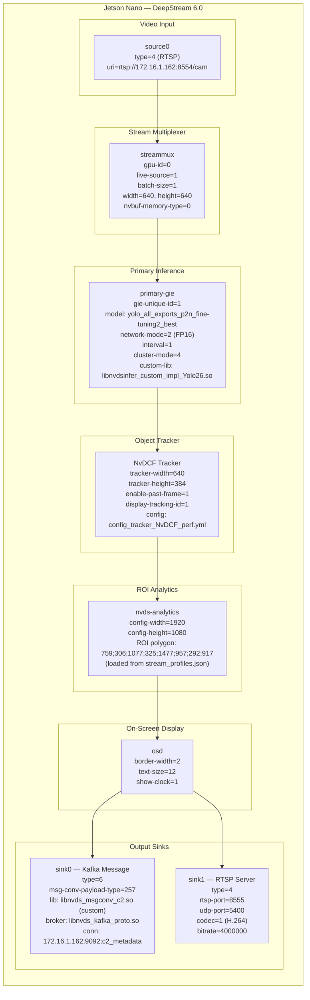

# 01 — Edge Pipeline (Jetson Nano)

DeepStream 6.0 GStreamer pipeline running on Jetson Nano (192.168.1.14).
Configured by `deepstream/multi-stream/setup_c2_roi.sh`.



## Key Configuration Files

| File | Purpose |
|------|---------|
| `setup_c2_roi.sh` | Main launcher — generates all DeepStream configs at runtime |
| `config_infer_c2.txt` | YOLO inference config (generated) |
| `config_nvdsanalytics_roi.txt` | ROI polygon filter config (generated) |
| `cfg_kafka.txt` | Kafka broker connection string |
| `nvmsgconv_c2_config.txt` | Custom message converter config |
| `libnvds_msgconv_c2.so` | Custom Type 257 message converter (C++) |
| `libnvdsinfer_custom_impl_Yolo26.so` | Custom YOLO parser |

## Kafka Payload Schema (Type 257)

```json
{
  "timestamp": 1715400000.123,
  "source_id": 0,
  "objects": [
    {
      "class_id": 2,
      "label": "car",
      "confidence": 0.87,
      "tracker_id": 42,
      "bbox": { "left": 100, "top": 200, "width": 80, "height": 60 },
      "roi_status": "inside"
    }
  ]
}
```
