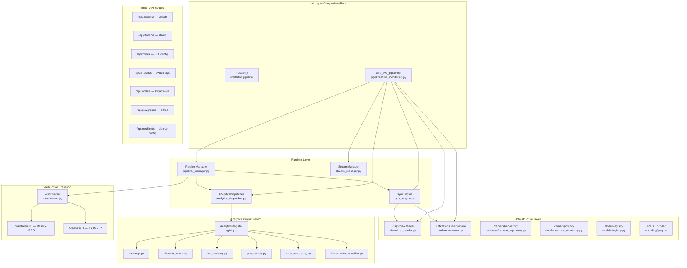
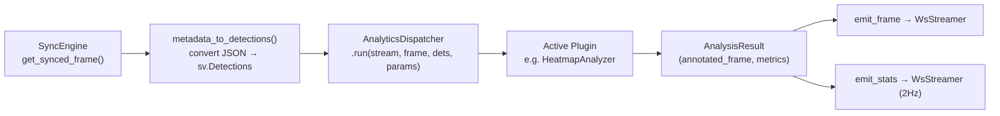

# 02 — Backend Architecture (FastAPI)

The backend is a layered FastAPI application at `c2_center/backend/app/`.

## Composition Root

`main.py` wires everything at import time via `wire_live_pipeline()`.

---

## Runtime Layer — Processing Loop

Each stream gets its own `asyncio.Task` inside `PipelineManager._loop()`:

### SyncEngine Details

| Feature | Implementation |
|---------|---------------|
| **Drift Correction** | EMA offset `α=0.05`: `offset = (1-α)*offset + α*(meta_ts - frame_ts)` |
| **Anti-flicker Hold** | Re-use last detections for `0.5s` if no new Kafka match |
| **Matching Strategy** | `pop_nearest(stream_id, target_ts, tolerance_ms)` — one-pass closest timestamp |

---

## Analytics Plugin System

Plugins are auto-discovered from `app/analytics/plugins/` via `registry.discover()`.

| Slug | Mode | Requires Tracker | Requires Zones | Geometry |
|------|------|:-:|:-:|----------|
| `heatmap` | live | ✗ | ✗ | none |
| `absolute_count` | live | ✗ | ✔ | polygon |
| `line_crossing` | live | ✔ | ✔ | dual_line |
| `area_occupancy` | live | ✗ | ✔ | polygon |
| `pce_density` | offline | ✗ | ✔ | polygon |
| `fundamental_equation` | offline | ✔ | ✔ | dual_line |

---

## Infrastructure Components

| Component | File | Description |
|-----------|------|-------------|
| `RtspVideoReader` | `video/rtsp_reader.py` | Threaded OpenCV reader, one thread per stream |
| `KafkaConsumerService` | `kafka/consumer.py` | aiokafka consumer, in-memory buffer per stream, `pop_nearest()` |
| `CameraRepository` | `database/camera_repository.py` | SQLite CRUD for camera configs (`c2_cameras.db`) |
| `ZoneRepository` | `database/zone_repository.py` | In-memory dict for ROI/line zones per stream |
| `ModelRegistry` | `models/registry.py` | Scans `.pt`/`.onnx` files, tracks active model + labels |
| `JPEG Encoder` | `encoding/jpeg.py` | `frame_to_base64()` — OpenCV imencode → base64 for WS |
