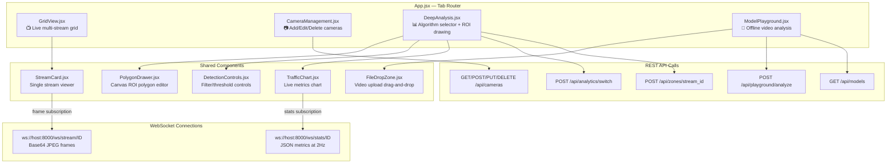

# 03 — Frontend Architecture (React + Vite)

React SPA at `c2_center/frontend/`, built with Vite.

## Page & Component Tree

---

## Page Details

### GridView (`pages/GridView.jsx`)
- Renders a responsive grid of `StreamCard` components.
- One WebSocket per visible stream for live video.

### CameraManagement (`pages/CameraManagement.jsx`)
- Full CRUD UI for camera records stored in SQLite.
- Fields: `stream_id`, `rtsp_url`, `name`, `description`, `enabled`.
- On add/enable: calls `POST /api/cameras` → backend calls `pipeline.add_stream()`.

### DeepAnalysis (`pages/DeepAnalysis.jsx`)
- **Algorithm Selector**: Dropdown populated from `GET /api/analytics` → registry slugs.
- **ROI Drawing**: `PolygonDrawer` lets user draw polygon/lines on the canvas.
- **Live Metrics**: `TrafficChart` shows real-time analytics from `/ws/stats/ID`.
- **Controls**: `DetectionControls` for confidence thresholds, class filters.

### ModelPlayground (`pages/ModelPlayground.jsx`)
- Upload video via `FileDropZone` → `POST /api/playground/analyze`.
- Select model from `GET /api/models`.
- Choose analytics algorithm (live + offline modes available).
- Renders processed video result with detection overlays.

---

## Communication Protocols

| Protocol | Endpoint | Direction | Payload |
|----------|----------|-----------|---------|
| WebSocket | `/ws/stream/{id}` | Server → Client | `{type: "frame", data: "<base64 JPEG>"}` |
| WebSocket | `/ws/stats/{id}` | Server → Client | `{type: "stats", data: {vehicle_count, ...}}` |
| REST | `/api/cameras` | Bidirectional | Camera CRUD JSON |
| REST | `/api/analytics/switch` | Client → Server | `{stream_id, algorithm}` |
| REST | `/api/zones/{id}` | Client → Server | `{roi_polygon, entry_line, exit_line}` |
| REST | `/api/playground/analyze` | Client → Server | `multipart/form-data (video + params)` |
