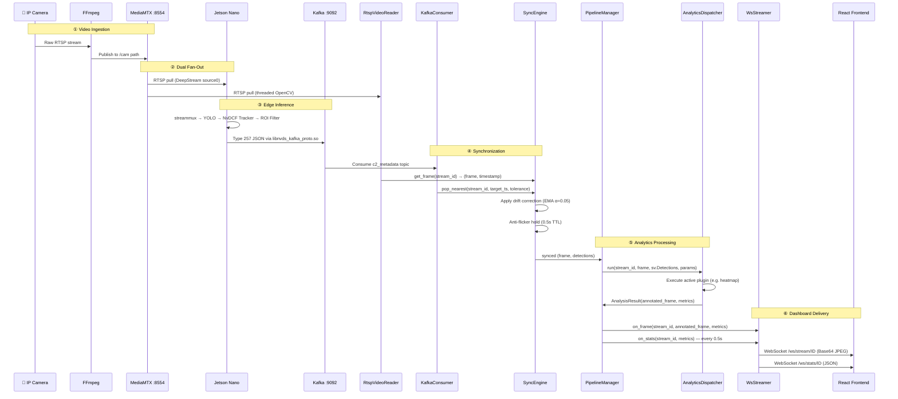

# 04 — End-to-End Data Flow

Complete sequence from camera capture to dashboard rendering.

## Sequence Diagram



---

## Data Transformation Pipeline

```
Camera (H.264/RTSP)
  │
  ├──→ MediaMTX ──→ Jetson Nano
  │                    │
  │                    ├─ streammux (resize 640×640)
  │                    ├─ primary-gie (YOLO FP16, batch=1)
  │                    ├─ tracker (NvDCF 640×384)
  │                    ├─ nvds-analytics (ROI polygon filter)
  │                    ├─ nvmsgconv (Type 257 → JSON)
  │                    └─ sink0 → Kafka "c2_metadata"
  │                         │
  │                         │  JSON payload:
  │                         │  {timestamp, source_id, objects: [{class_id, label,
  │                         │   confidence, tracker_id, bbox, roi_status}]}
  │                         │
  │                         ▼
  │                    KafkaConsumer.pop_nearest()
  │                         │
  ├──→ MediaMTX ──→ RtspVideoReader.get_frame()
  │                         │
  │                         ▼
  │                    SyncEngine
  │                    ├─ Match frame_ts ↔ meta_ts (±tolerance)
  │                    ├─ Drift correction: offset = EMA(meta_ts - frame_ts)
  │                    └─ Anti-flicker: hold last detections for 0.5s
  │                         │
  │                         ▼
  │                    metadata_to_detections()
  │                    JSON objects → sv.Detections (supervision library)
  │                         │
  │                         ▼
  │                    AnalyticsDispatcher.run()
  │                    ├─ Load zone params (ROI polygon, lines)
  │                    ├─ Scale ROI to actual frame resolution
  │                    └─ Execute active plugin
  │                         │
  │                         ▼
  │                    AnalysisResult
  │                    ├─ annotated_frame (numpy array with overlays)
  │                    └─ metrics {vehicle_count, occupancy, ...}
  │                         │
  │                         ▼
  │                    WsStreamer
  │                    ├─ frame_to_base64(frame, quality=70)
  │                    ├─ /ws/stream/ID → {type:"frame", data:"<b64>"}
  │                    └─ /ws/stats/ID  → {type:"stats", data:{...}}  @2Hz
  │                         │
  │                         ▼
  │                    React Frontend
  │                    ├─ StreamCard: render base64 → 
  │                    └─ TrafficChart: plot metrics live
```

---

## Network Topology

```
┌──────────────────────────────────────────────────┐
│  Laptop A (172.16.1.162)                         │
│                                                  │
│  ┌──────────┐  ┌──────────┐  ┌───────────────┐  │
│  │ MediaMTX │  │  Kafka   │  │ FastAPI :8000  │  │
│  │  :8554   │  │  :9092   │  │  + React :5173 │  │
│  └────┬─────┘  └────┬─────┘  └───────┬───────┘  │
│       │              │                │          │
└───────┼──────────────┼────────────────┼──────────┘
        │              │                │
        │  LAN (192.168.1.x / 172.16.1.x)
        │              │                │
┌───────┼──────────────┼────────────────┘
│       ▼              ▼
│  ┌─────────────────────────┐
│  │ Jetson Nano             │
│  │ 192.168.1.14            │
│  │                         │
│  │ DeepStream 6.0          │
│  │ RTSP in  ← :8554       │
│  │ RTSP out → :8555        │
│  │ Kafka out → :9092       │
│  └─────────────────────────┘
│
│  ┌─────────┐  ┌─────────┐
│  │ Camera 1│  │ Camera 2│  ...
│  └─────────┘  └─────────┘
```
