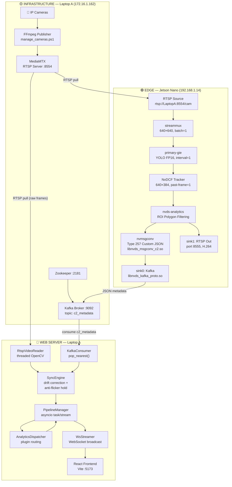

# C2 Center — System Architecture Overview

High-level overview connecting all subsystems across the distributed C2 Surveillance Center.

## Subsystem Documentation

| Diagram | File | Description |
|---------|------|-------------|
| Edge Pipeline | [01_EDGE_PIPELINE.md](./01_EDGE_PIPELINE.md) | DeepStream GStreamer pipeline on Jetson Nano |
| Backend Architecture | [02_BACKEND_ARCHITECTURE.md](./02_BACKEND_ARCHITECTURE.md) | FastAPI layers: runtime, analytics, infrastructure, transport |
| Frontend Architecture | [03_FRONTEND_ARCHITECTURE.md](./03_FRONTEND_ARCHITECTURE.md) | React pages, components, WS/REST connections |
| Data Flow | [04_DATA_FLOW.md](./04_DATA_FLOW.md) | End-to-end sequence diagram from camera to dashboard |
