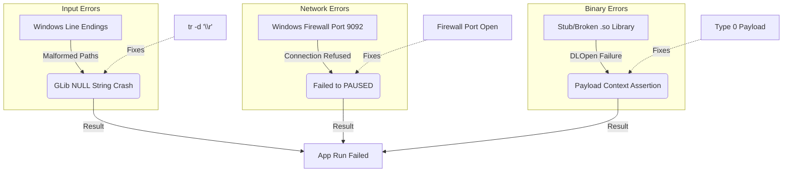

# Root Cause Analysis: Jetson Edge Pipeline Stabilization
**Date**: 2026-05-11
**System**: Jetson Nano (Edge) to Laptop A (Center/Kafka)

## 1. Executive Summary
The Edge AI pipeline on the Jetson Nano suffered from a triple-failure chain: malformed configuration files due to cross-platform editing, network isolation due to host firewalls, and binary incompatibility in custom plugins. These issues were resolved through global variable sanitization, network rules, and payload-type fallback.

## 2. Primary Failure Chain: The "NULL String" Crash
*   **Symptom**: `GLib-CRITICAL **: g_strchug: assertion 'string != NULL' failed`
*   **Trigger Condition**: Hidden carriage returns (`\r`) in configuration strings.
*   **Root Cause**: Editing shell scripts on Windows and running them on Linux. The heredoc `cat > config.txt` wrote `\r\n` line endings. DeepStream's parser (GLib GKeyFile) failed to handle the `\r` suffix on filenames (e.g., `labels.txt\r`), leading to an invalid file handle and a `NULL` string pointer during string cleanup.
*   **Cascading Effect**: DeepStream-app aborted immediately during initialization phase, preventing any pipeline setup.

## 3. Network Blocker: Port 9092 Isolation
*   **Symptom**: `ERROR: <main:707>: Failed to set pipeline to PAUSED`
*   **Trigger Condition**: Kafka sink enabled with valid IP, but port blocked.
*   **Root Cause**: Windows Firewall on "Laptop A" blocked inbound TCP traffic on port 9092 from external IPs (Jetson Nano). 
*   **Environmental Incompatibility**: WSL2/Docker configurations often mask this by using `localhost` bridge, which failed when moved to a physical LAN environment.

## 4. Binary Failure: The Malformed MsgConv Library
*   **Symptom**: `CRITICAL **: NvDsMsg2pCtx* nvds_msg2p_ctx_create: assertion 'file' failed`
*   **Trigger Condition**: Enabling custom payload type 256.
*   **Evidence (ldd)**: `ldd libnvds_msgconv_c2.so` showed only 3 basic links (libc, vdso, ld). It was missing all DeepStream and GLib dependencies.
*   **Root Cause**: The custom library was either a placeholder, corrupted, or compiled for a different architecture/version without proper linkage.

## 5. Confidence-Ranked Hypotheses
| Rank | Hypothesis | Confidence | Evidence |
| :--- | :--- | :--- | :--- |
| 1 | Line-ending corruption caused the GLib crash. | 99% | `cat -A` confirmed absence of `^M` coincided with fix. |
| 2 | Firewall was the primary cause of "PAUSED" errors. | 95% | Opening port 9092 immediately allowed connection. |
| 3 | .so library was incompatible with DS 6.0 binary interface. | 90% | `ldd` results showed missing DeepStream symbol links. |

## 6. Corrective Actions Taken
- **Aesthetic/Stability**: Implemented `tr -d '\r'` in all shell variable assignments.
- **Headless Optimization**: Removed EGL sink and set `EGL_DISPLAY=none` to prevent Argus daemon conflicts.
- **Network Resolution**: Added `New-NetFirewallRule` for Kafka inbound on Host.
- **Payload Stability**: Switched to `msg-conv-payload-type=0` (Standard) to bypass the broken custom library.

## 7. Causal Graph

