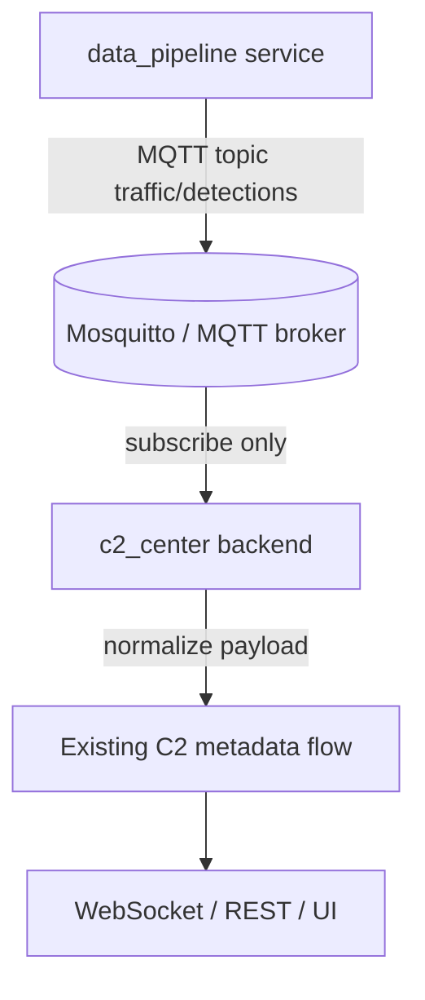
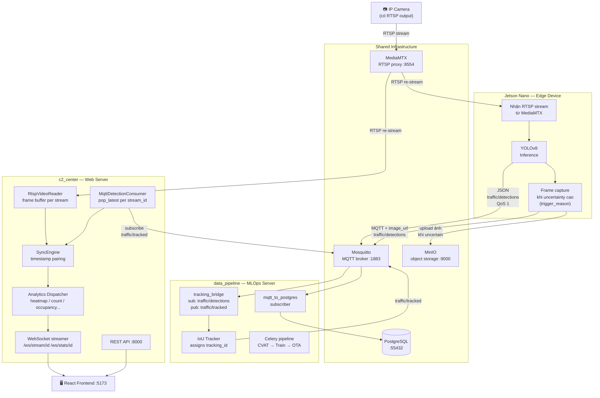

## User

[@Spec Kit ECC Migration and Cursor Cleanup](zed:///agent/thread/794ea1e9-6f40-4c28-a1e7-2ae3077d6140?name=Spec+Kit+ECC+Migration+and+Cursor+Cleanup)
tôi cần biến đổi c2_center web server để nhận dữ liệu từ data_pipeline

## Assistant

Mình sẽ rà cấu trúc repo và các tài liệu Spec Kit hiện có trước, rồi xác định `c2_center` và `data_pipeline` đang giao tiếp theo kiểu nào để sửa đúng điểm nhận dữ liệu.

**Tool Call: `coding-practices` Skill**
Status: Canceled

**Tool Call: `karpathy-guidelines` Skill**
Status: Canceled

**Tool Call: List the `Final.yolov8` directory's contents**
Status: Completed

# Folders:
Final.yolov8\.agent
Final.yolov8\.agents
Final.yolov8\.github
Final.yolov8\.specify
Final.yolov8\QA
Final.yolov8\c2_center
Final.yolov8\data_pipeline
Final.yolov8\datasets
Final.yolov8\deepstream_apps
Final.yolov8\deepstream_prompt_engineering
Final.yolov8\density
Final.yolov8\docs
Final.yolov8\export
Final.yolov8\jetson
Final.yolov8\memory
Final.yolov8\models
Final.yolov8\notebooks
Final.yolov8\plans
Final.yolov8\rstp
Final.yolov8\scenarios
Final.yolov8\scratch
Final.yolov8\scripts
Final.yolov8\tmp

# Files:
Final.yolov8\.gitignore
Final.yolov8\AGENTS.md


**Tool Call: Read file `AGENTS.md`**
Status: Completed

```Final.yolov8/AGENTS.md
     1	<!-- SPECKIT START -->
     2	For additional context about technologies to be used, project structure,
     3	shell commands, and other important information, read the current plan
     4	<!-- SPECKIT END -->

```


## User

nhưng mà nên làm cách nào để không merge 2 cái này lại thành 1 repo vì điều đó quá nguy hiểm

## Assistant

<thinking>
**Gathering context for architecture**

I’m considering using list and grep to help with their question about architecture. However, as a coding agent, it seems I should gather more context first to avoid making guesses. I’ll take a closer look at c2_center and the top-level data_pipeline. This approach should provide better insights into what they need, ensuring that I’m on the right track when formulating my response!
</thinking>

Để trả lời chắc hơn theo đúng repo hiện tại, mình sẽ xem nhanh `c2_center` và `data_pipeline` đang có interface gì sẵn (HTTP/MQTT/WebSocket, v.v.) rồi đề xuất cách tách an toàn.

**Tool Call: List the `Final.yolov8/c2_center` directory's contents**
Status: Completed

# Folders:
Final.yolov8\c2_center\.pytest_cache
Final.yolov8\c2_center\backend
Final.yolov8\c2_center\config
Final.yolov8\c2_center\deepstream
Final.yolov8\c2_center\docs
Final.yolov8\c2_center\frontend
Final.yolov8\c2_center\infrastructure

# Files:
Final.yolov8\c2_center\CAMERA_MANAGEMENT.md
Final.yolov8\c2_center\QUICKSTART.md
Final.yolov8\c2_center\docker-compose.yml


**Tool Call: List the `Final.yolov8/data_pipeline` directory's contents**
Status: Completed

# Folders:
Final.yolov8\data_pipeline\core-backbone
Final.yolov8\data_pipeline\cvat
Final.yolov8\data_pipeline\pipeline

# Files:
Final.yolov8\data_pipeline\.gitignore
Final.yolov8\data_pipeline\check_mqtt.py
Final.yolov8\data_pipeline\convert_yolo_to_cvat.py
Final.yolov8\data_pipeline\cvat_discovery.py


**Tool Call: 50 matches**
Status: Completed

file://D:\datas\Final.yolov8\c2_center

file://D:\datas\Final.yolov8\c2_center\.pytest_cache

file://D:\datas\Final.yolov8\c2_center\CAMERA_MANAGEMENT.md

file://D:\datas\Final.yolov8\c2_center\QUICKSTART.md

file://D:\datas\Final.yolov8\c2_center\backend

file://D:\datas\Final.yolov8\c2_center\backend\.pytest_cache

file://D:\datas\Final.yolov8\c2_center\backend\CAMERAS.md

file://D:\datas\Final.yolov8\c2_center\backend\app

file://D:\datas\Final.yolov8\c2_center\backend\app\__init__.py

file://D:\datas\Final.yolov8\c2_center\backend\app\analytics

file://D:\datas\Final.yolov8\c2_center\backend\app\analytics\__init__.py

file://D:\datas\Final.yolov8\c2_center\backend\app\analytics\base.py

file://D:\datas\Final.yolov8\c2_center\backend\app\analytics\contracts.py

file://D:\datas\Final.yolov8\c2_center\backend\app\analytics\plugins

file://D:\datas\Final.yolov8\c2_center\backend\app\analytics\plugins\__init__.py

file://D:\datas\Final.yolov8\c2_center\backend\app\analytics\plugins\absolute_count.py

file://D:\datas\Final.yolov8\c2_center\backend\app\analytics\plugins\area_occupancy.py

file://D:\datas\Final.yolov8\c2_center\backend\app\analytics\plugins\fundamental_equation.py

file://D:\datas\Final.yolov8\c2_center\backend\app\analytics\plugins\heatmap.py

file://D:\datas\Final.yolov8\c2_center\backend\app\analytics\plugins\line_crossing.py

file://D:\datas\Final.yolov8\c2_center\backend\app\analytics\plugins\pce_density.py

file://D:\datas\Final.yolov8\c2_center\backend\app\analytics\registry.py

file://D:\datas\Final.yolov8\c2_center\backend\app\api

file://D:\datas\Final.yolov8\c2_center\backend\app\api\__init__.py

file://D:\datas\Final.yolov8\c2_center\backend\app\api\analytics_api.py

file://D:\datas\Final.yolov8\c2_center\backend\app\api\cameras.py

file://D:\datas\Final.yolov8\c2_center\backend\app\api\mediamtx.py

file://D:\datas\Final.yolov8\c2_center\backend\app\api\models_api.py

file://D:\datas\Final.yolov8\c2_center\backend\app\api\playground.py

file://D:\datas\Final.yolov8\c2_center\backend\app\api\streams.py

file://D:\datas\Final.yolov8\c2_center\backend\app\api\zones.py

file://D:\datas\Final.yolov8\c2_center\backend\app\core

file://D:\datas\Final.yolov8\c2_center\backend\app\core\__init__.py

file://D:\datas\Final.yolov8\c2_center\backend\app\core\config.py

file://D:\datas\Final.yolov8\c2_center\backend\app\core\log_filters.py

file://D:\datas\Final.yolov8\c2_center\backend\app\domain

file://D:\datas\Final.yolov8\c2_center\backend\app\domain\__init__.py

file://D:\datas\Final.yolov8\c2_center\backend\app\domain\analytics

file://D:\datas\Final.yolov8\c2_center\backend\app\domain\analytics\__init__.py

file://D:\datas\Final.yolov8\c2_center\backend\app\domain\analytics\models.py

file://D:\datas\Final.yolov8\c2_center\backend\app\domain\camera

file://D:\datas\Final.yolov8\c2_center\backend\app\domain\camera\__init__.py

file://D:\datas\Final.yolov8\c2_center\backend\app\domain\camera\models.py

file://D:\datas\Final.yolov8\c2_center\backend\app\domain\detection

file://D:\datas\Final.yolov8\c2_center\backend\app\domain\detection\__init__.py

file://D:\datas\Final.yolov8\c2_center\backend\app\domain\detection\converters.py

file://D:\datas\Final.yolov8\c2_center\backend\app\domain\detection\models.py

file://D:\datas\Final.yolov8\c2_center\backend\app\domain\stream

file://D:\datas\Final.yolov8\c2_center\backend\app\domain\stream\__init__.py

file://D:\datas\Final.yolov8\c2_center\backend\app\domain\stream\models.py

**Tool Call: 45 matches**
Status: Completed

file://D:\datas\Final.yolov8\data_pipeline

file://D:\datas\Final.yolov8\data_pipeline\.gitignore

file://D:\datas\Final.yolov8\data_pipeline\check_mqtt.py

file://D:\datas\Final.yolov8\data_pipeline\convert_yolo_to_cvat.py

file://D:\datas\Final.yolov8\data_pipeline\core-backbone

file://D:\datas\Final.yolov8\data_pipeline\core-backbone\Dockerfile

file://D:\datas\Final.yolov8\data_pipeline\core-backbone\docker-compose.yml

file://D:\datas\Final.yolov8\data_pipeline\core-backbone\init.sql

file://D:\datas\Final.yolov8\data_pipeline\core-backbone\mosquitto.conf

file://D:\datas\Final.yolov8\data_pipeline\core-backbone\mqtt_to_postgres_subscriber.py

file://D:\datas\Final.yolov8\data_pipeline\cvat

file://D:\datas\Final.yolov8\data_pipeline\cvat_discovery.py

file://D:\datas\Final.yolov8\data_pipeline\pipeline

file://D:\datas\Final.yolov8\data_pipeline\pipeline\Dockerfile

file://D:\datas\Final.yolov8\data_pipeline\pipeline\__init__.py

file://D:\datas\Final.yolov8\data_pipeline\pipeline\celery_app.py

file://D:\datas\Final.yolov8\data_pipeline\pipeline\config.py

file://D:\datas\Final.yolov8\data_pipeline\pipeline\docker-compose.yml

file://D:\datas\Final.yolov8\data_pipeline\pipeline\services

file://D:\datas\Final.yolov8\data_pipeline\pipeline\services\__init__.py

file://D:\datas\Final.yolov8\data_pipeline\pipeline\services\cvat_automation_service.py

file://D:\datas\Final.yolov8\data_pipeline\pipeline\services\mqtt_service.py

file://D:\datas\Final.yolov8\data_pipeline\pipeline\tasks

file://D:\datas\Final.yolov8\data_pipeline\pipeline\tasks\__init__.py

file://D:\datas\Final.yolov8\data_pipeline\pipeline\tasks\check_storage.py

file://D:\datas\Final.yolov8\data_pipeline\pipeline\tasks\create_manifest.py

file://D:\datas\Final.yolov8\data_pipeline\pipeline\tasks\cvat_cleanup.py

file://D:\datas\Final.yolov8\data_pipeline\pipeline\tasks\cvat_discovery.py

file://D:\datas\Final.yolov8\data_pipeline\pipeline\tasks\list_minio.py

file://D:\datas\Final.yolov8\data_pipeline\pipeline\tasks\mark_as_trained.py

file://D:\datas\Final.yolov8\data_pipeline\pipeline\tasks\mock_train.py

file://D:\datas\Final.yolov8\data_pipeline\pipeline\tasks\ota_deploy.py

file://D:\datas\Final.yolov8\data_pipeline\pipeline\tasks\prepare_training_data.py

file://D:\datas\Final.yolov8\data_pipeline\pipeline\tasks\test_jetson_upload.py

file://D:\datas\Final.yolov8\data_pipeline\pipeline\tasks\train_engine.py

file://D:\datas\Final.yolov8\data_pipeline\pipeline\tasks\upload_base_dataset.py

file://D:\datas\Final.yolov8\data_pipeline\pipeline\utils

file://D:\datas\Final.yolov8\data_pipeline\pipeline\utils\__init__.py

file://D:\datas\Final.yolov8\data_pipeline\pipeline\utils\cvat_handler.py

file://D:\datas\Final.yolov8\data_pipeline\pipeline\utils\data_processor.py

file://D:\datas\Final.yolov8\data_pipeline\pipeline\utils\db_handler.py

file://D:\datas\Final.yolov8\data_pipeline\pipeline\utils\inference_handler.py

file://D:\datas\Final.yolov8\data_pipeline\pipeline\utils\minio_handler.py

file://D:\datas\Final.yolov8\data_pipeline\pipeline\utils\mqtt_handler.py

file://D:\datas\Final.yolov8\data_pipeline\pipeline\utils\telegram_handler.py

## Assistant

<thinking>
**Inspecting MQTT topics**

I need to find an answer, so it seems like I should really look into the files to understand the exact MQTT topics and schemas. Maybe it would make sense to search for terms like MQTT, topics, and API to get better insights. By digging into these specifics, I’ll be able to provide a more accurate and informed response. Let's see what information I can uncover.
</thinking>

Mình thấy `data_pipeline` đã có MQTT (`check_mqtt.py`, `mqtt_service.py`, `mqtt_to_postgres_subscriber.py`). Mình sẽ đọc nhanh các file cấu hình/interface liên quan để đề xuất boundary cụ thể, không cần merge repo.

**Tool Call: Search files for regex `MQTT|mqtt|topic|TOPIC|subscribe|publish|BROKER|broker`**
Status: Completed

Showing matches 1-20 (there were more matches found; use offset: 20 to see next page):

## Matches in Final.yolov8\data_pipeline\check_mqtt.py

### L1-9
```
import paho.mqtt.client as mqtt
import time

def on_message(client, userdata, msg):
    print(f"✅ RECEIVED on host: {msg.topic} -> {msg.payload.decode()[:50]}")

client = mqtt.Client()
client.on_message = on_message

```

### L10-14
```
print("🔍 Connecting to localhost:1883...")
client.connect("127.0.0.1", 1883)
client.subscribe("#")
print("👂 Listening for ALL messages on localhost:1883... (Press Ctrl+C to stop)")
client.loop_forever()
```

## Matches in Final.yolov8\data_pipeline\core-backbone\mqtt_to_postgres_subscriber.py

### L4-15
```
from typing import TypedDict, List, Optional
import psycopg2
from paho.mqtt import client as mqtt_client

# ================= CONFIG (Ưu tiên Docker Env) =================
MQTT_BROKER = os.getenv("MQTT_BROKER", "mqtt") # Mặc định là 'mqtt' trong docker
MQTT_PORT = int(os.getenv("MQTT_PORT", "1883"))
MQTT_TOPIC = os.getenv("MQTT_TOPIC", "traffic/detections")
MQTT_QOS = int(os.getenv("MQTT_QOS", "1"))
MQTT_CLIENT_ID = os.getenv("MQTT_CLIENT_ID", f"subscriber_{int(time.time())}")

DB_HOST = os.getenv("DB_HOST", "db") # Mặc định là 'db' trong docker
```

### L65-77
```
            self.conn = None # Reset connection for retry

# ================= MQTT HANDLER =================
class MQTTHandler:
    def __init__(self, db: DBHandler):
        self.db = db
        # Tương thích paho-mqtt 2.0
        try:
            self.client = mqtt_client.Client(mqtt_client.CallbackAPIVersion.VERSION1, MQTT_CLIENT_ID)
        except AttributeError:
            self.client = mqtt_client.Client(MQTT_CLIENT_ID)
            
        self.client.on_connect = self.on_connect
```

### L80-97
```
    def on_connect(self, client, userdata, flags, rc):
        if rc == 0:
            print(f"📡 [MQTT] Connected to broker at {MQTT_BROKER}:{MQTT_PORT}")
            # Debug: Nghe TẤT CẢ các topic để xem có tin nhắn nào tới không
            client.subscribe("#", qos=MQTT_QOS)
            print(f"📥 [MQTT] Subscribed to ALL topics (#) for debugging")
        else:
            print(f"❌ [MQTT] Connection failed with code {rc}")

    def on_message(self, client, userdata, msg):
        try:
            print(f"📩 [MQTT] Got message on topic: {msg.topic}")
            print(f"📦 [MQTT] Payload: {msg.payload.decode()[:100]}...")
            
            if msg.topic != MQTT_TOPIC:
                return # Bỏ qua nếu không phải topic chúng ta cần
            data = json.loads(msg.payload.decode())
            payload: DetectionPayload = {
```

### L105-109
```
            print(f"📝 [DB] Recorded 1 detection from {payload['camera_id']}")
        except Exception as e:
            print(f"⚠️ [MQTT] Message processing error: {e}")

    def run(self):
```

### L110-120
```
        import socket
        try:
            mqtt_ip = socket.gethostbyname(MQTT_BROKER)
            print(f"🔍 [DNS] '{MQTT_BROKER}' resolved to IP: {mqtt_ip}")
        except Exception as e:
            print(f"⚠️ [DNS] Could not resolve '{MQTT_BROKER}': {e}")
            
        print(f"🚀 [MQTT] Attempting to connect to {MQTT_BROKER}...")
        self.client.connect(MQTT_BROKER, MQTT_PORT, keepalive=60)
        self.client.loop_forever()

```

### L122-126
```
if __name__ == "__main__":
    db = DBHandler()
    # Thử kết nối DB trước khi chạy MQTT
    for i in range(5):
        try:
```

### L131-135
```
            time.sleep(2)
            
    mqtt = MQTTHandler(db)
    mqtt.run()

```

## Matches in Final.yolov8\data_pipeline\pipeline\celery_app.py

### L1-8
```
from celery import Celery
from .config import CELERY_BROKER_URL, CELERY_RESULT_BACKEND

app = Celery(
    'pipeline_tasks',
    broker=CELERY_BROKER_URL,
    backend=CELERY_RESULT_BACKEND,
    include=['pipeline.services.cvat_automation_service']
```

## Matches in Final.yolov8\data_pipeline\pipeline\config.py

### L2-6
```

# ================= CELERY CONFIG =================
CELERY_BROKER_URL = os.getenv("CELERY_BROKER_URL", "redis://localhost:6379/0")
CELERY_RESULT_BACKEND = os.getenv("CELERY_RESULT_BACKEND", "redis://localhost:6379/0")

```

### L34-43
```
TRAIN_DATA_THRESHOLD = 5 # Ngưỡng thấp để test luồng tự động

# ================= MQTT CONFIG =================
MQTT_BROKER = os.getenv("MQTT_BROKER", "127.0.0.1")
MQTT_PORT = int(os.getenv("MQTT_PORT", "1883"))
MQTT_TOPIC = os.getenv("MQTT_TOPIC", "traffic/detections")
MQTT_QOS = 1
MQTT_CLIENT_ID = f"server_subscriber_{os.getpid()}"

# ================= DB CONFIG =================
```

## Matches in Final.yolov8\data_pipeline\pipeline\services\mqtt_service.py

### L5-22
```
sys.path.append(os.path.abspath(os.path.join(os.path.dirname(__file__), '../..')))

from pipeline.utils.mqtt_handler import MQTTHandler
from pipeline.utils.db_handler import DBHandler

def main():
    print("🚀 Starting MQTT Listener Service...")
    db = DBHandler()
    mqtt = MQTTHandler(db)
    
    try:
        mqtt.run()
    except KeyboardInterrupt:
        print("🛑 Stopping MQTT Listener...")
    except Exception as e:
        print(f"❌ [MQTT Service] Critical error: {e}")

if __name__ == "__main__":
```

## Matches in Final.yolov8\data_pipeline\pipeline\tasks\ota_deploy.py

### L2-6
```
import time
from pipeline.utils.minio_handler import MinioHandler
from pipeline.utils.mqtt_handler import MQTTHandler
from pipeline.utils.db_handler import DBHandler
from pipeline.config import (
```

### L14-18
```
    minio = MinioHandler()
    db = DBHandler()
    mqtt = MQTTHandler(db)
    
    if not os.path.exists(BEST_MODEL_PATH):
```

### L32-38
```
    model_url = f"http://{MINIO_URL}/{BUCKET_PRODUCTION_MODELS}/{object_name}"
    
    # 4. Bắn lệnh OTA qua MQTT
    print(f"📡 [OTA] Phát lệnh cập nhật tới {camera_id}...")
    mqtt.send_ota_update(camera_id, version, model_url)
    
    print(f"✅ [OTA] Hoàn tất triển khai model {version}")
```

## Matches in Final.yolov8\data_pipeline\pipeline\tasks\test_jetson_upload.py

### L3-8
```
import io
import json
from paho.mqtt import client as mqtt_client
from ..config import BUCKET_RAW_DATA, MQTT_BROKER, MQTT_PORT, MQTT_TOPIC
from ..utils.minio_handler import MinioHandler

```

### L12-30
```
    minio.ensure_bucket(BUCKET_RAW_DATA)

    # 2. Khởi tạo MQTT
    print(f"🔌 Attempting to connect to Broker: {MQTT_BROKER} Port: {MQTT_PORT}")
    print(f"📡 Target Topic: {MQTT_TOPIC}")
    client_id = f'python-mqtt-test-{int(time.time())}'
    
    # Tương thích với paho-mqtt bản 2.0+
    try:
        mqtt = mqtt_client.Client(mqtt_client.CallbackAPIVersion.VERSION1, client_id)
    except AttributeError:
        mqtt = mqtt_client.Client(client_id)
    try:
        mqtt.connect(MQTT_BROKER, MQTT_PORT)
        print(f"✅ Connected to MQTT Broker: {MQTT_BROKER}")
    except Exception as e:
        print(f"❌ Failed to connect MQTT: {e}")
        return

```

### L37-41
```
        return

    print("🚀 [Simulating Jetson] Starting data push to MinIO & MQTT...")
    upload_count = 0
    
```

### L53-57
```
        print(f"📷 [1/2] Uploaded image to MinIO: {img_name}")
        
        # B. Gửi JSON qua MQTT
        payload = {
            "camera_id": "CAM_01",
```


**Tool Call: Search files for regex `MQTT|mqtt|websocket|WebSocket|subscribe|publish|detection|detections|event`**
Status: Completed

Showing matches 1-20 (there were more matches found; use offset: 20 to see next page):

## Matches in Final.yolov8\c2_center\backend\app\analytics\base.py

### L22-26
```
    All analyzers receive:
        - frame: raw video frame (np.ndarray, BGR)
        - detections: sv.Detections from metadata or local inference
        - params: user-configurable parameters (zone coords, thresholds, etc.)

```

### L45-49
```
        self,
        frame: np.ndarray,
        detections: sv.Detections,
        params: dict,
    ) -> AnalysisResult:
```

## Matches in Final.yolov8\c2_center\backend\app\analytics\plugins\absolute_count.py

### L38-42
```
        self,
        frame: np.ndarray,
        detections: sv.Detections,
        params: dict,
    ) -> AnalysisResult:
```

### L53-58
```
        annotated = frame.copy()

        if roi_polygon is None or len(detections) == 0:
            # No ROI defined or no detections — return raw frame
            return AnalysisResult(
                annotated_frame=annotated,
```

### L65-69
```
        count = 0
        in_roi_mask = []
        for bbox in detections.xyxy:
            cx = int((bbox[0] + bbox[2]) / 2)
            cy = int((bbox[1] + bbox[3]) / 2)
```

### L73-79
```
                count += 1

        # Filter detections to ROI
        mask = np.array(in_roi_mask, dtype=bool)
        det_in_roi = detections[mask]

        # Annotate
```

### L90-96
```
                labels.append(cls_name)

        annotated = self._box_annotator.annotate(scene=annotated, detections=det_in_roi)
        annotated = self._label_annotator.annotate(
            scene=annotated, detections=det_in_roi, labels=labels
        )

```

## Matches in Final.yolov8\c2_center\backend\app\analytics\plugins\area_occupancy.py

### L59-63
```
        self,
        frame: np.ndarray,
        detections: sv.Detections,
        params: dict,
    ) -> AnalysisResult:
```

### L100-107
```
        bev_canvas = np.zeros((self.BEV_SIZE, self.BEV_SIZE), dtype=np.uint8)

        # Filter detections inside ROI polygon
        roi_int = src_pts.astype(np.int32)
        in_roi_mask = []
        for bbox in detections.xyxy:
            cx = int((bbox[0] + bbox[2]) / 2)
            cy = int((bbox[1] + bbox[3]) / 2)
```

### L110-114
```

        mask = np.array(in_roi_mask, dtype=bool) if in_roi_mask else np.array([], dtype=bool)
        det_in_roi = detections[mask] if len(mask) > 0 else detections[:0]

        # Transform each bbox to BEV and paint
```

### L127-131
```

        # Annotate main frame
        annotated = self._box_annotator.annotate(scene=annotated, detections=det_in_roi)
        cv2.polylines(annotated, [roi_int], True, (0, 0, 255), 2)

```

### L147-155
```
        display_text = f"Occupancy: {occupancy_pct:.1f}% | {status_text}"
        if not det_in_roi and occupancy_pct == 0.0:
            # Check if we've ever seen detections
            if not getattr(self, "_ever_seen_detections", False):
                display_text = "Occupancy: Initializing..."
        else:
            self._ever_seen_detections = True

        cv2.putText(
```

## Matches in Final.yolov8\c2_center\backend\app\analytics\plugins\fundamental_equation.py

### L26-31
```
    def __init__(self):
        self._box_ann = sv.BoxAnnotator(thickness=2)
        self._entry_events: deque = deque()  # (timestamp,)
        self._exit_events: deque = deque()   # (timestamp,)
        self._entry_tracker: dict[int, float] = {}  # tracking_id -> entry_time
        self._speeds: deque = deque(maxlen=100)  # recent speed measurements
```

### L36-41
```

    def reset(self):
        self._entry_events.clear()
        self._exit_events.clear()
        self._entry_tracker.clear()
        self._speeds.clear()
```

### L42-46
```
        self._total_crossed = 0

    def process(self, frame, detections, params):
        entry_line = params.get("entry_line")  # [[x1,y1],[x2,y2]]
        exit_line = params.get("exit_line")    # [[x1,y1],[x2,y2]]
```

### L67-71
```
        tracker_ids = None
        try:
            tracker_ids = detections.tracker_id if hasattr(detections, "tracker_id") else None
        except Exception:
            tracker_ids = None
```

### L77-81
```
                if trk_id == -1:
                    continue
                bbox = detections.xyxy[i]
                cx = int((bbox[0] + bbox[2]) / 2)
                cy = int((bbox[1] + bbox[3]) / 2)
```

### L84-88
```
                    if abs(cy - entry_y) < 15:
                        self._entry_tracker[trk_id] = now
                        self._entry_events.append(now)
                else:
                    if abs(cy - exit_y) < 15:
```

### L94-98
```
                                if 1 < speed < 250:
                                    self._speeds.append(speed)
                            self._exit_events.append(now)
                            self._total_crossed += 1
        else:
```

### L99-104
```
            # Local matching fallback (centroid nearest-neighbor within short time window)
            centroids = []
            for i in range(len(detections)):
                bbox = detections.xyxy[i]
                cx = int((bbox[0] + bbox[2]) / 2)
                cy = int((bbox[1] + bbox[3]) / 2)
```


**Tool Call: Read file `data_pipeline\pipeline\services\mqtt_service.py`**
Status: Completed

```Final.yolov8/data_pipeline/pipeline/services/mqtt_service.py
     1	import sys
     2	import os
     3	
     4	# Add the project root to sys.path so we can import 'pipeline'
     5	sys.path.append(os.path.abspath(os.path.join(os.path.dirname(__file__), '../..')))
     6	
     7	from pipeline.utils.mqtt_handler import MQTTHandler
     8	from pipeline.utils.db_handler import DBHandler
     9	
    10	def main():
    11	    print("🚀 Starting MQTT Listener Service...")
    12	    db = DBHandler()
    13	    mqtt = MQTTHandler(db)
    14	    
    15	    try:
    16	        mqtt.run()
    17	    except KeyboardInterrupt:
    18	        print("🛑 Stopping MQTT Listener...")
    19	    except Exception as e:
    20	        print(f"❌ [MQTT Service] Critical error: {e}")
    21	
    22	if __name__ == "__main__":
    23	    main()

```


**Tool Call: Read file `data_pipeline\core-backbone\mqtt_to_postgres_subscriber.py`**
Status: Completed

```Final.yolov8/data_pipeline/core-backbone/mqtt_to_postgres_subscriber.py
     1	import json
     2	import os
     3	import time
     4	from typing import TypedDict, List, Optional
     5	import psycopg2
     6	from paho.mqtt import client as mqtt_client
     7	
     8	# ================= CONFIG (Ưu tiên Docker Env) =================
     9	MQTT_BROKER = os.getenv("MQTT_BROKER", "mqtt") # Mặc định là 'mqtt' trong docker
    10	MQTT_PORT = int(os.getenv("MQTT_PORT", "1883"))
    11	MQTT_TOPIC = os.getenv("MQTT_TOPIC", "traffic/detections")
    12	MQTT_QOS = int(os.getenv("MQTT_QOS", "1"))
    13	MQTT_CLIENT_ID = os.getenv("MQTT_CLIENT_ID", f"subscriber_{int(time.time())}")
    14	
    15	DB_HOST = os.getenv("DB_HOST", "db") # Mặc định là 'db' trong docker
    16	DB_PORT = int(os.getenv("DB_PORT", "5432"))
    17	DB_NAME = os.getenv("DB_NAME", "traffic_db")
    18	DB_USER = os.getenv("DB_USER", "admin")
    19	DB_PASSWORD = os.getenv("DB_PASSWORD", "password123")
    20	DB_TABLE = os.getenv("DB_TABLE", "detections")
    21	
    22	# ================= DATA TYPES =================
    23	class DetectionPayload(TypedDict):
    24	    camera_id: str
    25	    image_url: str
    26	    timestamp: float
    27	    trigger_reason: str
    28	    edge_predictions: List[dict]
    29	
    30	# ================= DATABASE HANDLER =================
    31	class DBHandler:
    32	    def __init__(self):
    33	        self.conn = None
    34	
    35	    def connect(self):
    36	        print(f"🐘 [DB] Connecting to {DB_NAME} at {DB_HOST}:{DB_PORT}...")
    37	        try:
    38	            self.conn = psycopg2.connect(
    39	                host=DB_HOST, port=DB_PORT, dbname=DB_NAME,
    40	                user=DB_USER, password=DB_PASSWORD,
    41	                connect_timeout=5
    42	            )
    43	            self.conn.autocommit = True
    44	            print("✅ [DB] Connected successfully.")
    45	        except Exception as e:
    46	            print(f"❌ [DB] Connection failed: {e}")
    47	            raise
    48	
    49	    def insert(self, p: DetectionPayload):
    50	        sql = f"""
    51	        INSERT INTO {DB_TABLE} (
    52	            camera_id, image_url, "timestamp", trigger_reason, status, edge_predictions
    53	        ) VALUES (%s, %s, to_timestamp(%s), %s, 'NEW', %s)
    54	        """
    55	        try:
    56	            if not self.conn or self.conn.closed:
    57	                self.connect()
    58	            with self.conn.cursor() as cur:
    59	                cur.execute(sql, (
    60	                    p["camera_id"], p["image_url"], p["timestamp"], 
    61	                    p["trigger_reason"], json.dumps(p["edge_predictions"])
    62	                ))
    63	        except Exception as e:
    64	            print(f"❌ [DB] Insert error: {e}")
    65	            self.conn = None # Reset connection for retry
    66	
    67	# ================= MQTT HANDLER =================
    68	class MQTTHandler:
    69	    def __init__(self, db: DBHandler):
    70	        self.db = db
    71	        # Tương thích paho-mqtt 2.0
    72	        try:
    73	            self.client = mqtt_client.Client(mqtt_client.CallbackAPIVersion.VERSION1, MQTT_CLIENT_ID)
    74	        except AttributeError:
    75	            self.client = mqtt_client.Client(MQTT_CLIENT_ID)
    76	            
    77	        self.client.on_connect = self.on_connect
    78	        self.client.on_message = self.on_message
    79	
    80	    def on_connect(self, client, userdata, flags, rc):
    81	        if rc == 0:
    82	            print(f"📡 [MQTT] Connected to broker at {MQTT_BROKER}:{MQTT_PORT}")
    83	            # Debug: Nghe TẤT CẢ các topic để xem có tin nhắn nào tới không
    84	            client.subscribe("#", qos=MQTT_QOS)
    85	            print(f"📥 [MQTT] Subscribed to ALL topics (#) for debugging")
    86	        else:
    87	            print(f"❌ [MQTT] Connection failed with code {rc}")
    88	
    89	    def on_message(self, client, userdata, msg):
    90	        try:
    91	            print(f"📩 [MQTT] Got message on topic: {msg.topic}")
    92	            print(f"📦 [MQTT] Payload: {msg.payload.decode()[:100]}...")
    93	            
    94	            if msg.topic != MQTT_TOPIC:
    95	                return # Bỏ qua nếu không phải topic chúng ta cần
    96	            data = json.loads(msg.payload.decode())
    97	            payload: DetectionPayload = {
    98	                "camera_id": str(data.get("camera_id", "unknown")),
    99	                "image_url": str(data.get("image_url", "")),
   100	                "timestamp": float(data.get("timestamp", time.time())),
   101	                "trigger_reason": str(data.get("trigger_reason", "")),
   102	                "edge_predictions": data.get("detections", [])
   103	            }
   104	            self.db.insert(payload)
   105	            print(f"📝 [DB] Recorded 1 detection from {payload['camera_id']}")
   106	        except Exception as e:
   107	            print(f"⚠️ [MQTT] Message processing error: {e}")
   108	
   109	    def run(self):
   110	        import socket
   111	        try:
   112	            mqtt_ip = socket.gethostbyname(MQTT_BROKER)
   113	            print(f"🔍 [DNS] '{MQTT_BROKER}' resolved to IP: {mqtt_ip}")
   114	        except Exception as e:
   115	            print(f"⚠️ [DNS] Could not resolve '{MQTT_BROKER}': {e}")
   116	            
   117	        print(f"🚀 [MQTT] Attempting to connect to {MQTT_BROKER}...")
   118	        self.client.connect(MQTT_BROKER, MQTT_PORT, keepalive=60)
   119	        self.client.loop_forever()
   120	
   121	# ================= MAIN =================
   122	if __name__ == "__main__":
   123	    db = DBHandler()
   124	    # Thử kết nối DB trước khi chạy MQTT
   125	    for i in range(5):
   126	        try:
   127	            db.connect()
   128	            break
   129	        except:
   130	            print(f"⏳ Waiting for DB... (attempt {i+1}/5)")
   131	            time.sleep(2)
   132	            
   133	    mqtt = MQTTHandler(db)
   134	    mqtt.run()

```


## Assistant

<thinking>
**Considering integration options**

I’m thinking about adding an adapter service in the c2_center backend for data handling using Pydantic schema contracts. It’ll be implemented on FastAPI startup and push data to the store or via WebSocket. Separately, c2_center can expose an HTTP push webhook for simple acknowledgment, but it requires changes to the data_pipeline. 

Using a shared database could be easier but comes with tight coupling issues. I’m also weighing the submodule approach, being cautious with nested repositories to prevent tracking issues.

**Checking git status**

I think I should check the git status just to be sure about things, especially to see if the submodule is tracked. Running `git status` might be a good idea. But then again, maybe it’s not entirely necessary right now? It could provide clarity on the current state of the repository, so I wonder if I should go ahead and do it anyway to avoid any surprises later on. Ah, the indecision!
</thinking>

Mình sẽ kiểm tra nhanh trạng thái Git để xem `data_pipeline` hiện đang là repo con riêng, submodule, hay thư mục untracked trong repo cha — vì cách giữ an toàn phụ thuộc vào điểm này.

**Tool Call: git --no-pager status --short --branch**
Status: Completed

Terminal:
```
## main...origin/main
A  data_pipeline


```


## User

c2_center sẽ thay đổi, data_pipeline sẽ remain unchanged if possible

## Assistant

Đúng hướng an toàn là: **không import code từ `data_pipeline` vào `c2_center`**, không subtree/merge; chỉ tích hợp qua **protocol contract** sẵn có. Vì `data_pipeline` đã dùng MQTT topic `traffic/detections`, mình sẽ xem `c2_center` backend hiện có lifecycle/API/realtime state nào để thêm consumer ở phía `c2_center` בלבד.

**Tool Call: 12 matches**
Status: Completed

file://D:\datas\Final.yolov8\c2_center\backend\app\infrastructure\video\rtsp_reader.py

file://D:\datas\Final.yolov8\c2_center\backend\app\main.py

file://D:\datas\Final.yolov8\c2_center\backend\app\pipelines\__init__.py

file://D:\datas\Final.yolov8\c2_center\backend\app\pipelines\live_monitoring.py

file://D:\datas\Final.yolov8\c2_center\backend\app\runtime\__init__.py

file://D:\datas\Final.yolov8\c2_center\backend\app\runtime\analytics_dispatcher.py

file://D:\datas\Final.yolov8\c2_center\backend\app\runtime\pipeline_manager.py

file://D:\datas\Final.yolov8\c2_center\backend\app\runtime\stream_manager.py

file://D:\datas\Final.yolov8\c2_center\backend\app\runtime\sync_engine.py

file://D:\datas\Final.yolov8\c2_center\backend\app\storage\__init__.py

file://D:\datas\Final.yolov8\c2_center\backend\app\ws\__init__.py

file://D:\datas\Final.yolov8\c2_center\backend\app\ws\streamer.py

**Tool Call: 50 matches**
Status: Completed

file://D:\datas\Final.yolov8\c2_center\backend

file://D:\datas\Final.yolov8\c2_center\backend\.pytest_cache

file://D:\datas\Final.yolov8\c2_center\backend\CAMERAS.md

file://D:\datas\Final.yolov8\c2_center\backend\app

file://D:\datas\Final.yolov8\c2_center\backend\app\__init__.py

file://D:\datas\Final.yolov8\c2_center\backend\app\analytics

file://D:\datas\Final.yolov8\c2_center\backend\app\analytics\__init__.py

file://D:\datas\Final.yolov8\c2_center\backend\app\analytics\base.py

file://D:\datas\Final.yolov8\c2_center\backend\app\analytics\contracts.py

file://D:\datas\Final.yolov8\c2_center\backend\app\analytics\plugins

file://D:\datas\Final.yolov8\c2_center\backend\app\analytics\plugins\__init__.py

file://D:\datas\Final.yolov8\c2_center\backend\app\analytics\plugins\absolute_count.py

file://D:\datas\Final.yolov8\c2_center\backend\app\analytics\plugins\area_occupancy.py

file://D:\datas\Final.yolov8\c2_center\backend\app\analytics\plugins\fundamental_equation.py

file://D:\datas\Final.yolov8\c2_center\backend\app\analytics\plugins\heatmap.py

file://D:\datas\Final.yolov8\c2_center\backend\app\analytics\plugins\line_crossing.py

file://D:\datas\Final.yolov8\c2_center\backend\app\analytics\plugins\pce_density.py

file://D:\datas\Final.yolov8\c2_center\backend\app\analytics\registry.py

file://D:\datas\Final.yolov8\c2_center\backend\app\api

file://D:\datas\Final.yolov8\c2_center\backend\app\api\__init__.py

file://D:\datas\Final.yolov8\c2_center\backend\app\api\analytics_api.py

file://D:\datas\Final.yolov8\c2_center\backend\app\api\cameras.py

file://D:\datas\Final.yolov8\c2_center\backend\app\api\mediamtx.py

file://D:\datas\Final.yolov8\c2_center\backend\app\api\models_api.py

file://D:\datas\Final.yolov8\c2_center\backend\app\api\playground.py

file://D:\datas\Final.yolov8\c2_center\backend\app\api\streams.py

file://D:\datas\Final.yolov8\c2_center\backend\app\api\zones.py

file://D:\datas\Final.yolov8\c2_center\backend\app\core

file://D:\datas\Final.yolov8\c2_center\backend\app\core\__init__.py

file://D:\datas\Final.yolov8\c2_center\backend\app\core\config.py

file://D:\datas\Final.yolov8\c2_center\backend\app\core\log_filters.py

file://D:\datas\Final.yolov8\c2_center\backend\app\domain

file://D:\datas\Final.yolov8\c2_center\backend\app\domain\__init__.py

file://D:\datas\Final.yolov8\c2_center\backend\app\domain\analytics

file://D:\datas\Final.yolov8\c2_center\backend\app\domain\analytics\__init__.py

file://D:\datas\Final.yolov8\c2_center\backend\app\domain\analytics\models.py

file://D:\datas\Final.yolov8\c2_center\backend\app\domain\camera

file://D:\datas\Final.yolov8\c2_center\backend\app\domain\camera\__init__.py

file://D:\datas\Final.yolov8\c2_center\backend\app\domain\camera\models.py

file://D:\datas\Final.yolov8\c2_center\backend\app\domain\detection

file://D:\datas\Final.yolov8\c2_center\backend\app\domain\detection\__init__.py

file://D:\datas\Final.yolov8\c2_center\backend\app\domain\detection\converters.py

file://D:\datas\Final.yolov8\c2_center\backend\app\domain\detection\models.py

file://D:\datas\Final.yolov8\c2_center\backend\app\domain\stream

file://D:\datas\Final.yolov8\c2_center\backend\app\domain\stream\__init__.py

file://D:\datas\Final.yolov8\c2_center\backend\app\domain\stream\models.py

file://D:\datas\Final.yolov8\c2_center\backend\app\domain\zones

file://D:\datas\Final.yolov8\c2_center\backend\app\domain\zones\__init__.py

file://D:\datas\Final.yolov8\c2_center\backend\app\domain\zones\models.py

file://D:\datas\Final.yolov8\c2_center\backend\app\infrastructure

**Tool Call: Search files for regex `FastAPI|APIRouter|include_router|lifespan|startup|uvicorn|SQLAlchemy|sqlite|postgres|websocket|WebSocket|redis`**
Status: Completed

Showing matches 1-20 (there were more matches found; use offset: 20 to see next page):

## Matches in Final.yolov8\c2_center\backend\app\api\analytics_api.py

### L1-11
```
"""C2 Center — Analytics API (algorithm switching + listing)."""

from typing import Literal

from fastapi import APIRouter, HTTPException, Query

from app.analytics.registry import registry

router = APIRouter(prefix="/api/analytics", tags=["analytics"])


```

52 lines remaining in ancestor node. Read the file to see all.

## Matches in Final.yolov8\c2_center\backend\app\api\cameras.py

### L1-11
```
"""C2 Center — Cameras API (CRUD for camera sources)."""

from fastapi import APIRouter, HTTPException

from app.infrastructure.database.camera_repository import camera_repo

router = APIRouter(prefix="/api/cameras", tags=["cameras"])


def get_router(pipeline):
    """Build the cameras router bound to the live pipeline handle."""
```

97 lines remaining in ancestor node. Read the file to see all.

## Matches in Final.yolov8\c2_center\backend\app\api\mediamtx.py

### L1-11
```
"""MediaMTX API: preview and deploy mediamtx.yml from backend camera records.

- GET  /api/mediamtx/preview -> return generated config (no write)
- POST /api/mediamtx/deploy  -> write mediamtx.yml to infrastructure folder
"""

from fastapi import APIRouter

from app.infrastructure.mediamtx.client import deploy_config

router = APIRouter(prefix="/api/mediamtx", tags=["mediamtx"])
```

15 lines remaining in ancestor node. Read the file to see all.

## Matches in Final.yolov8\c2_center\backend\app\api\models_api.py

### L1-11
```
"""C2 Center — Models API (list available models, switch active)."""

from fastapi import APIRouter, HTTPException

router = APIRouter(prefix="/api/models", tags=["models"])


def get_router(model_registry):
    @router.get("")
    async def list_models():
        models = model_registry.list_models()
```

26 lines remaining in ancestor node. Read the file to see all.

## Matches in Final.yolov8\c2_center\backend\app\api\playground.py

### L11-15
```
import numpy as np
import supervision as sv
from fastapi import APIRouter, File, Form, UploadFile, HTTPException

import logging
```

### L19-23
```
logger = logging.getLogger(__name__)

router = APIRouter(prefix="/api/playground", tags=["playground"])

# Hard cap to keep playground responsive on Jetson Nano-grade hardware.
```

## Matches in Final.yolov8\c2_center\backend\app\api\streams.py

### L1-11
```
"""C2 Center — Streams API (health check + stream discovery)."""

from fastapi import APIRouter

router = APIRouter(prefix="/api", tags=["streams"])


def get_router(sync_engine, kafka_consumer=None):
    @router.get("/health")
    async def health():
        streams = {}
```

20 lines remaining in ancestor node. Read the file to see all.

## Matches in Final.yolov8\c2_center\backend\app\api\zones.py

### L1-11
```
"""C2 Center — Zones API (CRUD for polygon/line coordinates)."""

from fastapi import APIRouter

from app.infrastructure.database.zone_repository import zone_repo

router = APIRouter(prefix="/api/zones", tags=["zones"])


@router.get("/{stream_id}")
async def get_zones(stream_id: str):
```

26 lines remaining in ancestor node. Read the file to see all.

## Matches in Final.yolov8\c2_center\backend\app\core\config.py

### L15-19
```
_APP_DIR = Path(__file__).resolve().parents[1]
_C2_CENTER_DIR = _BACKEND_DIR.parent  # c2_center/
_SQLITE_DIR = _APP_DIR / "storage" / "sqlite"


```

### class Settings › L35-39
```
    VIDEO_QUEUE_MAXSIZE: int = 20

    # --- WebSocket ---
    WS_TARGET_FPS: int = 15
    WS_JPEG_QUALITY: int = 75
```

### class Settings › L45-50
```

    # --- Persistence ---
    CAMERA_DB_PATH: Path = _SQLITE_DIR / "c2_cameras.db"
    ZONE_DB_PATH: Path = _SQLITE_DIR / "zone_store.db"
    STREAM_PROFILES_PATH: Path = _C2_CENTER_DIR / "config" / "stream_profiles.json"

```

## Matches in Final.yolov8\c2_center\backend\app\core\log_filters.py

### class HealthLogFilter › L6-18
```
class HealthLogFilter(logging.Filter):
    """Suppress noisy /api/health access log lines from uvicorn."""

    def filter(self, record: logging.LogRecord) -> bool:
        # uvicorn.access formats: '... "GET /api/health HTTP/1.1" 200'
        try:
            if record.args and len(record.args) >= 3:
                path = record.args[2]
                if isinstance(path, str) and "/api/health" in path:
                    return False
        except Exception:
            pass
        return True
```

## Matches in Final.yolov8\c2_center\backend\app\domain\camera\models.py

### class Camera › def from_row › L19-29
```
    def from_row(cls, row: tuple) -> "Camera":
        """Build Camera from a sqlite row of the cameras table."""
        return cls(
            stream_id=row[0],
            rtsp_url=row[1],
            name=row[2],
            description=row[3],
            enabled=bool(row[4]),
            created_at=row[5],
            updated_at=row[6],
        )
```

## Matches in Final.yolov8\c2_center\backend\app\infrastructure\database\camera_repository.py

### L1-11
```
"""
Camera repository — SQLite persistence for camera sources.

Each row maps to an `app.domain.camera.Camera` value object.
"""

import logging
import sqlite3
from datetime import datetime  # noqa: F401  (used implicitly via CURRENT_TIMESTAMP defaults)
from pathlib import Path
from typing import Optional
```

### class CameraRepository › L19-37
```
class CameraRepository:
    """SQLite-backed repository for camera sources."""

    def __init__(self, db_path: Path | None = None) -> None:
        self.db_path = Path(db_path) if db_path is not None else settings.CAMERA_DB_PATH
        self._init_db()

    def _init_db(self) -> None:
        """Initialize database schema if it doesn't exist."""
        self.db_path.parent.mkdir(parents=True, exist_ok=True)
        conn = sqlite3.connect(self.db_path)
        cursor = conn.cursor()
        cursor.execute(
            """
            CREATE TABLE IF NOT EXISTS cameras (
                stream_id TEXT PRIMARY KEY,
                rtsp_url TEXT NOT NULL,
                name TEXT NOT NULL,
                description TEXT DEFAULT '',
```

101 lines remaining in ancestor node. Read the file to see all.

### class CameraRepository › def add_camera › L56-66
```
        """Add a new camera source. Returns the created camera as a dict."""
        conn = sqlite3.connect(self.db_path)
        cursor = conn.cursor()
        try:
            cursor.execute(
                """
                INSERT INTO cameras (stream_id, rtsp_url, name, description, enabled)
                VALUES (?, ?, ?, ?, ?)
                """,
                (stream_id, rtsp_url, name, description, 1 if enabled else 0),
            )
```

7 lines remaining in ancestor node. Read the file to see all.

### class CameraRepository › def add_camera › L68-72
```
            logger.info("Camera added: %s (%s)", stream_id, rtsp_url)
            return self.get_camera(stream_id)
        except sqlite3.IntegrityError:
            raise ValueError(f"Camera with stream_id '{stream_id}' already exists")
        finally:
```

### class CameraRepository › def get_camera › L76-85
```
        """Get a camera by stream_id."""
        conn = sqlite3.connect(self.db_path)
        cursor = conn.cursor()
        cursor.execute("SELECT * FROM cameras WHERE stream_id = ?", (stream_id,))
        row = cursor.fetchone()
        conn.close()

        if not row:
            return None
        return Camera.from_row(row).to_dict()
```

### class CameraRepository › def list_cameras › L88-97
```
        """List all cameras (optionally only enabled ones)."""
        conn = sqlite3.connect(self.db_path)
        cursor = conn.cursor()
        if enabled_only:
            cursor.execute("SELECT * FROM cameras WHERE enabled = 1 ORDER BY created_at")
        else:
            cursor.execute("SELECT * FROM cameras ORDER BY created_at")
        rows = cursor.fetchall()
        conn.close()
        return [Camera.from_row(row).to_dict() for row in rows]
```

### class CameraRepository › def update_camera › L100-110
```
        """Update camera fields (rtsp_url, name, description, enabled)."""
        conn = sqlite3.connect(self.db_path)
        cursor = conn.cursor()

        cursor.execute("SELECT * FROM cameras WHERE stream_id = ?", (stream_id,))
        if not cursor.fetchone():
            conn.close()
            raise ValueError(f"Camera '{stream_id}' not found")

        allowed_fields = {"rtsp_url", "name", "description", "enabled"}
        updates = {k: v for k, v in kwargs.items() if k in allowed_fields}
```

16 lines remaining in ancestor node. Read the file to see all.


**Tool Call: Search files for regex `requirements|pyproject|paho|mqtt`**
Status: Completed

Found 4 matches:

## Matches in Final.yolov8\c2_center\backend\app\analytics\registry.py

### L15-19
```
logger = logging.getLogger(__name__)

# Heuristic mapping from analyzer slug to its zone/tracker/mode requirements.
# Kept here (not in plugin code) to avoid forcing every plugin to declare
# extra metadata; this list is small and easy to maintain.
```

### L28-35
```
_KNOWN_REQUIREMENTS: dict[str, tuple[bool, bool, AnalyzerMode, str, dict]] = {
    "heatmap":               (False, False, "live",    "none",      {}),
    "absolute_count":        (False, True,  "live",    "polygon",   {"roi_polygon": [[100, 100], [400, 100], [400, 400], [100, 400]]}),
    "line_crossing":         (True,  True,  "live",    "dual_line", {"entry_line": [[100, 200], [400, 200]], "exit_line": [[100, 400], [400, 400]]}),
    "pce_density":           (False, True,  "offline", "polygon",   {"roi_polygon": [[100, 100], [400, 100], [400, 400], [100, 400]], "road_length_km": 0.1}),
    "area_occupancy":        (False, True,  "live",    "polygon",   {"roi_polygon": [[100, 100], [400, 100], [400, 400], [100, 400]]}),
    "fundamental_equation":  (True,  True,  "offline", "dual_line", {"entry_line": [[100, 200], [400, 200]], "exit_line": [[100, 400], [400, 400]], "line_distance_km": 0.02}),
}
```

### class AnalyticsRegistry › def list_all › L78-88
```
            instance = cls()
            req_tracker, req_zones, declared_mode, geom, params = _KNOWN_REQUIREMENTS.get(
                slug, (False, False, "both", "none", {})
            )
            if mode is not None and declared_mode not in (mode, "both"):
                continue
            out.append(
                AnalyzerMetadata(
                    slug=slug,
                    name=instance.name,
                    requires_tracker=req_tracker,
```

6 lines remaining in ancestor node. Read the file to see all.

### class AnalyticsRegistry › def get_mode › L98-100
```
        """Return the declared mode for an analyzer (defaults to 'both')."""
        reqs = _KNOWN_REQUIREMENTS.get(slug, (False, False, "both", "none", {}))
        return reqs[2]
```


## Assistant

Mình sẽ đọc các phần `main.py`, cấu hình và model detection để đặt subscriber vào đúng lifecycle, không phá flow hiện tại.

**Tool Call: Read file `c2_center\backend\app\main.py`**
Status: Completed

```Final.yolov8/c2_center/backend/app/main.py
     1	"""
     2	C2 Center backend — FastAPI entry point.
     3	
     4	Composition root:
     5	1. Wire the live monitoring pipeline (kafka, video, sync, analytics, ws).
     6	2. Discover analytics plugins.
     7	3. Mount REST + WebSocket routes.
     8	4. Drive `pipeline.start()` / `pipeline.stop()` from FastAPI lifespan.
     9	
    10	Run with:
    11	    cd c2_center/backend
    12	    uvicorn app.main:app --host 0.0.0.0 --port 8000
    13	"""
    14	
    15	import logging
    16	import os
    17	import sys
    18	from contextlib import asynccontextmanager
    19	
    20	# Ensure the backend directory is importable so that `prune_module` (a top-level
    21	# module referenced by some Ultralytics .pt checkpoints) can be loaded by
    22	# torch's unpickler. This must happen before any model load.
    23	_BACKEND_DIR = os.path.dirname(os.path.dirname(os.path.abspath(__file__)))
    24	if _BACKEND_DIR and _BACKEND_DIR not in sys.path:
    25	    sys.path.insert(0, _BACKEND_DIR)
    26	
    27	from fastapi import FastAPI, WebSocket, WebSocketDisconnect
    28	from fastapi.middleware.cors import CORSMiddleware
    29	
    30	from app.analytics.registry import registry
    31	from app.api import analytics_api as analytics_api_module
    32	from app.api import cameras as cameras_module
    33	from app.api import mediamtx as mediamtx_module
    34	from app.api import models_api as models_api_module
    35	from app.api import playground as playground_module
    36	from app.api import streams as streams_module
    37	from app.api import zones as zones_module
    38	from app.core.config import settings
    39	from app.infrastructure.database.camera_repository import camera_repo
    40	from app.infrastructure.database.zone_repository import zone_repo
    41	from app.infrastructure.models.registry import ModelRegistry
    42	from app.pipelines.live_monitoring import wire_live_pipeline
    43	from app.ws.streamer import WsStreamer
    44	
    45	from app.core.log_filters import HealthLogFilter
    46	
    47	logging.basicConfig(
    48	    level=logging.INFO,
    49	    format="%(asctime)s [%(name)s] %(levelname)s: %(message)s",
    50	)
    51	logger = logging.getLogger("c2_backend")
    52	
    53	# Suppress noisy /api/health access log lines
    54	logging.getLogger("uvicorn.access").addFilter(HealthLogFilter())
    55	
    56	# --- Composition root: build singletons once at import time ---
    57	registry.discover("app.analytics.plugins")
    58	
    59	model_registry = ModelRegistry()
    60	ws_streamer = WsStreamer()
    61	pipeline = wire_live_pipeline(
    62	    registry=registry,
    63	    ws_streamer=ws_streamer,
    64	    camera_repo=camera_repo,
    65	    zone_repo=zone_repo,
    66	    model_registry=model_registry,
    67	)
    68	
    69	
    70	@asynccontextmanager
    71	async def lifespan(app: FastAPI):
    72	    logger.info("=" * 50)
    73	    logger.info("C2 CENTER BACKEND STARTING")
    74	    logger.info("=" * 50)
    75	    logger.info("Configuration:")
    76	    logger.info("  Kafka: %s (topic: %s)", settings.KAFKA_BOOTSTRAP, settings.KAFKA_TOPIC)
    77	    logger.info("  Models dir: %s", settings.MODELS_DIR)
    78	
    79	    cameras = camera_repo.list_cameras()
    80	    logger.info("  Cameras: %d configured", len(cameras))
    81	    for cam in cameras:
    82	        logger.info("    - %s: %s (enabled: %s)", cam["stream_id"], cam["rtsp_url"], cam["enabled"])
    83	
    84	    discovered = model_registry.scan()
    85	    logger.info("Discovered %d models", len(discovered))
    86	
    87	    discovered_plugins = registry.slugs()
    88	    logger.info("Registered analytics plugins: %s", discovered_plugins)
    89	
    90	    await pipeline.start()
    91	    logger.info("All services started. API: %s:%d", settings.API_HOST, settings.API_PORT)
    92	
    93	    yield
    94	
    95	    logger.info("Shutting down...")
    96	    await pipeline.stop()
    97	    logger.info("Shutdown complete.")
    98	
    99	
   100	app = FastAPI(
   101	    title="C2 Surveillance Center",
   102	    version="2.2.0",
   103	    lifespan=lifespan,
   104	)
   105	
   106	app.add_middleware(
   107	    CORSMiddleware,
   108	    allow_origins=["*"],
   109	    allow_credentials=True,
   110	    allow_methods=["*"],
   111	    allow_headers=["*"],
   112	)
   113	
   114	# --- REST API routes ---
   115	app.include_router(streams_module.get_router(pipeline.sync_engine, pipeline.kafka_consumer))
   116	app.include_router(cameras_module.get_router(pipeline))
   117	app.include_router(zones_module.router)
   118	app.include_router(analytics_api_module.get_router(pipeline))
   119	app.include_router(models_api_module.get_router(model_registry))
   120	app.include_router(playground_module.get_router(model_registry))
   121	app.include_router(mediamtx_module.router)
   122	
   123	
   124	# --- WebSocket endpoints ---
   125	@app.websocket("/ws/stream/{stream_id}")
   126	async def ws_video(websocket: WebSocket, stream_id: str):
   127	    """WebSocket: live annotated video frames (base64 JPEG)."""
   128	    await websocket.accept()
   129	    ws_streamer.register_stream(stream_id)
   130	    ws_streamer.add_video_client(stream_id, websocket)
   131	    logger.info("WS video client connected: %s", stream_id)
   132	    try:
   133	        while True:
   134	            await websocket.receive_text()  # keep-alive
   135	    except WebSocketDisconnect:
   136	        pass
   137	    finally:
   138	        ws_streamer.remove_video_client(stream_id, websocket)
   139	        logger.info("WS video client disconnected: %s", stream_id)
   140	
   141	
   142	@app.websocket("/ws/stats/{stream_id}")
   143	async def ws_stats(websocket: WebSocket, stream_id: str):
   144	    """WebSocket: analytics stats JSON at 2 Hz."""
   145	    await websocket.accept()
   146	    ws_streamer.register_stream(stream_id)
   147	    ws_streamer.add_stats_client(stream_id, websocket)
   148	    logger.info("WS stats client connected: %s", stream_id)
   149	    try:
   150	        while True:
   151	            await websocket.receive_text()
   152	    except WebSocketDisconnect:
   153	        pass
   154	    finally:
   155	        ws_streamer.remove_stats_client(stream_id, websocket)
   156	        logger.info("WS stats client disconnected: %s", stream_id)
   157	
   158	
   159	@app.get("/")
   160	async def root():
   161	    cameras = camera_repo.list_cameras()
   162	    streams = {cam["stream_id"]: cam["rtsp_url"] for cam in cameras}
   163	    return {
   164	        "service": "C2 Surveillance Center",
   165	        "version": "2.2.0",
   166	        "docs": "/docs",
   167	        "streams": streams,
   168	    }

```


**Tool Call: Read file `c2_center\backend\app\core\config.py`**
Status: Completed

```Final.yolov8/c2_center/backend/app/core/config.py
     1	"""
     2	C2 Center backend configuration (Pydantic Settings).
     3	
     4	All settings can be overridden via environment variables (prefix C2_) or a .env file.
     5	"""
     6	
     7	from pathlib import Path
     8	
     9	from pydantic_settings import BaseSettings
    10	
    11	# Resolve repository-relative directories once.
    12	# This file is at: c2_center/backend/app/core/config.py
    13	# parents[0] = core, parents[1] = app, parents[2] = backend, parents[3] = c2_center
    14	_BACKEND_DIR = Path(__file__).resolve().parents[2]
    15	_APP_DIR = Path(__file__).resolve().parents[1]
    16	_C2_CENTER_DIR = _BACKEND_DIR.parent  # c2_center/
    17	_SQLITE_DIR = _APP_DIR / "storage" / "sqlite"
    18	
    19	
    20	class Settings(BaseSettings):
    21	    """Application settings loaded from environment or .env file."""
    22	
    23	    # --- Kafka ---
    24	    KAFKA_BOOTSTRAP: str = "localhost:9092"
    25	    KAFKA_TOPIC: str = "c2_metadata"
    26	    KAFKA_GROUP_ID: str = "c2_backend"
    27	
    28	    # --- Models ---
    29	    # Backend scans this directory for model subdirectories.
    30	    # Each subdirectory must contain: weights file (.pt or .onnx) + labels.txt
    31	    MODELS_DIR: Path = _BACKEND_DIR / "ml_models"
    32	
    33	    # --- Sync Engine ---
    34	    SYNC_TOLERANCE_MS: float = 100.0
    35	    VIDEO_QUEUE_MAXSIZE: int = 20
    36	
    37	    # --- WebSocket ---
    38	    WS_TARGET_FPS: int = 15
    39	    WS_JPEG_QUALITY: int = 75
    40	
    41	    # --- Server ---
    42	    API_HOST: str = "0.0.0.0"
    43	    API_PORT: int = 8000
    44	    WS_PORT: int = 8001
    45	
    46	    # --- Persistence ---
    47	    CAMERA_DB_PATH: Path = _SQLITE_DIR / "c2_cameras.db"
    48	    ZONE_DB_PATH: Path = _SQLITE_DIR / "zone_store.db"
    49	    STREAM_PROFILES_PATH: Path = _C2_CENTER_DIR / "config" / "stream_profiles.json"
    50	
    51	    model_config = {"env_prefix": "C2_", "env_file": ".env", "extra": "ignore"}
    52	
    53	
    54	# Singleton instance
    55	settings = Settings()

```


**Tool Call: Read file `c2_center\backend\app\domain\detection\models.py`**
Status: Completed

```Final.yolov8/c2_center/backend/app/domain/detection/models.py
     1	"""Detection domain types — Kafka payload schema for a single tracked object."""
     2	
     3	from dataclasses import dataclass
     4	
     5	
     6	@dataclass(frozen=True)
     7	class BoundingBox:
     8	    """Pixel-space bounding box."""
     9	
    10	    x: float
    11	    y: float
    12	    w: float
    13	    h: float
    14	
    15	    @property
    16	    def x2(self) -> float:
    17	        return self.x + self.w
    18	
    19	    @property
    20	    def y2(self) -> float:
    21	        return self.y + self.h
    22	
    23	
    24	@dataclass(frozen=True)
    25	class DetectionObject:
    26	    """One tracked object emitted by DeepStream into Kafka."""
    27	
    28	    tracking_id: int
    29	    class_id: int
    30	    class_name: str
    31	    confidence: float
    32	    bbox: BoundingBox
    33	
    34	    @classmethod
    35	    def from_payload(cls, payload: dict) -> "DetectionObject":
    36	        bbox = payload.get("bbox", {})
    37	        return cls(
    38	            tracking_id=int(payload.get("tracking_id", -1)),
    39	            class_id=int(payload.get("class_id", 0)),
    40	            class_name=str(payload.get("class_name", "")),
    41	            confidence=float(payload.get("confidence", 0.0)),
    42	            bbox=BoundingBox(
    43	                x=float(bbox.get("x", 0)),
    44	                y=float(bbox.get("y", 0)),
    45	                w=float(bbox.get("w", 0)),
    46	                h=float(bbox.get("h", 0)),
    47	            ),
    48	        )

```


**Tool Call: Read file `c2_center\backend\app\domain\detection\converters.py`**
Status: Completed

```Final.yolov8/c2_center/backend/app/domain/detection/converters.py
     1	"""Converters between Kafka detection payloads and supervision data structures."""
     2	
     3	import logging
     4	
     5	import numpy as np
     6	import supervision as sv
     7	
     8	logger = logging.getLogger(__name__)
     9	
    10	# Process-wide flag: warn at most once when DeepStream metadata lacks tracker IDs.
    11	_missing_tracker_warned = False
    12	
    13	
    14	def metadata_to_detections(objects: list[dict]) -> sv.Detections:
    15	    """Convert a list of Kafka payload objects into a supervision Detections.
    16	
    17	    A bbox is expected to be {"x", "y", "w", "h"} in pixels. Missing
    18	    tracking_id surfaces as -1 and triggers a single warning per process.
    19	    """
    20	    global _missing_tracker_warned
    21	
    22	    if not objects:
    23	        return sv.Detections.empty()
    24	
    25	    xyxy: list[list[float]] = []
    26	    confs: list[float] = []
    27	    class_ids: list[int] = []
    28	    tracker_ids: list[int] = []
    29	
    30	    for obj in objects:
    31	        bbox = obj.get("bbox")
    32	        if isinstance(bbox, list) and len(bbox) == 4:
    33	            # Format: [x1, y1, x2, y2]
    34	            xyxy.append([float(bbox[0]), float(bbox[1]), float(bbox[2]), float(bbox[3])])
    35	        elif isinstance(bbox, dict):
    36	            # Format: {"x": ..., "y": ..., "w": ..., "h": ...}
    37	            x = float(bbox.get("x", 0))
    38	            y = float(bbox.get("y", 0))
    39	            w = float(bbox.get("w", 0))
    40	            h = float(bbox.get("h", 0))
    41	            xyxy.append([x, y, x + w, y + h])
    42	        else:
    43	            xyxy.append([0.0, 0.0, 0.0, 0.0])
    44	        confs.append(float(obj.get("confidence", 0.5)))
    45	        class_ids.append(int(obj.get("class_id", 0)))
    46	
    47	        t_id = int(obj.get("tracking_id", -1))
    48	        if t_id == -1 and not _missing_tracker_warned:
    49	            logger.warning(
    50	                "Missing tracking_id in Kafka metadata; analytics relying on tracking may fail."
    51	            )
    52	            _missing_tracker_warned = True
    53	        tracker_ids.append(t_id)
    54	
    55	    return sv.Detections(
    56	        xyxy=np.array(xyxy, dtype=np.float32),
    57	        confidence=np.array(confs, dtype=np.float32),
    58	        class_id=np.array(class_ids, dtype=int),
    59	        tracker_id=np.array(tracker_ids, dtype=int),
    60	    )

```


**Tool Call: Read file `c2_center\backend\app\api\streams.py`**
Status: Completed

```Final.yolov8/c2_center/backend/app/api/streams.py
     1	"""C2 Center — Streams API (health check + stream discovery)."""
     2	
     3	from fastapi import APIRouter
     4	
     5	router = APIRouter(prefix="/api", tags=["streams"])
     6	
     7	
     8	def get_router(sync_engine, kafka_consumer=None):
     9	    @router.get("/health")
    10	    async def health():
    11	        streams = {}
    12	        for sid in sync_engine.get_stream_ids():
    13	            streams[sid] = sync_engine.get_stream_status(sid)
    14	        kafka_connected = False
    15	        if kafka_consumer is not None:
    16	            try:
    17	                kafka_connected = bool(kafka_consumer.is_connected)
    18	            except Exception:
    19	                kafka_connected = False
    20	        return {"status": "ok", "streams": streams, "kafka_connected": kafka_connected}
    21	
    22	    @router.get("/streams")
    23	    async def list_streams():
    24	        result = []
    25	        for sid in sync_engine.get_stream_ids():
    26	            status = sync_engine.get_stream_status(sid)
    27	            result.append(status)
    28	        return result
    29	
    30	    return router

```


**Tool Call: Read file `c2_center\backend\app\ws\streamer.py`**
Status: Completed

```Final.yolov8/c2_center/backend/app/ws/streamer.py
     1	"""
     2	WebSocket transport for live frames and stats.
     3	
     4	Listens for `(stream_id, frame, metrics)` events from the pipeline manager
     5	and broadcasts them to subscribed WebSocket clients. This module is
     6	transport-only: no analytics, no synchronization, no video decoding.
     7	"""
     8	
     9	import asyncio
    10	import logging
    11	
    12	import numpy as np
    13	
    14	from app.core.config import settings
    15	from app.infrastructure.encoding.jpeg import frame_to_base64
    16	
    17	logger = logging.getLogger(__name__)
    18	
    19	
    20	class WsStreamer:
    21	    """Maintains per-stream WebSocket client sets and fans out events to them."""
    22	
    23	    def __init__(self) -> None:
    24	        self._video_clients: dict[str, set] = {}
    25	        self._stats_clients: dict[str, set] = {}
    26	
    27	    def register_stream(self, stream_id: str) -> None:
    28	        """Ensure client sets exist for this stream."""
    29	        self._video_clients.setdefault(stream_id, set())
    30	        self._stats_clients.setdefault(stream_id, set())
    31	
    32	    def unregister_stream(self, stream_id: str) -> None:
    33	        """Drop all client tracking for a removed stream."""
    34	        self._video_clients.pop(stream_id, None)
    35	        self._stats_clients.pop(stream_id, None)
    36	
    37	    def add_video_client(self, stream_id: str, ws) -> None:
    38	        self._video_clients.setdefault(stream_id, set()).add(ws)
    39	
    40	    def remove_video_client(self, stream_id: str, ws) -> None:
    41	        self._video_clients.get(stream_id, set()).discard(ws)
    42	
    43	    def add_stats_client(self, stream_id: str, ws) -> None:
    44	        self._stats_clients.setdefault(stream_id, set()).add(ws)
    45	
    46	    def remove_stats_client(self, stream_id: str, ws) -> None:
    47	        self._stats_clients.get(stream_id, set()).discard(ws)
    48	
    49	    async def on_frame(self, stream_id: str, frame: np.ndarray, _metrics: dict) -> None:
    50	        """PipelineManager subscriber — broadcast a JPEG-encoded frame."""
    51	        clients = self._video_clients.get(stream_id)
    52	        if not clients:
    53	            return
    54	        b64 = await asyncio.to_thread(frame_to_base64, frame, settings.WS_JPEG_QUALITY)
    55	        await self._broadcast(clients, {"type": "frame", "data": b64})
    56	
    57	    async def on_stats(self, stream_id: str, metrics: dict) -> None:
    58	        """PipelineManager subscriber — broadcast a metrics snapshot."""
    59	        clients = self._stats_clients.get(stream_id)
    60	        if not clients:
    61	            return
    62	        await self._broadcast(clients, {"type": "stats", "data": metrics})
    63	
    64	    @staticmethod
    65	    async def _broadcast(clients: set, payload: dict) -> None:
    66	        """Send `payload` to every client; drop the ones that fail."""
    67	        dead: set = set()
    68	        # Iterate over a copy to tolerate concurrent disconnects.
    69	        for ws in list(clients):
    70	            try:
    71	                await ws.send_json(payload)
    72	            except Exception:
    73	                dead.add(ws)
    74	        if dead:
    75	            clients -= dead

```


## Assistant

<thinking>
**Inspecting pipeline manager sync engine**

I need to look into the pipeline manager sync engine for Kafka. It seems like a crucial component to understand the overall functionality. I’ll start by gathering more details about how these systems interact and what workflows I should be particularly aware of. There might be specific settings or parameters that influence its performance. I’m hoping to clarify its role in the overall architecture and identify any potential issues. Let's get this figured out!
</thinking>

Mình sẽ xem thêm `PipelineManager`, `SyncEngine`, Kafka consumer để biết payload metadata đang đi vào analytics thế nào; từ đó MQTT consumer có thể bơm vào cùng đường nội bộ thay vì tạo nhánh riêng.

**Tool Call: Read file `c2_center\backend\app\runtime\sync_engine.py`**
Status: Completed

```Final.yolov8/c2_center/backend/app/runtime/sync_engine.py
     1	"""
     2	Sync engine — pairs RTSP video frames with Kafka metadata by timestamp.
     3	
     4	Holds references to the video reader (frame source) and Kafka consumer
     5	(metadata source), and exposes one main coroutine `get_synced_frame()` that
     6	returns the latest frame plus its best-matching detection list.
     7	"""
     8	
     9	import collections
    10	import logging
    11	import time
    12	
    13	import numpy as np
    14	
    15	from app.core.config import settings
    16	from app.infrastructure.kafka.consumer import KafkaConsumerService
    17	from app.infrastructure.video.rtsp_reader import RtspVideoReader
    18	
    19	logger = logging.getLogger(__name__)
    20	
    21	
    22	class SyncEngine:
    23	    """
    24	    Synchronizes video frames from RtspVideoReader with JSON metadata
    25	    from KafkaConsumerService.
    26	
    27	    For each stream, takes the latest video frame and finds the
    28	    Kafka metadata message whose timestamp is closest (within tolerance).
    29	    """
    30	
    31	    def __init__(
    32	        self,
    33	        video_reader: RtspVideoReader,
    34	        kafka_consumer: KafkaConsumerService,
    35	    ) -> None:
    36	        self.video_reader = video_reader
    37	        self.kafka_consumer = kafka_consumer
    38	        # Anti-flicker: store last valid detections per stream
    39	        self._last_detections: dict[str, tuple[float, list[dict]]] = {}
    40	        # TTL=0: disabled — Latest-to-Latest strategy means stale holds = ghost boxes
    41	        self._hold_ttl_sec = 0.0
    42	        
    43	        # Sliding Window for Pure Clock Drift extraction
    44	        # stream_id -> deque of raw (now - kafka_ts) differences
    45	        self._offset_windows: dict[str, collections.deque] = {}
    46	
    47	    async def get_synced_frame(
    48	        self, stream_id: str
    49	    ) -> tuple[np.ndarray | None, list[dict]]:
    50	        """
    51	        Frame Buffering Sync Strategy (Time-Travel Matching).
    52	        Waits for metadata, calculates the true historical capture time of the frame,
    53	        and retrieves the exact matching frame from the video reader's past buffer.
    54	        """
    55	        # 1. Grab the latest metadata FIRST
    56	        metadata = await self.kafka_consumer.pop_latest(stream_id)
    57	        now = time.time()
    58	        
    59	        if not metadata:
    60	            # If no new metadata, just get the absolute newest video frame to keep the stream alive
    61	            result = self.video_reader.get_closest_frame(stream_id, now)
    62	            if result is None:
    63	                return None, []
    64	            frame, frame_ts = result
    65	            # Re-use last known bounding boxes
    66	            _, last_objs = self._last_detections.get(stream_id, (0, []))
    67	            return frame, last_objs
    68	
    69	        # 2. We have new metadata!
    70	        kafka_ts = metadata.get("timestamp", 0)
    71	        all_objects = metadata.get("objects", [])
    72	        
    73	        raw_diff = now - kafka_ts if kafka_ts > 0 else 0
    74	        
    75	        # Add the raw difference to the sliding window (track last 100 frames)
    76	        if stream_id not in self._offset_windows:
    77	            self._offset_windows[stream_id] = collections.deque(maxlen=100)
    78	        self._offset_windows[stream_id].append(raw_diff)
    79	            
    80	        # The Unchangeable Order Property (NTP-style Minimum Filter):
    81	        # raw_diff = Clock_Drift + Network_Latency + Processing_Latency.
    82	        # Since Processing/Network Latency is always > 0 and fluctuates (Jitter),
    83	        # the MINIMUM raw_diff in our window represents the fastest possible packet 
    84	        # (closest to pure Clock Drift with zero jitter).
    85	        pure_clock_drift = min(self._offset_windows[stream_id])
    86	        
    87	        # Calculate the exact timestamp when this frame arrived at our backend
    88	        # No magic numbers needed! The pure clock drift natively aligns the sequence.
    89	        expected_capture_ts = kafka_ts + pure_clock_drift
    90	        
    91	        # 3. Time-Travel: Fetch the historical frame from the deque buffer
    92	        result = self.video_reader.get_closest_frame(stream_id, expected_capture_ts, max_latency=1.0)
    93	        
    94	        if result is None:
    95	            return None, []
    96	            
    97	        frame, frame_ts = result
    98	        
    99	        # --- DIAGNOSTIC LOGGING ---
   100	        if not hasattr(self, '_diag_sync_count'):
   101	            self._diag_sync_count = 0
   102	            
   103	        self._diag_sync_count += 1
   104	        if self._diag_sync_count % 100 == 0:
   105	            error_ms = abs(expected_capture_ts - frame_ts) * 1000
   106	            logger.info(
   107	                "[SYNC-DIAG][%s] Video fetched from %dms ago. Alignment error: %dms | Objects: %d",
   108	                stream_id, (now - frame_ts) * 1000, error_ms, len(all_objects)
   109	            )
   110	            
   111	        self._last_detections[stream_id] = (frame_ts, all_objects)
   112	        return frame, all_objects
   113	
   114	    def get_stream_ids(self) -> list[str]:
   115	        """Return all configured stream IDs."""
   116	        return self.video_reader.get_stream_ids()
   117	
   118	    def get_stream_status(self, stream_id: str) -> dict:
   119	        """Get connection status for a stream."""
   120	        return {
   121	            "stream_id": stream_id,
   122	            "video_connected": self.video_reader.is_stream_connected(stream_id),
   123	            "kafka_connected": self.kafka_consumer.is_connected,
   124	        }

```


**Tool Call: Read file `c2_center\backend\app\runtime\pipeline_manager.py`**
Status: Completed

```Final.yolov8/c2_center/backend/app/runtime/pipeline_manager.py
     1	"""
     2	Pipeline manager — owns the per-stream asyncio processing loop.
     3	
     4	For every active stream, runs an asyncio task that:
     5	  1. pulls a synchronized (frame, detections) pair from SyncEngine,
     6	  2. dispatches it to the AnalyticsDispatcher,
     7	  3. emits the resulting (annotated_frame, metrics) to subscribers.
     8	
     9	Subscribers (e.g. the WebSocket transport) register callbacks via
    10	`on_frame()` and `on_stats()` — they receive results without the
    11	pipeline knowing how they are delivered.
    12	"""
    13	
    14	import asyncio
    15	import logging
    16	import time
    17	from typing import Awaitable, Callable
    18	
    19	import numpy as np
    20	
    21	from app.core.config import settings
    22	from app.domain.detection.converters import metadata_to_detections
    23	from app.runtime.analytics_dispatcher import AnalyticsDispatcher
    24	from app.runtime.sync_engine import SyncEngine
    25	
    26	logger = logging.getLogger(__name__)
    27	
    28	
    29	# Subscriber callback signatures.
    30	FrameSubscriber = Callable[[str, np.ndarray, dict], Awaitable[None]]
    31	StatsSubscriber = Callable[[str, dict], Awaitable[None]]
    32	
    33	
    34	class PipelineManager:
    35	    """Owns one asyncio task per stream that drives the live processing loop."""
    36	
    37	    def __init__(
    38	        self,
    39	        sync_engine: SyncEngine,
    40	        dispatcher: AnalyticsDispatcher,
    41	        zone_repo,
    42	        model_registry,
    43	    ) -> None:
    44	        self._sync = sync_engine
    45	        self._dispatcher = dispatcher
    46	        self._zone_repo = zone_repo
    47	        self._model_registry = model_registry
    48	
    49	        self._tasks: dict[str, asyncio.Task] = {}
    50	        self._frame_subs: list[FrameSubscriber] = []
    51	        self._stats_subs: list[StatsSubscriber] = []
    52	        self._running = False
    53	        self._stats_interval_sec = 0.5  # 2 Hz
    54	        self._log_interval_sec = 5.0  # Debug log every 5s
    55	        self._last_log_at: dict[str, float] = {}
    56	        self._sync_counts: dict[str, int] = {}  # objects synced per stream
    57	
    58	    def on_frame(self, callback: FrameSubscriber) -> None:
    59	        """Subscribe to annotated-frame events."""
    60	        self._frame_subs.append(callback)
    61	
    62	    def on_stats(self, callback: StatsSubscriber) -> None:
    63	        """Subscribe to metrics events."""
    64	        self._stats_subs.append(callback)
    65	
    66	    def start(self) -> None:
    67	        """Mark pipelines as running. Tasks are launched per stream by `start_stream`."""
    68	        self._running = True
    69	        logger.info("Pipeline manager running")
    70	
    71	    async def stop(self) -> None:
    72	        """Cancel every per-stream task."""
    73	        self._running = False
    74	        for task in list(self._tasks.values()):
    75	            task.cancel()
    76	        for task in list(self._tasks.values()):
    77	            try:
    78	                await task
    79	            except (asyncio.CancelledError, Exception):
    80	                pass
    81	        self._tasks.clear()
    82	        logger.info("Pipeline manager stopped")
    83	
    84	    def start_stream(self, stream_id: str) -> None:
    85	        """Launch the processing task for `stream_id` if not already running."""
    86	        if stream_id in self._tasks:
    87	            return
    88	        if not self._running:
    89	            logger.warning("Pipeline manager not started; deferring stream %s", stream_id)
    90	            return
    91	        self._dispatcher.attach_stream(stream_id)
    92	        task = asyncio.create_task(self._loop(stream_id), name=f"pipeline-{stream_id}")
    93	        self._tasks[stream_id] = task
    94	        logger.info("[%s] Pipeline task started", stream_id)
    95	
    96	    def stop_stream(self, stream_id: str) -> None:
    97	        """Cancel the processing task for `stream_id`."""
    98	        task = self._tasks.pop(stream_id, None)
    99	        if task:
   100	            task.cancel()
   101	        self._dispatcher.detach_stream(stream_id)
   102	
   103	    async def _loop(self, stream_id: str) -> None:
   104	        """Main processing loop for a single stream."""
   105	        interval = 1.0 / max(1, settings.WS_TARGET_FPS)
   106	        last_stats_at = 0.0
   107	
   108	        while self._running:
   109	            try:
   110	                t0 = time.time()
   111	
   112	                # Pacing: Ensure we don't run faster than the target FPS to avoid metadata reuse
   113	                loop_start = time.time()
   114	                target_fps = 25.0
   115	                frame_time = 1.0 / target_fps
   116	
   117	                frame, objects = await self._sync.get_synced_frame(stream_id)
   118	                if frame is None:
   119	                    await asyncio.sleep(0.01)
   120	                    continue
   121	
   122	                detections = metadata_to_detections(objects)
   123	
   124	                # ==================== DIAGNOSTIC LOGGING ====================
   125	                frame_h, frame_w = frame.shape[:2]
   126	                
   127	                # Log raw Kafka bbox BEFORE any scaling (first 3 objects)
   128	                if objects and not hasattr(self, '_diag_logged'):
   129	                    raw_sample = objects[:3]
   130	                    logger.warning(
   131	                        "[DIAG][%s] FRAME_RES=%dx%d | RAW Kafka objects(%d): %s",
   132	                        stream_id, frame_w, frame_h, len(objects),
   133	                        str([{k: v for k, v in o.items() if k in ('tracking_id', 'bbox')} for o in raw_sample]),
   134	                    )
   135	                    if len(detections) > 0:
   136	                        logger.warning(
   137	                            "[DIAG][%s] PRE-SCALE xyxy[0]: %s",
   138	                            stream_id, detections.xyxy[0].tolist(),
   139	                        )
   140	
   141	                # FIX: Scale bbox from inference resolution (640x640) to frame resolution.
   142	                # DeepStream's streammux resizes input to 640x640 for YOLO inference.
   143	                # The Kafka metadata contains bbox coords in that inference space.
   144	                # But the RTSP video frame is at camera native res (e.g. 1920x1080).
   145	                # Without scaling, boxes appear tiny/misplaced ("ghost boxes").
   146	                if len(detections) > 0:
   147	                    inf_w, inf_h = 640, 640  # streammux width/height in setup_c2_roi.sh
   148	                    if frame_w != inf_w or frame_h != inf_h:
   149	                        scale_x = frame_w / inf_w
   150	                        scale_y = frame_h / inf_h
   151	                        detections.xyxy[:, [0, 2]] *= scale_x
   152	                        detections.xyxy[:, [1, 3]] *= scale_y
   153	
   154	                # Log POST-SCALE bbox (once)
   155	                if objects and not hasattr(self, '_diag_logged'):
   156	                    if len(detections) > 0:
   157	                        logger.warning(
   158	                            "[DIAG][%s] POST-SCALE xyxy[0]: %s | scale=%.2fx%.2f",
   159	                            stream_id, detections.xyxy[0].tolist(),
   160	                            frame_w / 640, frame_h / 640,
   161	                        )
   162	                    self._diag_logged = True
   163	                # ============================================================
   164	
   165	                if not objects:
   166	                    # Skip analytics if no objects, but keep emitting stats to avoid WS timeout
   167	                    await self._emit_stats(stream_id, {"status": "running", "synced_objects": 0})
   168	                    # FPS Pacing Sleep still needed here
   169	                    loop_elapsed = time.time() - loop_start
   170	                    sleep_time = max(0, frame_time - loop_elapsed)
   171	                    if sleep_time > 0:
   172	                        await asyncio.sleep(sleep_time)
   173	                    continue
   174	
   175	                params = self._build_params(stream_id, detections, frame=frame)
   176	
   177	                # Periodic debug logging
   178	                self._sync_counts[stream_id] = self._sync_counts.get(stream_id, 0) + len(objects)
   179	                now_log = time.time()
   180	                last_log = self._last_log_at.get(stream_id, 0)
   181	                if now_log - last_log >= self._log_interval_sec:
   182	                    algo = self._dispatcher.get_active_slug(stream_id) or "none"
   183	                    logger.info(
   184	                        "[%s] algo=%s | synced_objects=%d | detections=%d",
   185	                        stream_id, algo, self._sync_counts[stream_id], len(detections),
   186	                    )
   187	                    self._sync_counts[stream_id] = 0
   188	                    self._last_log_at[stream_id] = now_log
   189	
   190	                result = self._dispatcher.run(stream_id, frame, detections, params)
   191	
   192	                await self._emit_frame(stream_id, result.annotated_frame, result.metrics)
   193	
   194	                now = time.time()
   195	                if now - last_stats_at >= self._stats_interval_sec:
   196	                    last_stats_at = now
   197	                    # Inject active algorithm so frontend can render dynamic metrics
   198	                    result.metrics["algorithm"] = self._dispatcher.get_active_slug(stream_id) or "heatmap"
   199	                    await self._emit_stats(stream_id, result.metrics)
   200	
   201	                # FPS Pacing Sleep
   202	                loop_elapsed = time.time() - loop_start
   203	                sleep_time = max(0, frame_time - loop_elapsed)
   204	                if sleep_time > 0:
   205	                    await asyncio.sleep(sleep_time)
   206	
   207	            except asyncio.CancelledError:
   208	                break
   209	            except Exception:
   210	                logger.exception("[%s] Pipeline loop error", stream_id)
   211	                await asyncio.sleep(0.5)
   212	
   213	        logger.info("[%s] Pipeline task exited", stream_id)
   214	
   215	    def _build_params(self, stream_id: str, detections, frame: np.ndarray | None = None) -> dict:
   216	        """Assemble the params dict that the active analyzer expects."""
   217	        params = dict(self._zone_repo.get(stream_id, {}))
   218	
   219	        # Scale roi_polygon from config resolution to actual frame resolution
   220	        if "roi_polygon" in params and frame is not None:
   221	            config_res = params.pop("roi_config_resolution", None)
   222	            if config_res:
   223	                from app.infrastructure.config.stream_profiles import scale_polygon
   224	                frame_h, frame_w = frame.shape[:2]
   225	                params["roi_polygon"] = scale_polygon(
   226	                    params["roi_polygon"],
   227	                    src_res=tuple(config_res),
   228	                    dst_res=(frame_w, frame_h),
   229	                )
   230	
   231	        try:
   232	            tracker_present = (
   233	                hasattr(detections, "tracker_id")
   234	                and detections.tracker_id.size > 0
   235	                and int(detections.tracker_id.max()) != -1
   236	            )
   237	        except Exception:
   238	            tracker_present = False
   239	        params["tracker_present"] = tracker_present
   240	
   241	        active_model = self._model_registry.active_model_name
   242	        if active_model:
   243	            try:
   244	                labels = self._model_registry.get_labels(active_model)
   245	                params["labels_map"] = {i: name for i, name in enumerate(labels)}
   246	            except ValueError:
   247	                params["labels_map"] = {}
   248	        return params
   249	
   250	    async def _emit_frame(self, stream_id: str, frame: np.ndarray, metrics: dict) -> None:
   251	        for sub in list(self._frame_subs):
   252	            try:
   253	                await sub(stream_id, frame, metrics)
   254	            except Exception:
   255	                logger.exception("Frame subscriber failed for stream %s", stream_id)
   256	
   257	    async def _emit_stats(self, stream_id: str, metrics: dict) -> None:
   258	        for sub in list(self._stats_subs):
   259	            try:
   260	                await sub(stream_id, metrics)
   261	            except Exception:
   262	                logger.exception("Stats subscriber failed for stream %s", stream_id)

```


**Tool Call: Read file `c2_center\backend\app\runtime\analytics_dispatcher.py`**
Status: Completed

```Final.yolov8/c2_center/backend/app/runtime/analytics_dispatcher.py
     1	"""
     2	Per-stream analytics dispatcher.
     3	
     4	Owns the mapping `stream_id -> active analyzer instance` and runs the
     5	selected analyzer for each frame. Knows about the analytics registry
     6	but nothing about transport (WebSocket) or video acquisition.
     7	"""
     8	
     9	import logging
    10	
    11	import numpy as np
    12	import supervision as sv
    13	
    14	from app.analytics.base import BaseAnalyzer
    15	from app.analytics.registry import AnalyticsRegistry
    16	from app.domain.analytics import AnalysisResult
    17	
    18	logger = logging.getLogger(__name__)
    19	
    20	# Default live analyzer for newly attached streams.
    21	# `heatmap` is chosen because it requires zero user-drawn calibration (no ROI,
    22	# no lines) and produces meaningful output the moment the first frame arrives.
    23	DEFAULT_ALGORITHM_SLUG = "heatmap"
    24	
    25	
    26	class AnalyticsDispatcher:
    27	    """Routes (stream, frame, detections) to the analyzer chosen for that stream."""
    28	
    29	    def __init__(self, registry: AnalyticsRegistry) -> None:
    30	        self._registry = registry
    31	        self._active_slug: dict[str, str] = {}
    32	        self._analyzers: dict[str, BaseAnalyzer] = {}
    33	
    34	    def attach_stream(self, stream_id: str, slug: str | None = None) -> None:
    35	        """Bind a default analyzer to a stream. No-op if already attached."""
    36	        if stream_id in self._analyzers:
    37	            return
    38	        chosen = slug or DEFAULT_ALGORITHM_SLUG
    39	        if not self._registry.has(chosen):
    40	            raise KeyError(f"Unknown algorithm: {chosen}")
    41	        self._active_slug[stream_id] = chosen
    42	        self._analyzers[stream_id] = self._registry.get(chosen)()
    43	        logger.info("[%s] Analyzer attached: %s", stream_id, chosen)
    44	
    45	    def detach_stream(self, stream_id: str) -> None:
    46	        """Remove the analyzer binding for a stream."""
    47	        self._active_slug.pop(stream_id, None)
    48	        self._analyzers.pop(stream_id, None)
    49	
    50	    def set_algorithm(self, stream_id: str, slug: str) -> None:
    51	        """Switch the active analyzer for a stream."""
    52	        if not self._registry.has(slug):
    53	            raise KeyError(f"Unknown algorithm: {slug}")
    54	        self._active_slug[stream_id] = slug
    55	        self._analyzers[stream_id] = self._registry.get(slug)()
    56	        logger.info("[%s] Algorithm switched to: %s", stream_id, slug)
    57	
    58	    def get_active_slug(self, stream_id: str) -> str | None:
    59	        return self._active_slug.get(stream_id)
    60	
    61	    def run(
    62	        self,
    63	        stream_id: str,
    64	        frame: np.ndarray,
    65	        detections: sv.Detections,
    66	        params: dict,
    67	    ) -> AnalysisResult:
    68	        """Execute the analyzer attached to `stream_id`.
    69	
    70	        If no analyzer is attached, returns a passthrough result so the
    71	        frame can still flow to consumers.
    72	        """
    73	        analyzer = self._analyzers.get(stream_id)
    74	        if analyzer is None:
    75	            return AnalysisResult(annotated_frame=frame, metrics={})
    76	        return analyzer.process(frame, detections, params)

```


**Tool Call: 16 matches**
Status: Completed

file://D:\datas\Final.yolov8\c2_center\backend\app\infrastructure\__init__.py

file://D:\datas\Final.yolov8\c2_center\backend\app\infrastructure\config\__init__.py

file://D:\datas\Final.yolov8\c2_center\backend\app\infrastructure\config\stream_profiles.py

file://D:\datas\Final.yolov8\c2_center\backend\app\infrastructure\database\__init__.py

file://D:\datas\Final.yolov8\c2_center\backend\app\infrastructure\database\camera_repository.py

file://D:\datas\Final.yolov8\c2_center\backend\app\infrastructure\database\zone_repository.py

file://D:\datas\Final.yolov8\c2_center\backend\app\infrastructure\encoding\__init__.py

file://D:\datas\Final.yolov8\c2_center\backend\app\infrastructure\encoding\jpeg.py

file://D:\datas\Final.yolov8\c2_center\backend\app\infrastructure\kafka\__init__.py

file://D:\datas\Final.yolov8\c2_center\backend\app\infrastructure\kafka\consumer.py

file://D:\datas\Final.yolov8\c2_center\backend\app\infrastructure\mediamtx\__init__.py

file://D:\datas\Final.yolov8\c2_center\backend\app\infrastructure\mediamtx\client.py

file://D:\datas\Final.yolov8\c2_center\backend\app\infrastructure\models\__init__.py

file://D:\datas\Final.yolov8\c2_center\backend\app\infrastructure\models\registry.py

file://D:\datas\Final.yolov8\c2_center\backend\app\infrastructure\video\__init__.py

file://D:\datas\Final.yolov8\c2_center\backend\app\infrastructure\video\rtsp_reader.py

**Tool Call: Search files for regex `Kafka|kafka|consumer|metadata|on_metadata|add_metadata|push_metadata|ingest`**
Status: Completed

Showing matches 1-20 (there were more matches found; use offset: 20 to see next page):

## Matches in Final.yolov8\c2_center\backend\app\analytics\__init__.py

### L1-11
```
"""Analytics package: base contract, registry, plugins.

Plugins are discovered at runtime by `registry.discover('app.analytics.plugins')`.
The legacy ``ANALYZER_REGISTRY`` dict is kept as a backwards-compatibility view
into the same registry storage so older callers still work.
"""

from app.analytics.base import AnalysisResult, BaseAnalyzer
from app.analytics.contracts import AnalyzerMetadata
from app.analytics.registry import AnalyticsRegistry, registry

```

12 lines remaining in ancestor node. Read the file to see all.

### L15-22
```
__all__ = [
    "ANALYZER_REGISTRY",
    "AnalysisResult",
    "AnalyticsRegistry",
    "AnalyzerMetadata",
    "BaseAnalyzer",
    "registry",
]
```

## Matches in Final.yolov8\c2_center\backend\app\analytics\base.py

### class BaseAnalyzer › L19-29
```
    """
    Abstract base class for traffic analytics algorithms.

    All analyzers receive:
        - frame: raw video frame (np.ndarray, BGR)
        - detections: sv.Detections from metadata or local inference
        - params: user-configurable parameters (zone coords, thresholds, etc.)

    All analyzers return:
        - AnalysisResult with annotated frame + metrics dict
    """
```

## Matches in Final.yolov8\c2_center\backend\app\analytics\contracts.py

### L1-11
```
"""Analytics plugin contracts — metadata describing each registered analyzer."""

from dataclasses import dataclass
from typing import Literal

# "live"    — appropriate for the live RTSP pipeline (no heavy calibration)
# "offline" — must run in playground (requires user calibration / dense state)
# "both"    — runs anywhere
AnalyzerMode = Literal["live", "offline", "both"]


```

23 lines remaining in ancestor node. Read the file to see all.

### class AnalyzerMetadata › L13-23
```
class AnalyzerMetadata:
    """Static metadata about a registered analyzer plugin."""

    slug: str
    name: str
    requires_tracker: bool
    requires_zones: bool
    mode: AnalyzerMode
    geometry_type: Literal["polygon", "line", "dual_line", "none"] = "none"
    example_params: dict | None = None

```

10 lines remaining in ancestor node. Read the file to see all.

## Matches in Final.yolov8\c2_center\backend\app\analytics\registry.py

### L11-15
```

from app.analytics.base import BaseAnalyzer
from app.analytics.contracts import AnalyzerMetadata, AnalyzerMode

logger = logging.getLogger(__name__)
```

### L17-21
```
# Heuristic mapping from analyzer slug to its zone/tracker/mode requirements.
# Kept here (not in plugin code) to avoid forcing every plugin to declare
# extra metadata; this list is small and easy to maintain.
#
# mode semantics (Option D — Hybrid):
```

### class AnalyticsRegistry › def list_all › L68-81
```
        return list(self._classes.keys())

    def list_all(self, mode: AnalyzerMode | None = None) -> list[AnalyzerMetadata]:
        """Return metadata for every registered analyzer.

        If `mode` is provided, only return analyzers whose declared mode matches
        (analyzers tagged as "both" always pass through any filter).
        """
        out: list[AnalyzerMetadata] = []
        for slug, cls in self._classes.items():
            instance = cls()
            req_tracker, req_zones, declared_mode, geom, params = _KNOWN_REQUIREMENTS.get(
                slug, (False, False, "both", "none", {})
            )
```

### class AnalyticsRegistry › def list_all › L84-94
```
            out.append(
                AnalyzerMetadata(
                    slug=slug,
                    name=instance.name,
                    requires_tracker=req_tracker,
                    requires_zones=req_zones,
                    mode=declared_mode,
                    geometry_type=geom,
                    example_params=params
                )
            )
```

## Matches in Final.yolov8\c2_center\backend\app\api\streams.py

### def get_router › L8-20
```
def get_router(sync_engine, kafka_consumer=None):
    @router.get("/health")
    async def health():
        streams = {}
        for sid in sync_engine.get_stream_ids():
            streams[sid] = sync_engine.get_stream_status(sid)
        kafka_connected = False
        if kafka_consumer is not None:
            try:
                kafka_connected = bool(kafka_consumer.is_connected)
            except Exception:
                kafka_connected = False
        return {"status": "ok", "streams": streams, "kafka_connected": kafka_connected}
```

10 lines remaining in ancestor node. Read the file to see all.

## Matches in Final.yolov8\c2_center\backend\app\core\config.py

### class Settings › L21-31
```
    """Application settings loaded from environment or .env file."""

    # --- Kafka ---
    KAFKA_BOOTSTRAP: str = "localhost:9092"
    KAFKA_TOPIC: str = "c2_metadata"
    KAFKA_GROUP_ID: str = "c2_backend"

    # --- Models ---
    # Backend scans this directory for model subdirectories.
    # Each subdirectory must contain: weights file (.pt or .onnx) + labels.txt
    MODELS_DIR: Path = _BACKEND_DIR / "ml_models"
```

20 lines remaining in ancestor node. Read the file to see all.

## Matches in Final.yolov8\c2_center\backend\app\domain\detection\converters.py

### L1-11
```
"""Converters between Kafka detection payloads and supervision data structures."""

import logging

import numpy as np
import supervision as sv

logger = logging.getLogger(__name__)

# Process-wide flag: warn at most once when DeepStream metadata lacks tracker IDs.
_missing_tracker_warned = False
```

50 lines remaining in ancestor node. Read the file to see all.

### def metadata_to_detections › L14-24
```
def metadata_to_detections(objects: list[dict]) -> sv.Detections:
    """Convert a list of Kafka payload objects into a supervision Detections.

    A bbox is expected to be {"x", "y", "w", "h"} in pixels. Missing
    tracking_id surfaces as -1 and triggers a single warning per process.
    """
    global _missing_tracker_warned

    if not objects:
        return sv.Detections.empty()

```

36 lines remaining in ancestor node. Read the file to see all.

### def metadata_to_detections › L49-51
```
            logger.warning(
                "Missing tracking_id in Kafka metadata; analytics relying on tracking may fail."
            )
```

## Matches in Final.yolov8\c2_center\backend\app\domain\detection\models.py

### L1-11
```
"""Detection domain types — Kafka payload schema for a single tracked object."""

from dataclasses import dataclass


@dataclass(frozen=True)
class BoundingBox:
    """Pixel-space bounding box."""

    x: float
    y: float
```

38 lines remaining in ancestor node. Read the file to see all.

### class DetectionObject › L25-35
```
class DetectionObject:
    """One tracked object emitted by DeepStream into Kafka."""

    tracking_id: int
    class_id: int
    class_name: str
    confidence: float
    bbox: BoundingBox

    @classmethod
    def from_payload(cls, payload: dict) -> "DetectionObject":
```

13 lines remaining in ancestor node. Read the file to see all.

## Matches in Final.yolov8\c2_center\backend\app\domain\stream\models.py

### class StreamStatus › L12-23
```
    """Connectivity status of a single stream."""

    stream_id: str
    video_connected: bool
    kafka_connected: bool

    def to_dict(self) -> dict:
        return {
            "stream_id": self.stream_id,
            "video_connected": self.video_connected,
            "kafka_connected": self.kafka_connected,
        }
```

## Matches in Final.yolov8\c2_center\backend\app\infrastructure\__init__.py

### L1-2
```
"""Infrastructure: adapters to external systems (Kafka, DB, MediaMTX, video, models)."""

```

## Matches in Final.yolov8\c2_center\backend\app\infrastructure\kafka\__init__.py

### L1-4
```
from app.infrastructure.kafka.consumer import KafkaConsumerService

__all__ = ["KafkaConsumerService"]

```

## Matches in Final.yolov8\c2_center\backend\app\infrastructure\kafka\consumer.py

### L1-14
```
"""
Kafka consumer adapter.

Subscribes to the c2_metadata topic and routes JSON messages to per-stream
metadata buffers consumed by the sync engine.

Architecture note (2026-05-11):
  DeepStream's nvmsgconv New-API emits ONE Kafka message per detected object.
  All messages from the same frame share the same timestamp. This consumer
  groups them into a single list before handing them to the SyncEngine.

  The consumer runs on a DEDICATED THREAD (not an asyncio task) so that heavy
  CPU work on the asyncio event loop (annotation, JPEG encoding, WS send)
  cannot starve message consumption.
```

1 lines remaining in ancestor node. Read the file to see all.


## Assistant

Mình sẽ đọc Kafka consumer vì có vẻ nó là adapter metadata hiện tại; MQTT nên mirror contract này để `SyncEngine` không cần biết source là Kafka hay data_pipeline.

**Tool Call: Read file `c2_center\backend\app\infrastructure\kafka\consumer.py` (lines 1-240)**
Status: Completed

```Final.yolov8/c2_center/backend/app/infrastructure/kafka/consumer.py
     1	"""
     2	Kafka consumer adapter.
     3	
     4	Subscribes to the c2_metadata topic and routes JSON messages to per-stream
     5	metadata buffers consumed by the sync engine.
     6	
     7	Architecture note (2026-05-11):
     8	  DeepStream's nvmsgconv New-API emits ONE Kafka message per detected object.
     9	  All messages from the same frame share the same timestamp. This consumer
    10	  groups them into a single list before handing them to the SyncEngine.
    11	
    12	  The consumer runs on a DEDICATED THREAD (not an asyncio task) so that heavy
    13	  CPU work on the asyncio event loop (annotation, JPEG encoding, WS send)
    14	  cannot starve message consumption.
    15	"""
    16	
    17	import json
    18	import logging
    19	import threading
    20	import time
    21	from collections import defaultdict
    22	
    23	from kafka import KafkaConsumer as SyncKafkaConsumer
    24	
    25	from app.core.config import settings
    26	
    27	logger = logging.getLogger(__name__)
    28	
    29	
    30	class KafkaConsumerService:
    31	    """
    32	    Thread-based Kafka consumer that listens to DeepStream metadata messages.
    33	
    34	    Uses a dedicated daemon thread for consumption, guaranteeing that asyncio
    35	    event-loop starvation on the main thread cannot cause dropped or partially
    36	    grouped metadata frames.
    37	
    38	    Data flow:
    39	      Kafka → _consume_thread → _building[stream] (per-object grouping)
    40	                                → _ready[stream]   (complete frame, single-slot)
    41	      SyncEngine → pop_latest() → reads _ready[stream]
    42	    """
    43	
    44	    def __init__(self) -> None:
    45	        self._consumer: SyncKafkaConsumer | None = None
    46	        self._thread: threading.Thread | None = None
    47	
    48	        # Mapping: source_id (str) → semantic stream_id (str)
    49	        self.stream_id_map: dict[str, str] = {}
    50	
    51	        # --- Per-stream double-buffer (thread-safe via GIL) ---
    52	        # _building: frame currently being assembled (objects still arriving)
    53	        #   key = stream_id, value = (kafka_ts: float, data: dict)
    54	        self._building: dict[str, tuple[float, dict]] = {}
    55	
    56	        # _ready: last FULLY COMPLETED frame, ready for SyncEngine to pop
    57	        #   key = stream_id, value = dict (the metadata payload with all objects)
    58	        self._ready: dict[str, dict] = {}
    59	
    60	        self._lock = threading.Lock()   # protects _building + _ready
    61	        self._running = False
    62	
    63	        # Track streams we've already warned about missing tracking_id to avoid log spam
    64	        self._warned_missing_tracker: set[str] = set()
    65	
    66	    def set_stream_mapping(self, source_index: int, stream_id: str) -> None:
    67	        """Register that DeepStream source 'i' corresponds to backend 'stream_id'."""
    68	        self.stream_id_map[str(source_index)] = stream_id
    69	        logger.info("Kafka mapping registered: source %d -> %s", source_index, stream_id)
    70	
    71	    async def start(self) -> None:
    72	        """Start the Kafka consumer background thread."""
    73	        logger.info(
    74	            "Starting Kafka consumer: %s topic=%s",
    75	            settings.KAFKA_BOOTSTRAP,
    76	            settings.KAFKA_TOPIC,
    77	        )
    78	        self._running = True
    79	        self._thread = threading.Thread(
    80	            target=self._consume_thread,
    81	            daemon=True,
    82	            name="kafka-consumer",
    83	        )
    84	        self._thread.start()
    85	        logger.info("Kafka consumer started successfully (dedicated thread).")
    86	
    87	    async def stop(self) -> None:
    88	        """Stop the consumer and join the background thread."""
    89	        self._running = False
    90	        if self._thread and self._thread.is_alive():
    91	            self._thread.join(timeout=5.0)
    92	        if self._consumer:
    93	            self._consumer.close()
    94	        logger.info("Kafka consumer stopped.")
    95	
    96	    def _consume_thread(self) -> None:
    97	        """Main consume loop — runs in its own thread, never blocks asyncio."""
    98	        logger.info("Kafka consume thread started.")
    99	        import uuid
   100	        
   101	        while self._running:
   102	            try:
   103	                # Recreate consumer if it was broken or not initialized
   104	                if self._consumer is None:
   105	                    unique_group_id = f"{settings.KAFKA_GROUP_ID}_{uuid.uuid4().hex[:8]}"
   106	                    self._consumer = SyncKafkaConsumer(
   107	                        settings.KAFKA_TOPIC,
   108	                        bootstrap_servers=settings.KAFKA_BOOTSTRAP,
   109	                        group_id=unique_group_id,
   110	                        value_deserializer=lambda m: json.loads(m.decode("utf-8")),
   111	                        auto_offset_reset="latest",
   112	                        consumer_timeout_ms=500,
   113	                    )
   114	                    logger.info("Kafka consumer object created/recreated.")
   115	
   116	                # poll() returns immediately with available records (up to max_records)
   117	                records = self._consumer.poll(timeout_ms=100, max_records=500)
   118	                for _tp, messages in records.items():
   119	                    for msg in messages:
   120	                        try:
   121	                            self._process_message(msg.value)
   122	                        except Exception:
   123	                            logger.exception("Error processing Kafka message")
   124	                            
   125	            except Exception as e:
   126	                if self._running:
   127	                    logger.error("Kafka socket/poll error: %s. Reconnecting in 2s...", str(e))
   128	                    try:
   129	                        if self._consumer:
   130	                            self._consumer.close()
   131	                    except Exception:
   132	                        pass
   133	                    self._consumer = None
   134	                    time.sleep(2.0)
   135	
   136	        logger.info("Kafka consume thread exited.")
   137	
   138	    def _process_message(self, data: dict) -> None:
   139	        """Process a single Kafka message — group objects by frame timestamp."""
   140	        raw_stream_id = data.get("stream_id") or data.get("source_id", "unknown")
   141	        stream_id = self.stream_id_map.get(str(raw_stream_id), str(raw_stream_id))
   142	
   143	        timestamp = float(data.get("timestamp", 0))
   144	        objs = data.get("objects", [])
   145	
   146	        # Warn once about missing tracker
   147	        if objs:
   148	            sample = objs[0]
   149	            if "tracking_id" not in sample and stream_id not in self._warned_missing_tracker:
   150	                logger.warning(
   151	                    "Kafka message missing 'tracking_id' for stream %s. Sample: %s",
   152	                    stream_id, str(sample)[:200],
   153	                )
   154	                self._warned_missing_tracker.add(stream_id)
   155	
   156	        with self._lock:
   157	            building = self._building.get(stream_id)
   158	
   159	            if building is not None:
   160	                build_ts, build_data = building
   161	                if abs(build_ts - timestamp) < 0.001:
   162	                    # Same frame — merge objects
   163	                    build_data.setdefault("objects", []).extend(objs)
   164	                    return
   165	                else:
   166	                    # New frame arrived -> previous frame is COMPLETE
   167	                    # Publish previous frame to _ready slot
   168	                    self._ready[stream_id] = build_data
   169	                    n_objs = len(build_data.get("objects", []))
   170	                    if not hasattr(self, '_diag_frame_count'):
   171	                        self._diag_frame_count = 0
   172	                    self._diag_frame_count += 1
   173	                    if self._diag_frame_count <= 5:
   174	                        logger.warning(
   175	                            "[DIAG-KAFKA] Frame complete: stream=%s ts=%.3f objects=%d",
   176	                            stream_id, build_ts, n_objs,
   177	                        )
   178	
   179	            # Start building the new frame
   180	            self._building[stream_id] = (timestamp, data)
   181	
   182	    async def pop_latest(self, stream_id: str) -> dict | None:
   183	        """
   184	        Return the latest complete metadata frame for a stream.
   185	
   186	        Uses PEEK semantics: the data stays in _ready until the consumer
   187	        thread overwrites it with a newer frame. This means every call
   188	        returns the most recent complete frame (never None after bootstrap).
   189	        
   190	        Returns None only if NO frame has ever been completed for this stream.
   191	        Thread-safe — called from the asyncio event loop.
   192	        """
   193	        with self._lock:
   194	            return self._ready.get(stream_id)  # peek, don't pop
   195	
   196	    async def pop_nearest(
   197	        self, stream_id: str, target_ts: float, tolerance_ms: float = 50.0
   198	    ) -> dict | None:
   199	        """Legacy API — just delegates to pop_latest for backwards compatibility."""
   200	        return await self.pop_latest(stream_id)
   201	
   202	    @property
   203	    def is_connected(self) -> bool:
   204	        """Check if consumer is running."""
   205	        return self._running and self._consumer is not None

```


## Assistant

Mình cần xem composition của `wire_live_pipeline` để biết khởi động Kafka/video ra sao và có nên thêm source metadata mới song song hay thay thế Kafka.

**Tool Call: Read file `c2_center\backend\app\pipelines\live_monitoring.py` (lines 1-240)**
Status: Completed

```Final.yolov8/c2_center/backend/app/pipelines/live_monitoring.py
     1	"""
     2	Live monitoring pipeline composition.
     3	
     4	`wire_live_pipeline()` constructs every runtime + infrastructure object
     5	needed for the live RTSP -> Kafka -> Analytics -> WebSocket flow,
     6	wires them together, and returns a `LivePipelineHandle` exposing
     7	`start()` / `stop()` / `add_stream()` / `remove_stream()`.
     8	
     9	Other pipelines (replay, playground) are intentionally not implemented yet.
    10	"""
    11	
    12	import logging
    13	from dataclasses import dataclass
    14	
    15	from app.analytics.registry import AnalyticsRegistry
    16	from app.infrastructure.database.camera_repository import CameraRepository
    17	from app.infrastructure.database.zone_repository import ZoneRepository
    18	from app.infrastructure.kafka.consumer import KafkaConsumerService
    19	from app.infrastructure.models.registry import ModelRegistry
    20	from app.infrastructure.video.rtsp_reader import RtspVideoReader
    21	from app.runtime.analytics_dispatcher import AnalyticsDispatcher
    22	from app.runtime.pipeline_manager import PipelineManager
    23	from app.runtime.stream_manager import StreamManager
    24	from app.runtime.sync_engine import SyncEngine
    25	from app.ws.streamer import WsStreamer
    26	
    27	logger = logging.getLogger(__name__)
    28	
    29	
    30	@dataclass
    31	class LivePipelineHandle:
    32	    """Bundle of every component constructed for the live pipeline."""
    33	
    34	    stream_manager: StreamManager
    35	    pipeline_manager: PipelineManager
    36	    analytics_dispatcher: AnalyticsDispatcher
    37	    sync_engine: SyncEngine
    38	    video_reader: RtspVideoReader
    39	    kafka_consumer: KafkaConsumerService
    40	    model_registry: ModelRegistry
    41	    ws_streamer: WsStreamer
    42	    camera_repo: CameraRepository
    43	    zone_repo: ZoneRepository
    44	
    45	    async def start(self) -> None:
    46	        """Bring every subsystem up and replay enabled cameras from the DB."""
    47	        self.video_reader.start()
    48	
    49	        try:
    50	            await self.kafka_consumer.start()
    51	        except Exception:
    52	            logger.warning("Kafka not available — running without metadata sync")
    53	
    54	        self.pipeline_manager.start()
    55	
    56	        cameras = self.camera_repo.list_cameras()
    57	        logger.info("Live pipeline replaying %d cameras from DB", len(cameras))
    58	        for cam in cameras:
    59	            if not cam.get("enabled", True):
    60	                continue
    61	            self.add_stream(cam["stream_id"], cam["rtsp_url"])
    62	
    63	    async def stop(self) -> None:
    64	        """Tear every subsystem down in reverse dependency order."""
    65	        await self.pipeline_manager.stop()
    66	        try:
    67	            await self.kafka_consumer.stop()
    68	        except Exception:
    69	            logger.exception("Kafka consumer stop failed")
    70	        self.video_reader.stop()
    71	
    72	    def __post_init__(self):
    73	        self._source_counter = 0
    74	
    75	    def add_stream(self, stream_id: str, rtsp_url: str) -> bool:
    76	        """Add a stream end-to-end: video reader, stream manager, pipeline task."""
    77	        # Register mapping: DeepStream numeric ID -> backend semantic ID
    78	        self.kafka_consumer.set_stream_mapping(self._source_counter, stream_id)
    79	        self._source_counter += 1
    80	
    81	        # Auto-seed zone_repo from stream_profiles.json if empty
    82	        self._seed_zones_from_profile(stream_id)
    83	
    84	        added = self.video_reader.add_stream(stream_id, rtsp_url)
    85	        # Even if reader rejects (already exists), we still want stream_manager+pipeline aware.
    86	        self.stream_manager.add_stream(stream_id)
    87	        self.ws_streamer.register_stream(stream_id)
    88	        self.pipeline_manager.start_stream(stream_id)
    89	        return added
    90	
    91	    def _seed_zones_from_profile(self, stream_id: str) -> None:
    92	        """If zone_repo is empty for this stream, seed it from stream_profiles.json."""
    93	        from app.core.config import settings
    94	        from app.infrastructure.config.stream_profiles import load_stream_profiles
    95	
    96	        existing = self.zone_repo.get(stream_id, {})
    97	        if existing.get("roi_polygon"):
    98	            logger.info("[%s] zone_repo already has ROI — skipping seed", stream_id)
    99	            return
   100	
   101	        profiles = load_stream_profiles(settings.STREAM_PROFILES_PATH)
   102	        profile = profiles.get(stream_id)
   103	        if not profile:
   104	            logger.info("[%s] No stream profile found — skipping ROI seed", stream_id)
   105	            return
   106	
   107	        zone_data = {}
   108	        if profile.get("roi_polygon"):
   109	            zone_data["roi_polygon"] = profile["roi_polygon"]
   110	            zone_data["roi_config_resolution"] = profile.get("resolution", [1920, 1080])
   111	        if profile.get("entry_line"):
   112	            zone_data["entry_line"] = profile["entry_line"]
   113	        if profile.get("exit_line"):
   114	            zone_data["exit_line"] = profile["exit_line"]
   115	
   116	        if zone_data:
   117	            self.zone_repo.set(stream_id, zone_data)
   118	            logger.info("[%s] Seeded zone_repo from stream_profiles: %s", stream_id, list(zone_data.keys()))
   119	
   120	    def remove_stream(self, stream_id: str) -> bool:
   121	        """Tear down a single stream end-to-end."""
   122	        self.pipeline_manager.stop_stream(stream_id)
   123	        self.stream_manager.remove_stream(stream_id)
   124	        self.ws_streamer.unregister_stream(stream_id)
   125	        return self.video_reader.remove_stream(stream_id)
   126	
   127	
   128	def wire_live_pipeline(
   129	    registry: AnalyticsRegistry,
   130	    ws_streamer: WsStreamer,
   131	    camera_repo: CameraRepository,
   132	    zone_repo: ZoneRepository,
   133	    model_registry: ModelRegistry,
   134	) -> LivePipelineHandle:
   135	    """Construct and connect the full live monitoring pipeline."""
   136	    video_reader = RtspVideoReader()
   137	    kafka_consumer = KafkaConsumerService()
   138	    sync_engine = SyncEngine(video_reader, kafka_consumer)
   139	
   140	    dispatcher = AnalyticsDispatcher(registry)
   141	    pipeline_manager = PipelineManager(
   142	        sync_engine=sync_engine,
   143	        dispatcher=dispatcher,
   144	        zone_repo=zone_repo,
   145	        model_registry=model_registry,
   146	    )
   147	
   148	    stream_manager = StreamManager()
   149	
   150	    # Wire WS transport into pipeline events.
   151	    pipeline_manager.on_frame(ws_streamer.on_frame)
   152	    pipeline_manager.on_stats(ws_streamer.on_stats)
   153	
   154	    return LivePipelineHandle(
   155	        stream_manager=stream_manager,
   156	        pipeline_manager=pipeline_manager,
   157	        analytics_dispatcher=dispatcher,
   158	        sync_engine=sync_engine,
   159	        video_reader=video_reader,
   160	        kafka_consumer=kafka_consumer,
   161	        model_registry=model_registry,
   162	        ws_streamer=ws_streamer,
   163	        camera_repo=camera_repo,
   164	        zone_repo=zone_repo,
   165	    )

```


## Assistant

<thinking>
**Inspecting dependencies**

I see I need to take a closer look at the dependencies. It's essential to ensure everything is working harmoniously. I might need to check which libraries or components are included and if they're up to date. This step seems crucial because out-of-date dependencies can lead to unexpected issues down the road. Let's make sure that everything is running smoothly so that I can provide the best results. Got to keep everything organized!
</thinking>

Mình sẽ kiểm tra dependency/config Docker của `c2_center` để biết thêm MQTT client có sẵn chưa và nên expose biến môi trường thế nào.

**Tool Call: 1 match**
Status: Completed

file://D:\datas\Final.yolov8\c2_center\backend\requirements.txt

**Tool Call: No matches**
Status: Completed

```json
{
  "offset": 0,
  "current_matches_page": [],
  "all_matches_len": 0
}
```

**Tool Call: No matches**
Status: Completed

```json
{
  "offset": 0,
  "current_matches_page": [],
  "all_matches_len": 0
}
```

**Tool Call: Read file `c2_center\docker-compose.yml`**
Status: Completed

```Final.yolov8/c2_center/docker-compose.yml
     1	# C2 Center — Kafka + Zookeeper Infrastructure
     2	# Usage: docker compose up -d
     3	# Verify: docker compose logs kafka | grep "started"
     4	
     5	services:
     6	  zookeeper:
     7	    image: confluentinc/cp-zookeeper:7.5.0
     8	    container_name: c2_zookeeper
     9	    ports:
    10	      - "2181:2181"
    11	    environment:
    12	      ZOOKEEPER_CLIENT_PORT: 2181
    13	      ZOOKEEPER_TICK_TIME: 2000
    14	    restart: unless-stopped
    15	
    16	  kafka:
    17	    image: confluentinc/cp-kafka:7.5.0
    18	    container_name: c2_kafka
    19	    ports:
    20	      - "9092:9092"
    21	    environment:
    22	      KAFKA_BROKER_ID: 1
    23	      KAFKA_ZOOKEEPER_CONNECT: zookeeper:2181
    24	      # IMPORTANT: Use the current LAN IP so Jetson Nano can connect
    25	      KAFKA_ADVERTISED_LISTENERS: PLAINTEXT://192.168.1.27:9092
    26	      KAFKA_LISTENER_SECURITY_PROTOCOL_MAP: PLAINTEXT:PLAINTEXT
    27	      KAFKA_OFFSETS_TOPIC_REPLICATION_FACTOR: 1
    28	      KAFKA_AUTO_CREATE_TOPICS_ENABLE: "true"
    29	      KAFKA_LOG_RETENTION_HOURS: 1
    30	      KAFKA_LOG_RETENTION_BYTES: 104857600  # 100MB max
    31	    depends_on:
    32	      - zookeeper
    33	    restart: unless-stopped

```


**Tool Call: Search files for regex `kafka-python|paho|fastapi|uvicorn|requirements`**
Status: Completed

Showing matches 1-20 (there were more matches found; use offset: 20 to see next page):

## Matches in Final.yolov8\c2_center\CAMERA_MANAGEMENT.md

### # Dynamic Camera Management System › ## Architecture › L18-28
```
┌─────────────────────────────────────────────────────────┐
│ Frontend (React)                                        │
│ ├─ Camera Management Tab (Add/Edit/Delete/Enable)     │
│ └─ Displays real-time camera status                    │
└────────────────────┬────────────────────────────────────┘
                     │ HTTP REST API
                     ↓
┌─────────────────────────────────────────────────────────┐
│ Backend API (FastAPI)                                   │
│ ├─ /api/cameras (CRUD endpoints)                       │
│ ├─ SQLite database (c2_cameras.db)                     │
```

18 lines remaining in ancestor node. Read the file to see all.

### # Dynamic Camera Management System › ## Quick Start › ### 2. Start Backend › L60-62
```
cd D:\datas\Final.yolov8\c2_center\backend
uvicorn app.main:app --host 0.0.0.0 --port 8000
```
```

## Matches in Final.yolov8\c2_center\QUICKSTART.md

### # C2 Surveillance Center - Quick Start Guide (v2.2 Architecture) › ## Prerequisites › L7-8
```
- **Python 3.13** (with dependencies in `c2_center/backend/requirements.txt` installed)
- **Docker / Docker Desktop** (for Kafka and Zookeeper)
```

### # C2 Surveillance Center - Quick Start Guide (v2.2 Architecture) › ## 2. Start the Backend › L28-29
```
The backend is a FastAPI application that coordinates streams, analytics pipelines, and WebSockets.

```

### # C2 Surveillance Center - Quick Start Guide (v2.2 Architecture) › ## 2. Start the Backend › L31-37
```
cd D:\datas\Final.yolov8\c2_center\backend
# Install dependencies if you haven't already:
# pip install -r requirements.txt

# Run the backend
uvicorn app.main:app --host 0.0.0.0 --port 8000
```
```

## Matches in Final.yolov8\c2_center\backend\app\analytics\registry.py

### L15-19
```
logger = logging.getLogger(__name__)

# Heuristic mapping from analyzer slug to its zone/tracker/mode requirements.
# Kept here (not in plugin code) to avoid forcing every plugin to declare
# extra metadata; this list is small and easy to maintain.
```

### L28-35
```
_KNOWN_REQUIREMENTS: dict[str, tuple[bool, bool, AnalyzerMode, str, dict]] = {
    "heatmap":               (False, False, "live",    "none",      {}),
    "absolute_count":        (False, True,  "live",    "polygon",   {"roi_polygon": [[100, 100], [400, 100], [400, 400], [100, 400]]}),
    "line_crossing":         (True,  True,  "live",    "dual_line", {"entry_line": [[100, 200], [400, 200]], "exit_line": [[100, 400], [400, 400]]}),
    "pce_density":           (False, True,  "offline", "polygon",   {"roi_polygon": [[100, 100], [400, 100], [400, 400], [100, 400]], "road_length_km": 0.1}),
    "area_occupancy":        (False, True,  "live",    "polygon",   {"roi_polygon": [[100, 100], [400, 100], [400, 400], [100, 400]]}),
    "fundamental_equation":  (True,  True,  "offline", "dual_line", {"entry_line": [[100, 200], [400, 200]], "exit_line": [[100, 400], [400, 400]], "line_distance_km": 0.02}),
}
```

### class AnalyticsRegistry › def list_all › L78-88
```
            instance = cls()
            req_tracker, req_zones, declared_mode, geom, params = _KNOWN_REQUIREMENTS.get(
                slug, (False, False, "both", "none", {})
            )
            if mode is not None and declared_mode not in (mode, "both"):
                continue
            out.append(
                AnalyzerMetadata(
                    slug=slug,
                    name=instance.name,
                    requires_tracker=req_tracker,
```

6 lines remaining in ancestor node. Read the file to see all.

### class AnalyticsRegistry › def get_mode › L98-100
```
        """Return the declared mode for an analyzer (defaults to 'both')."""
        reqs = _KNOWN_REQUIREMENTS.get(slug, (False, False, "both", "none", {}))
        return reqs[2]
```

## Matches in Final.yolov8\c2_center\backend\app\api\analytics_api.py

### L1-11
```
"""C2 Center — Analytics API (algorithm switching + listing)."""

from typing import Literal

from fastapi import APIRouter, HTTPException, Query

from app.analytics.registry import registry

router = APIRouter(prefix="/api/analytics", tags=["analytics"])


```

52 lines remaining in ancestor node. Read the file to see all.

## Matches in Final.yolov8\c2_center\backend\app\api\cameras.py

### L1-11
```
"""C2 Center — Cameras API (CRUD for camera sources)."""

from fastapi import APIRouter, HTTPException

from app.infrastructure.database.camera_repository import camera_repo

router = APIRouter(prefix="/api/cameras", tags=["cameras"])


def get_router(pipeline):
    """Build the cameras router bound to the live pipeline handle."""
```

97 lines remaining in ancestor node. Read the file to see all.

## Matches in Final.yolov8\c2_center\backend\app\api\mediamtx.py

### L1-11
```
"""MediaMTX API: preview and deploy mediamtx.yml from backend camera records.

- GET  /api/mediamtx/preview -> return generated config (no write)
- POST /api/mediamtx/deploy  -> write mediamtx.yml to infrastructure folder
"""

from fastapi import APIRouter

from app.infrastructure.mediamtx.client import deploy_config

router = APIRouter(prefix="/api/mediamtx", tags=["mediamtx"])
```

15 lines remaining in ancestor node. Read the file to see all.

## Matches in Final.yolov8\c2_center\backend\app\api\models_api.py

### L1-11
```
"""C2 Center — Models API (list available models, switch active)."""

from fastapi import APIRouter, HTTPException

router = APIRouter(prefix="/api/models", tags=["models"])


def get_router(model_registry):
    @router.get("")
    async def list_models():
        models = model_registry.list_models()
```

26 lines remaining in ancestor node. Read the file to see all.

## Matches in Final.yolov8\c2_center\backend\app\api\playground.py

### L11-15
```
import numpy as np
import supervision as sv
from fastapi import APIRouter, File, Form, UploadFile, HTTPException

import logging
```

## Matches in Final.yolov8\c2_center\backend\app\api\streams.py

### L1-11
```
"""C2 Center — Streams API (health check + stream discovery)."""

from fastapi import APIRouter

router = APIRouter(prefix="/api", tags=["streams"])


def get_router(sync_engine, kafka_consumer=None):
    @router.get("/health")
    async def health():
        streams = {}
```

20 lines remaining in ancestor node. Read the file to see all.

## Matches in Final.yolov8\c2_center\backend\app\api\zones.py

### L1-11
```
"""C2 Center — Zones API (CRUD for polygon/line coordinates)."""

from fastapi import APIRouter

from app.infrastructure.database.zone_repository import zone_repo

router = APIRouter(prefix="/api/zones", tags=["zones"])


@router.get("/{stream_id}")
async def get_zones(stream_id: str):
```

26 lines remaining in ancestor node. Read the file to see all.

## Matches in Final.yolov8\c2_center\backend\app\core\log_filters.py

### class HealthLogFilter › L6-18
```
class HealthLogFilter(logging.Filter):
    """Suppress noisy /api/health access log lines from uvicorn."""

    def filter(self, record: logging.LogRecord) -> bool:
        # uvicorn.access formats: '... "GET /api/health HTTP/1.1" 200'
        try:
            if record.args and len(record.args) >= 3:
                path = record.args[2]
                if isinstance(path, str) and "/api/health" in path:
                    return False
        except Exception:
            pass
        return True
```

## Matches in Final.yolov8\c2_center\backend\app\main.py

### L1-14
```
"""
C2 Center backend — FastAPI entry point.

Composition root:
1. Wire the live monitoring pipeline (kafka, video, sync, analytics, ws).
2. Discover analytics plugins.
3. Mount REST + WebSocket routes.
4. Drive `pipeline.start()` / `pipeline.stop()` from FastAPI lifespan.

Run with:
    cd c2_center/backend
    uvicorn app.main:app --host 0.0.0.0 --port 8000
"""

```

### L25-30
```
    sys.path.insert(0, _BACKEND_DIR)

from fastapi import FastAPI, WebSocket, WebSocketDisconnect
from fastapi.middleware.cors import CORSMiddleware

from app.analytics.registry import registry
```

### L52-56
```

# Suppress noisy /api/health access log lines
logging.getLogger("uvicorn.access").addFilter(HealthLogFilter())

# --- Composition root: build singletons once at import time ---
```


## Assistant

Mình sẽ mở `requirements.txt` để xác nhận cần thêm `paho-mqtt`.

**Tool Call: Read file `c2_center\backend\requirements.txt`**
Status: Completed

```Final.yolov8/c2_center/backend/requirements.txt
     1	fastapi==0.115.0
     2	uvicorn[standard]==0.30.0
     3	kafka-python-ng>=2.2.0
     4	opencv-python-headless==4.10.0.84
     5	numpy>=1.26
     6	supervision>=0.25.0
     7	ultralytics>=8.3.0
     8	websockets==13.1
     9	pydantic-settings>=2.0
    10	python-multipart>=0.0.9

```


## Assistant

<thinking>
**Determining implementation steps**

I need to figure out how to implement what the user hinted at. They didn't exactly say "let's do it," but they mentioned needing changes, and it seems like that points toward wanting an implementation plan. I have to continue until the task is completed. I should take a closer look at the data pipeline payload from the test to ensure I get everything right. Let's keep pushing forward!
</thinking>

Để giữ `data_pipeline` unchanged, mình sẽ lấy contract payload hiện tại từ script test/simulator của nó, rồi tạo adapter trong `c2_center` để normalize về schema metadata nội bộ (`timestamp`, `objects`).

**Tool Call: Read file `data_pipeline\pipeline\tasks\test_jetson_upload.py` (lines 45-80)**
Status: Completed

```Final.yolov8/data_pipeline/pipeline/tasks/test_jetson_upload.py
    45	        
    46	        # Giả lập cứ sau 2 giây thì phát hiện 1 "ảnh khó"
    47	        img_name = f"edge_test_{int(time.time() * 1000)}.jpg"
    48	        
    49	        # A. Đẩy ảnh lên MinIO
    50	        _, img_encoded = cv2.imencode('.jpg', frame)
    51	        img_bytes = io.BytesIO(img_encoded.tobytes())
    52	        minio.upload_file(BUCKET_RAW_DATA, img_name, img_bytes, length=len(img_encoded.tobytes()))
    53	        print(f"📷 [1/2] Uploaded image to MinIO: {img_name}")
    54	        
    55	        # B. Gửi JSON qua MQTT
    56	        payload = {
    57	            "camera_id": "CAM_01",
    58	            "image_url": img_name,
    59	            "timestamp": time.time(),
    60	            "trigger_reason": "Uncertainty_High",
    61	            "detections": [
    62	                {"class": "car", "conf": 0.92, "bbox": [100, 200, 150, 250]},
    63	                {"class": "motor", "conf": 0.45, "bbox": [500, 300, 50, 80]}
    64	            ]
    65	        }
    66	        
    67	        publish_result = mqtt.publish(MQTT_TOPIC, json.dumps(payload))
    68	        publish_result.wait_for_publish() # Đợi gửi xong mới chạy tiếp
    69	        print(f"📡 [2/2] Published MQTT message for: {img_name}")
    70	        
    71	        upload_count += 1
    72	        time.sleep(2) # Chờ 2 giây cho lần tiếp theo
    73	
    74	    cap.release()
    75	    mqtt.disconnect()
    76	    print("🎉 [Simulation Done] Check your Database and MinIO!")
    77	
    78	if __name__ == "__main__":
    79	    main()

```


**Tool Call: Read file `data_pipeline\pipeline\utils\mqtt_handler.py` (lines 1-220)**
Status: Completed

```Final.yolov8/data_pipeline/pipeline/utils/mqtt_handler.py
     1	import json
     2	import time
     3	from paho.mqtt import client as mqtt_client
     4	from pipeline.config import MQTT_BROKER, MQTT_PORT, MQTT_TOPIC, MQTT_QOS, MQTT_CLIENT_ID
     5	from pipeline.utils.db_handler import DBHandler
     6	
     7	class MQTTHandler:
     8	    def __init__(self, db_handler: DBHandler):
     9	        self.db_handler = db_handler
    10	        self.client = mqtt_client.Client(client_id=MQTT_CLIENT_ID, clean_session=False)
    11	        self.client.reconnect_delay_set(min_delay=1, max_delay=30)
    12	        self.client.on_connect = self._on_connect
    13	        self.client.on_message = self._on_message
    14	
    15	    def _on_connect(self, client, userdata, flags, rc):
    16	        if rc != 0:
    17	            print(f"[MQTT] Connection failed rc={rc}")
    18	            return
    19	        print(f"[MQTT] Connected to {MQTT_BROKER}:{MQTT_PORT}")
    20	        client.subscribe(MQTT_TOPIC, qos=MQTT_QOS)
    21	        print(f"[MQTT] Subscribed to {MQTT_TOPIC}")
    22	
    23	    def _on_message(self, client, userdata, message):
    24	        raw_text = message.payload.decode("utf-8")
    25	        print(f"📩 [MQTT] Got message on topic: {message.topic}")
    26	        try:
    27	            data = json.loads(raw_text)
    28	            
    29	            # Khớp logic với file core-backbone của bạn
    30	            payload = {
    31	                "camera_id": str(data.get("camera_id", "unknown")),
    32	                "image_url": str(data.get("image_url", "")),
    33	                "timestamp": float(data.get("timestamp", time.time())),
    34	                "trigger_reason": str(data.get("trigger_reason", "")),
    35	                "edge_predictions": data.get("detections", []) # Lấy danh sách vật thể từ Jetson
    36	            }
    37	            
    38	            self.db_handler.insert_with_retry(payload)
    39	            print(f"📝 [DB] Recorded 1 detection from {payload['camera_id']} with {len(payload['edge_predictions'])} objects.")
    40	        except Exception as exc:
    41	            print(f"❌ [MQTT] Error processing message: {exc}")
    42	
    43	    def run(self):
    44	        print(f"🚀 [MQTT] Attempting to connect to {MQTT_BROKER}...")
    45	        self.client.connect(MQTT_BROKER, MQTT_PORT, keepalive=60)
    46	        self.client.loop_forever()
    47	
    48	    def publish(self, topic, payload):
    49	        """Gửi tin nhắn MQTT."""
    50	        # Nếu chưa connect thì connect
    51	        if not self.client.is_connected():
    52	            self.client.connect(MQTT_BROKER, MQTT_PORT)
    53	        self.client.publish(topic, payload, qos=1)
    54	
    55	    def send_ota_update(self, camera_id, version, model_url):
    56	        """Gửi lệnh cập nhật model xuống thiết bị qua MQTT."""
    57	        topic = f"traffic/cmd/{camera_id}"
    58	        payload = {
    59	            "command": "update_model",
    60	            "version": version,
    61	            "url": model_url,
    62	            "timestamp": time.time()
    63	        }
    64	        self.publish(topic, json.dumps(payload))
    65	        print(f"📡 [OTA] Sent update command to {camera_id}: Version {version}")

```


**Tool Call: Read file `data_pipeline\pipeline\config.py` (lines 30-55)**
Status: Completed

```Final.yolov8/data_pipeline/pipeline/config.py
    30	BOT_NAME = "TraffiJetsonAlertBot"
    31	
    32	# ================= AUTOMATION THRESHOLDS =================
    33	SYNC_BATCH_THRESHOLD = 2 # Ngưỡng thấp để test nhanh
    34	TRAIN_DATA_THRESHOLD = 5 # Ngưỡng thấp để test luồng tự động
    35	
    36	# ================= MQTT CONFIG =================
    37	MQTT_BROKER = os.getenv("MQTT_BROKER", "127.0.0.1")
    38	MQTT_PORT = int(os.getenv("MQTT_PORT", "1883"))
    39	MQTT_TOPIC = os.getenv("MQTT_TOPIC", "traffic/detections")
    40	MQTT_QOS = 1
    41	MQTT_CLIENT_ID = f"server_subscriber_{os.getpid()}"
    42	
    43	# ================= DB CONFIG =================
    44	DB_HOST = os.getenv("DB_HOST", "127.0.0.1")
    45	DB_PORT = int(os.getenv("DB_PORT", "5432"))
    46	DB_NAME = os.getenv("DB_NAME", "traffic_db")
    47	DB_USER = os.getenv("DB_USER", "admin")
    48	DB_PASSWORD = os.getenv("DB_PASSWORD", "password123")
    49	DB_TABLE = os.getenv("DB_TABLE", "detections")
    50	DB_RETRY_MAX_ATTEMPTS = 5
    51	DB_RETRY_BASE_SECONDS = 1.0
    52	
    53	# ================= PROJECT CONFIG =================
    54	YOLO_CLASSES = ["Bus", "Car", "Motor", "Truck"]
    55	MODEL_PATH = "pipeline/model/yolo26x.pt"

```


**Tool Call: Read file `data_pipeline\core-backbone\docker-compose.yml` (lines 1-220)**
Status: Completed

```Final.yolov8/data_pipeline/core-backbone/docker-compose.yml
     1	services:
     2	  # 1. Database lưu metadata
     3	  db:
     4	    image: postgres:15
     5	    environment:
     6	      POSTGRES_USER: admin
     7	      POSTGRES_PASSWORD: password123
     8	      POSTGRES_DB: traffic_db
     9	    ports:
    10	      - "55432:5432"
    11	    volumes:
    12	      - ./init.sql:/docker-entrypoint-initdb.d/init.sql
    13	
    14	  # 2. Object Storage lưu ảnh
    15	  minio:
    16	    image: minio/minio
    17	    ports:
    18	      - "9000:9000"
    19	      - "9001:9001"
    20	    environment:
    21	      MINIO_ROOT_USER: minioadmin
    22	      MINIO_ROOT_PASSWORD: minioadminpassword
    23	    command: server /data --console-address ":9001"
    24	
    25	  # 3. Redis làm Broker cho Celery
    26	  redis:
    27	    image: redis:7-alpine
    28	    ports:
    29	      - "6379:6379"
    30	
    31	  # 3. MQTT Broker để nhận tin nhắn từ Edge
    32	  mqtt:
    33	    image: eclipse-mosquitto
    34	    ports:
    35	      - "1883:1883"
    36	    volumes:
    37	      - ./mosquitto.conf:/mosquitto/config/mosquitto.conf
    38	
    39	  # 4. Subscriber Service (Xử lý dữ liệu và lưu vào DB)
    40	  subscriber:
    41	    build: .
    42	    restart: always
    43	    depends_on:
    44	      - db
    45	      - mqtt
    46	    environment:
    47	      - DB_HOST=db
    48	      - DB_PORT=5432
    49	      - MQTT_BROKER=mqtt
    50	      - MQTT_PORT=1883
    51	
    52	networks:
    53	  default:
    54	    name: mlops_traffic_net
    55	    external: true
```


## Assistant

<thinking>
**Designing MQTT Consumer**

I’m considering implementing an MQTT consumer for the c2_center web server to receive data from the data_pipeline while keeping them separate. My approach involves using the existing MQTT broker contract. I plan to add a consumer script that subscribes to the necessary environment variables. I also need to normalize the payload from the data_pipeline, especially the bbox ambiguity. It's critical to ensure the detection lists are transformed correctly for different object IDs. There’s a fine line to walk in how we interpret the data!

**Normalizing Detection Bboxes**

I'm focusing on how the c2 metadata_to_detections handles bounding boxes. It can either take a list in the form [x1, y1, x2, y2] or a dictionary with x, y, w, h. If the data_pipeline sends in the latter format, I need to create a dictionary when conditions are met, like if x2 is less than or equal to x or y2 is less than or equal to y, which seems contradictory for valid values. Configuring the C2_DATA_PIPELINE_BBOX_FORMAT to default to "xywh" might help since tests suggest that format works best. It's essential to think through how data is visualized and interpreted!

**Considering data pipelines**

I need to infer that they want the c2_center web server to receive and display data from the data_pipeline. If there are changes in c2_center while data_pipeline remains stable, it seems the simplest solution would be to have the c2_center consume an MQTT topic and serve recent events. However, since c2 sync uses Kafka, I could either integrate MQTT as a metadata source or create an event receive API endpoint. It’s important to figure out which option is better, so I'll look into the frontend.
</thinking>

Mình sẽ xem frontend có dùng health/stats/stream hay có chỗ hiển thị detection events, để quyết định MQTT data nên đưa vào live analytics hay expose thành API riêng.

**Tool Call: 35 matches**
Status: Completed

file://D:\datas\Final.yolov8\c2_center\frontend

file://D:\datas\Final.yolov8\c2_center\frontend\.gitignore

file://D:\datas\Final.yolov8\c2_center\frontend\index.html

file://D:\datas\Final.yolov8\c2_center\frontend\package-lock.json

file://D:\datas\Final.yolov8\c2_center\frontend\package.json

file://D:\datas\Final.yolov8\c2_center\frontend\public

file://D:\datas\Final.yolov8\c2_center\frontend\public\favicon.svg

file://D:\datas\Final.yolov8\c2_center\frontend\public\icons.svg

file://D:\datas\Final.yolov8\c2_center\frontend\src

file://D:\datas\Final.yolov8\c2_center\frontend\src\App.jsx

file://D:\datas\Final.yolov8\c2_center\frontend\src\assets

file://D:\datas\Final.yolov8\c2_center\frontend\src\assets\hero.png

file://D:\datas\Final.yolov8\c2_center\frontend\src\assets\typescript.svg

file://D:\datas\Final.yolov8\c2_center\frontend\src\assets\vite.svg

file://D:\datas\Final.yolov8\c2_center\frontend\src\components

file://D:\datas\Final.yolov8\c2_center\frontend\src\components\DetectionControls.jsx

file://D:\datas\Final.yolov8\c2_center\frontend\src\components\FileDropZone.jsx

file://D:\datas\Final.yolov8\c2_center\frontend\src\components\PolygonDrawer.jsx

file://D:\datas\Final.yolov8\c2_center\frontend\src\components\StreamCard.jsx

file://D:\datas\Final.yolov8\c2_center\frontend\src\components\TrafficChart.jsx

file://D:\datas\Final.yolov8\c2_center\frontend\src\counter.ts

file://D:\datas\Final.yolov8\c2_center\frontend\src\hooks

file://D:\datas\Final.yolov8\c2_center\frontend\src\hooks\useWebSocket.js

file://D:\datas\Final.yolov8\c2_center\frontend\src\index.css

file://D:\datas\Final.yolov8\c2_center\frontend\src\main.jsx

file://D:\datas\Final.yolov8\c2_center\frontend\src\main.ts

file://D:\datas\Final.yolov8\c2_center\frontend\src\pages

file://D:\datas\Final.yolov8\c2_center\frontend\src\pages\CameraManagement.css

file://D:\datas\Final.yolov8\c2_center\frontend\src\pages\CameraManagement.jsx

file://D:\datas\Final.yolov8\c2_center\frontend\src\pages\DeepAnalysis.jsx

file://D:\datas\Final.yolov8\c2_center\frontend\src\pages\GridView.jsx

file://D:\datas\Final.yolov8\c2_center\frontend\src\pages\ModelPlayground.jsx

file://D:\datas\Final.yolov8\c2_center\frontend\src\style.css

file://D:\datas\Final.yolov8\c2_center\frontend\tsconfig.json

file://D:\datas\Final.yolov8\c2_center\frontend\vite.config.js

**Tool Call: Search files for regex `/api/|/ws/|detections|events|traffic|camera_id|stream_id`**
Status: Completed

Showing matches 1-20 (there were more matches found; use offset: 20 to see next page):

## Matches in Final.yolov8\c2_center\frontend\index.html

### html › head › L3-9
```
  <head>
    <meta charset="UTF-8" />
    <meta name="viewport" content="width=device-width, initial-scale=1.0" />
    <meta name="description" content="C2 Surveillance Center — Real-time traffic monitoring with DeepStream AI and Supervision analytics" />
    <title>C2 Surveillance Center</title>
    <link rel="icon" href="data:image/svg+xml,<svg xmlns=%22http://www.w3.org/2000/svg%22 viewBox=%220 0 100 100%22><text y=%22.9em%22 font-size=%2290%22>🎯</text></svg>" />
  </head>
```

## Matches in Final.yolov8\c2_center\frontend\package-lock.json

### packages › node_modules/fsevents › L651-663
```
      }
    },
    "node_modules/fsevents": {
      "version": "2.3.3",
      "resolved": "https://registry.npmjs.org/fsevents/-/fsevents-2.3.3.tgz",
      "integrity": "sha512-5xoDfX+fL7faATnagmWPpbFtwh/R77WmMMqqHGS65C3vvB0YHrgF+B1YmZ3441tMj5n63k0212XNoJwzlhffQw==",
      "dev": true,
      "hasInstallScript": true,
      "license": "MIT",
      "optional": true,
      "os": [
        "darwin"
      ],
```

### packages › node_modules/vite › optionalDependencies › fsevents › L1269-1271
```
      "optionalDependencies": {
        "fsevents": "~2.3.3"
      },
```

## Matches in Final.yolov8\c2_center\frontend\src\components\StreamCard.jsx

### L12-16
```
  }, []);

  const { status } = useWebSocket(`/ws/stream/${streamId}`, {
    onMessage: handleMessage,
    enabled: true,
```

## Matches in Final.yolov8\c2_center\frontend\src\components\TrafficChart.jsx

### L1-5
```
import { LineChart, Line, XAxis, YAxis, CartesianGrid, Tooltip, ResponsiveContainer } from 'recharts';

export default function TrafficChart({ data = [] }) {
  return (
    <div className="glass-card" style={{ padding: 16, height: 200 }}>
```

## Matches in Final.yolov8\c2_center\frontend\src\pages\CameraManagement.jsx

### L9-13
```
  const [mediaMtxBusy, setMediaMtxBusy] = useState(false);
  const [formData, setFormData] = useState({
    stream_id: '',
    rtsp_url: '',
    name: '',
```

### L27-31
```
    try {
      setLoading(true);
      const res = await fetch('/api/cameras');
      const data = await res.json();
      setCameras(data.cameras || []);
```

### L50-54
```
    
    try {
      let url = '/api/cameras';
      let method = 'POST';
      let body = { ...formData };
```

### L55-62
```

      if (editingId) {
        url = `/api/cameras/${editingId}`;
        method = 'PUT';
        // Only send changed fields for updates
        delete body.stream_id;
      }

```

### L76-80
```
      
      setFormData({
        stream_id: '',
        rtsp_url: '',
        name: '',
```

### L92-96
```
  const handleEdit = (camera) => {
    setFormData(camera);
    setEditingId(camera.stream_id);
    setShowForm(true);
  };
```

### L100-104
```

    try {
      const res = await fetch(`/api/cameras/${streamId}`, { method: 'DELETE' });
      if (!res.ok) throw new Error('Failed to delete camera');
      
```

### L113-117
```
  const handleToggleEnabled = async (camera) => {
    try {
      const res = await fetch(`/api/cameras/${camera.stream_id}`, {
        method: 'PUT',
        headers: { 'Content-Type': 'application/json' },
```

### L127-131
```
  const handleReconnect = async (streamId) => {
    try {
      const res = await fetch(`/api/cameras/${streamId}/reconnect`, { method: 'POST' });
      if (!res.ok) throw new Error('Failed to reconnect camera');
      const data = await res.json();
```

### L150-154
```
    try {
      setMediaMtxBusy(true);
      const res = await fetch('/api/mediamtx/preview');
      if (!res.ok) throw new Error('Failed to preview MediaMTX config');
      const data = await res.json();
```

### L166-170
```
    try {
      setMediaMtxBusy(true);
      const res = await fetch('/api/mediamtx/deploy', { method: 'POST' });
      if (!res.ok) throw new Error('Failed to deploy MediaMTX config');
      const data = await res.json();
```

### L183-187
```
    setEditingId(null);
    setFormData({
      stream_id: '',
      rtsp_url: '',
      name: '',
```

### L241-246
```
                <input
                  type="text"
                  name="stream_id"
                  value={formData.stream_id}
                  onChange={handleInputChange}
                  disabled={!!editingId}
```

### L334-342
```
          <div className="cameras-list">
            {cameras.map(camera => (
              <div key={camera.stream_id} className={`camera-card ${camera.enabled ? 'enabled' : 'disabled'}`}>
                <div className="card-header">
                  <div className="camera-info">
                    <h3>{camera.name}</h3>
                    <p className="stream-id">{camera.stream_id}</p>
                  </div>
                  <div className={`status-badge ${camera.enabled ? 'active' : 'inactive'}`}>
```

### L373-377
```
                    className="btn-secondary btn-reconnect"
                    style={{ marginLeft: '8px' }}
                    onClick={() => handleReconnect(camera.stream_id)}
                    title="Force reconnect camera stream"
                    disabled={!camera.enabled}
```


## Assistant

Mình sẽ đọc `App`/`GridView` để biết giao diện hiện tại có chỗ nào phù hợp để thêm “pipeline events” hay chỉ backend là đủ.

**Tool Call: Read file `c2_center\frontend\src\App.jsx` (lines 1-240)**
Status: Completed

```Final.yolov8/c2_center/frontend/src/App.jsx
     1	import { useState } from 'react';
     2	import './index.css';
     3	import ModelPlayground from './pages/ModelPlayground';
     4	import GridView from './pages/GridView';
     5	import DeepAnalysis from './pages/DeepAnalysis';
     6	import CameraManagement from './pages/CameraManagement';
     7	
     8	const TABS = [
     9	  { id: 'cameras', label: '📷 Cameras', icon: '📷' },
    10	  { id: 'playground', label: '🧪 Playground', icon: '🧪' },
    11	  { id: 'grid', label: '📹 Grid View', icon: '📹' },
    12	  { id: 'analysis', label: '📊 Deep Analysis', icon: '📊' },
    13	];
    14	
    15	export default function App() {
    16	  const [activeTab, setActiveTab] = useState('cameras');
    17	
    18	  return (
    19	    <div className="app-layout">
    20	      {/* Navigation Bar */}
    21	      <nav className="nav-bar">
    22	        <div className="nav-logo">
    23	          <div className="nav-logo-icon">C2</div>
    24	          Surveillance Center
    25	        </div>
    26	
    27	        <div className="nav-tabs">
    28	          {TABS.map(tab => (
    29	            <button
    30	              key={tab.id}
    31	              className={`nav-tab ${activeTab === tab.id ? 'active' : ''}`}
    32	              onClick={() => setActiveTab(tab.id)}
    33	            >
    34	              {tab.label}
    35	            </button>
    36	          ))}
    37	        </div>
    38	
    39	        <div className="nav-status">
    40	          <div className="status-dot" />
    41	          System Online
    42	        </div>
    43	      </nav>
    44	
    45	      {/* Page Content */}
    46	      <main className="page-container">
    47	        {activeTab === 'cameras' && <CameraManagement />}
    48	        {activeTab === 'playground' && <ModelPlayground />}
    49	        {activeTab === 'grid' && <GridView />}
    50	        {activeTab === 'analysis' && <DeepAnalysis />}
    51	      </main>
    52	    </div>
    53	  );
    54	}

```


**Tool Call: Read file `c2_center\frontend\src\pages\GridView.jsx` (lines 1-260)**
Status: Completed

```Final.yolov8/c2_center/frontend/src/pages/GridView.jsx
     1	import { useState, useEffect } from 'react';
     2	import StreamCard from '../components/StreamCard';
     3	import { apiFetch } from '../hooks/useWebSocket';
     4	
     5	export default function GridView() {
     6	  const [streams, setStreams] = useState([]);
     7	  const [fullscreen, setFullscreen] = useState(null);
     8	
     9	  useEffect(() => {
    10	    apiFetch('/api/streams')
    11	      .then(data => setStreams(data || []))
    12	      .catch(() => setStreams([{ stream_id: 'stream_1' }, { stream_id: 'stream_2' }]));
    13	  }, []);
    14	
    15	  return (
    16	    <>
    17	      <div className="stream-grid">
    18	        {streams.map(s => (
    19	          <StreamCard key={s.stream_id} streamId={s.stream_id} onClick={setFullscreen} />
    20	        ))}
    21	        {streams.length === 0 && (
    22	          <div className="glass-card" style={{ padding: 48, textAlign: 'center', color: 'var(--text-muted)' }}>
    23	            <p style={{ fontSize: 36, marginBottom: 12 }}>📡</p>
    24	            <p>No streams available</p>
    25	            <p style={{ fontSize: 12, marginTop: 4 }}>Start the backend and camera simulators</p>
    26	          </div>
    27	        )}
    28	      </div>
    29	
    30	      {fullscreen && (
    31	        <div className="modal-overlay" onClick={() => setFullscreen(null)}>
    32	          <StreamCard streamId={fullscreen} />
    33	        </div>
    34	      )}
    35	    </>
    36	  );
    37	}

```


**Tool Call: Read file `c2_center\frontend\src\components\StreamCard.jsx` (lines 1-260)**
Status: Completed

```Final.yolov8/c2_center/frontend/src/components/StreamCard.jsx
     1	import { useState, useCallback, useRef } from 'react';
     2	import { useWebSocket } from '../hooks/useWebSocket';
     3	
     4	export default function StreamCard({ streamId, onClick }) {
     5	  const [frame, setFrame] = useState(null);
     6	  const imgRef = useRef(null);
     7	
     8	  const handleMessage = useCallback((msg) => {
     9	    if (msg.type === 'frame' && msg.data) {
    10	      setFrame(`data:image/jpeg;base64,${msg.data}`);
    11	    }
    12	  }, []);
    13	
    14	  const { status } = useWebSocket(`/ws/stream/${streamId}`, {
    15	    onMessage: handleMessage,
    16	    enabled: true,
    17	  });
    18	
    19	  const statusColor = status === 'connected' ? 'var(--accent-green)' :
    20	    status === 'connecting' ? 'var(--accent-amber)' : 'var(--accent-red)';
    21	
    22	  return (
    23	    <div className="glass-card stream-card" onClick={() => onClick?.(streamId)}>
    24	      {frame ? (
    25	        
    26	      ) : (
    27	        <div style={{ aspectRatio: '1', display: 'flex', alignItems: 'center', justifyContent: 'center', color: 'var(--text-muted)' }}>
    28	          Waiting for stream...
    29	        </div>
    30	      )}
    31	      <div className="stream-card-header">
    32	        <span className="stream-card-label">{streamId}</span>
    33	        <div style={{ display: 'flex', alignItems: 'center', gap: 6 }}>
    34	          <div style={{ width: 8, height: 8, borderRadius: '50%', background: statusColor }} />
    35	          <span style={{ fontSize: 11, color: 'rgba(255,255,255,0.7)' }}>{status}</span>
    36	        </div>
    37	      </div>
    38	    </div>
    39	  );
    40	}

```


**Tool Call: Read file `c2_center\frontend\src\hooks\useWebSocket.js` (lines 1-220)**
Status: Completed

```Final.yolov8/c2_center/frontend/src/hooks/useWebSocket.js
     1	import { useState, useEffect, useRef, useCallback } from 'react';
     2	
     3	const API_BASE = 'http://localhost:8000';
     4	const WS_BASE = 'ws://localhost:8000';
     5	
     6	/**
     7	 * Hook for WebSocket connection with auto-reconnect.
     8	 */
     9	export function useWebSocket(path, { onMessage, enabled = true } = {}) {
    10	  const wsRef = useRef(null);
    11	  const [status, setStatus] = useState('disconnected');
    12	
    13	  useEffect(() => {
    14	    if (!enabled || !path) return;
    15	
    16	    let ws;
    17	    let reconnectTimer;
    18	    let shouldReconnect = true;
    19	
    20	    function connect() {
    21	      setStatus('connecting');
    22	      ws = new WebSocket(`${WS_BASE}${path}`);
    23	
    24	      ws.onopen = () => {
    25	        setStatus('connected');
    26	      };
    27	
    28	      ws.onmessage = (event) => {
    29	        try {
    30	          const data = JSON.parse(event.data);
    31	          onMessage?.(data);
    32	        } catch (e) {
    33	          console.error('WS parse error:', e);
    34	        }
    35	      };
    36	
    37	      ws.onclose = () => {
    38	        setStatus('disconnected');
    39	        if (shouldReconnect) {
    40	          reconnectTimer = setTimeout(connect, 2000);
    41	        }
    42	      };
    43	
    44	      ws.onerror = () => {
    45	        ws.close();
    46	      };
    47	
    48	      wsRef.current = ws;
    49	    }
    50	
    51	    connect();
    52	
    53	    return () => {
    54	      shouldReconnect = false;
    55	      clearTimeout(reconnectTimer);
    56	      if (wsRef.current) {
    57	        wsRef.current.close();
    58	      }
    59	    };
    60	  }, [path, enabled]);
    61	
    62	  return { status, ws: wsRef };
    63	}
    64	
    65	/**
    66	 * Fetch helper for the C2 Backend API.
    67	 */
    68	export async function apiFetch(endpoint, options = {}) {
    69	  const res = await fetch(`${API_BASE}${endpoint}`, {
    70	    headers: { 'Content-Type': 'application/json', ...options.headers },
    71	    ...options,
    72	  });
    73	  if (!res.ok) throw new Error(`API error: ${res.status}`);
    74	  return res.json();
    75	}
    76	
    77	export { API_BASE, WS_BASE };

```


## Assistant

Mình sẽ kiểm tra có test framework/sẵn test nào cho backend để thêm test nhỏ cho adapter MQTT mà không cần broker thật.

**Tool Call: 15 matches**
Status: Completed

file://D:\datas\Final.yolov8\c2_center\backend\tests

file://D:\datas\Final.yolov8\c2_center\backend\tests\conftest.py

file://D:\datas\Final.yolov8\c2_center\backend\tests\test_analytics_api.py

file://D:\datas\Final.yolov8\c2_center\backend\tests\test_analytics_modes.py

file://D:\datas\Final.yolov8\c2_center\backend\tests\test_bbox_scaling.py

file://D:\datas\Final.yolov8\c2_center\backend\tests\test_dashboard_overhaul.py

file://D:\datas\Final.yolov8\c2_center\backend\tests\test_fundamental_equation.py

file://D:\datas\Final.yolov8\c2_center\backend\tests\test_kafka_connection.py

file://D:\datas\Final.yolov8\c2_center\backend\tests\test_kafka_grouping.py

file://D:\datas\Final.yolov8\c2_center\backend\tests\test_line_crossing.py

file://D:\datas\Final.yolov8\c2_center\backend\tests\test_playground_analyze.py

file://D:\datas\Final.yolov8\c2_center\backend\tests\test_roi_contract.py

file://D:\datas\Final.yolov8\c2_center\backend\tests\test_sync_engine.py

file://D:\datas\Final.yolov8\c2_center\backend\tests\test_sync_holding.py

file://D:\datas\Final.yolov8\c2_center\backend\tests\test_video_sync_delay.py

**Tool Call: No matches**
Status: Completed

```json
{
  "offset": 0,
  "current_matches_page": [],
  "all_matches_len": 0
}
```

**Tool Call: Search files for regex `pytest|unittest`**
Status: Completed

Showing matches 1-20 (there were more matches found; use offset: 20 to see next page):

## Matches in Final.yolov8\c2_center\backend\tests\test_analytics_api.py

### L1-11
```
"""Tests for the analytics REST API: mode filter + live-rejects-offline."""

import pytest
from fastapi import FastAPI
from fastapi.testclient import TestClient

from app.analytics.registry import registry as analytics_registry
from app.api import analytics_api as analytics_api_module


class _FakeDispatcher:
```

91 lines remaining in ancestor node. Read the file to see all.

### L31-40
```
@pytest.fixture(scope="module")
def client() -> TestClient:
    # Make sure the module-level registry has plugins discovered.
    if not analytics_registry.slugs():
        analytics_registry.discover("app.analytics.plugins")
    app = FastAPI()
    pipeline = _FakePipeline()
    app.include_router(analytics_api_module.get_router(pipeline))
    app.state.pipeline = pipeline  # so tests can inspect dispatcher
    return TestClient(app)
```

## Matches in Final.yolov8\c2_center\backend\tests\test_analytics_modes.py

### L1-11
```
"""Tests for analyzer mode tagging (Option D: live vs offline split)."""

import pytest

from app.analytics.registry import AnalyticsRegistry, registry as global_registry


def test_global_registry_discovers_all_six_plugins():
    """The composition root in main.py runs registry.discover('app.analytics.plugins').
    For tests we re-discover into a fresh registry to keep the fixture isolated."""
    reg = AnalyticsRegistry()
```

38 lines remaining in ancestor node. Read the file to see all.

### L16-20
```
@pytest.fixture
def reg() -> AnalyticsRegistry:
    r = AnalyticsRegistry()
    r.discover("app.analytics.plugins")
    return r
```

## Matches in Final.yolov8\c2_center\backend\tests\test_bbox_scaling.py

### L1-11
```
"""
Diagnostic tests for bbox coordinate scaling between DeepStream inference
resolution (640x640) and RTSP video resolution (1920x1080).

This is the prime suspect for "ghost boxes" — if bbox coords are not scaled
from inference res to display res, boxes appear tiny/misplaced.
"""

import numpy as np
import pytest
import supervision as sv
```

152 lines remaining in ancestor node. Read the file to see all.

### class TestBboxCoordinateScaling › def test_bbox_values_from_deepstream_are_inference_resolution › L40-45
```
        
        # bbox should be preserved as-is from Kafka
        assert dets.xyxy[0][0] == pytest.approx(220.95, abs=0.01)
        assert dets.xyxy[0][2] == pytest.approx(240.69, abs=0.01)
        
        # KEY INSIGHT: These coords are in 640x640 space.
```

### class TestBboxCoordinateScaling › def test_scaling_640_to_1920x1080 › L73-80
```
        
        # After scaling, coords should be in display resolution
        assert scaled[0] == pytest.approx(662.85, abs=0.1)  # 220.95 * 3.0
        assert scaled[1] == pytest.approx(307.92, abs=0.1)  # 182.47 * 1.6875
        assert scaled[2] == pytest.approx(722.07, abs=0.1)  # 240.69 * 3.0
        assert scaled[3] == pytest.approx(350.24, abs=0.1)  # 207.55 * 1.6875
        
        print(f"\n  Inference bbox: {inf_bbox}")
```

### class TestBboxCoordinateScaling › L82-86
```
        print(f"  Scale factors:  x={scale_x}, y={scale_y}")

    @pytest.mark.xfail(reason="BBox scaling is done in pipeline_manager, not metadata_to_detections")
    def test_current_pipeline_does_NOT_scale_bbox(self):
        """
```

## Matches in Final.yolov8\c2_center\backend\tests\test_dashboard_overhaul.py

### L1-14
```
"""Tests for Deep Analysis dashboard overhaul.

Covers:
1. area_occupancy should be classified as "live" mode
2. GET /api/analytics/algorithm/{stream_id} returns active algorithm
3. Stats WS messages should include algorithm slug
4. Kafka consumer stream_id mapping resolves correctly
5. Per-class counting extracted from detection objects
"""

import pytest
from unittest.mock import MagicMock, AsyncMock
import numpy as np

```

107 lines remaining in ancestor node. Read the file to see all.

### L73-83
```
@pytest.mark.asyncio
async def test_kafka_consumer_resolves_stream_mapping():
    """Kafka consumer should map numeric source_id '0' to semantic stream_id."""
    from app.infrastructure.kafka.consumer import KafkaConsumerService

    consumer = KafkaConsumerService()
    consumer.set_stream_mapping(0, "muahe")
    consumer.set_stream_mapping(1, "cam_02")

    assert consumer.stream_id_map["0"] == "muahe"
    assert consumer.stream_id_map["1"] == "cam_02"
```

### def test_converters_handle_bbox_list › L108-118
```
    """metadata_to_detections should accept bbox as [x1,y1,x2,y2]."""
    from app.domain.detection.converters import metadata_to_detections

    objects = [
        {"class_id": 0, "tracking_id": 1, "bbox": [10.0, 20.0, 50.0, 60.0]},
        {"class_id": 1, "tracking_id": 2, "bbox": [100.0, 200.0, 300.0, 400.0]},
    ]
    dets = metadata_to_detections(objects)
    assert len(dets) == 2
    assert dets.xyxy[0].tolist() == pytest.approx([10.0, 20.0, 50.0, 60.0])
    assert dets.xyxy[1].tolist() == pytest.approx([100.0, 200.0, 300.0, 400.0])
```

2 lines remaining in ancestor node. Read the file to see all.

## Matches in Final.yolov8\c2_center\backend\tests\test_kafka_connection.py

### L1-16
```
import pytest
import asyncio
from aiokafka import AIOKafkaConsumer
from app.core.config import settings

@pytest.mark.asyncio
async def test_kafka_docker_connection():
    """
    Test that Kafka is running inside Docker Desktop and accessible.
    This test attempts to connect to the Kafka bootstrap server and fetch metadata.
    """
    consumer = AIOKafkaConsumer(
        bootstrap_servers=settings.KAFKA_BOOTSTRAP,
        request_timeout_ms=5000,
        connections_max_idle_ms=5000
    )
```

10 lines remaining in ancestor node. Read the file to see all.

## Matches in Final.yolov8\c2_center\backend\tests\test_kafka_grouping.py

### L12-16
```

import numpy as np
import pytest

from app.infrastructure.kafka.consumer import KafkaConsumerService
```

### class TestPopLatest › L153-163
```
    """Verify pop_latest returns complete frames and clears the slot."""

    @pytest.mark.asyncio
    async def test_pop_latest_returns_none_when_empty(self):
        svc = KafkaConsumerService()
        result = await svc.pop_latest("cam1")
        assert result is None

    @pytest.mark.asyncio
    async def test_pop_latest_returns_none_while_building(self):
        """Should NOT return partially-built frames."""
```

79 lines remaining in ancestor node. Read the file to see all.

### class TestPopLatest › L172-176
```
        assert result is None, "pop_latest should not return a frame that's still building"

    @pytest.mark.asyncio
    async def test_pop_latest_returns_complete_frame(self):
        """Should return a complete frame once the next frame arrives."""
```

### class TestPopLatest › L191-195
```
        assert len(result["objects"]) == 5

    @pytest.mark.asyncio
    async def test_pop_latest_returns_same_data_until_overwritten(self):
        """Peek semantics: same data returned until consumer thread overwrites."""
```

### class TestPopLatest › L211-215
```
        assert second is first, "should be the exact same dict object"

    @pytest.mark.asyncio
    async def test_no_ghost_objects_across_frames(self):
        """Objects from frame N must NOT leak into frame N+1."""
```

### class TestMultiStream › L250-260
```
    """Verify streams don't contaminate each other."""

    @pytest.mark.asyncio
    async def test_separate_streams_independent(self):
        svc = KafkaConsumerService()
        svc._running = True

        # cam1: 3 objects
        for msg in make_frame_messages("cam1", 900.0, 3):
            svc._process_message(msg)
        svc._process_message({
```

17 lines remaining in ancestor node. Read the file to see all.

### class TestStreamMapping › L285-295
```
    """Verify numeric source_id → semantic stream_id mapping."""

    @pytest.mark.asyncio
    async def test_source_id_maps_to_stream_id(self):
        svc = KafkaConsumerService()
        svc._running = True
        svc.set_stream_mapping(0, "muahe")

        # Message uses numeric stream_id "0"
        svc._process_message({
            "stream_id": "0", "timestamp": 1000.0,
```

10 lines remaining in ancestor node. Read the file to see all.

### class TestThroughputSimulation › L313-323
```
    """Simulate real-world timing: Jetson at 25fps, backend at 15fps."""

    @pytest.mark.asyncio
    async def test_25fps_producer_15fps_consumer(self):
        """
        Simulate 2 seconds of operation:
        - Producer: 25 fps, 15 objects/frame = 50 frames, 750 messages
        - Consumer: 15 fps = 30 pop_latest calls
        
        EVERY pop_latest must return a COMPLETE frame (all 15 objects).
        """
```

88 lines remaining in ancestor node. Read the file to see all.


## Assistant

<thinking>
**Considering tests and edits**

I’m thinking it might be a good idea to add tests, but before making any edits, maybe I should ask for more input? It's possible I can proceed without it, but I want to be sure. I also think I need to read through the conftest file to see how it can influence what I decide. It’s all about making the right adjustments while ensuring everything works smoothly!
</thinking>

Mình sẽ thêm một adapter MQTT mới trong `c2_center` và test normalize payload; `data_pipeline` sẽ chỉ được đọc tham chiếu, không sửa.

**Tool Call: Read file `c2_center\backend\tests\conftest.py` (lines 1-220)**
Status: Completed

```Final.yolov8/c2_center/backend/tests/conftest.py
     1	"""Test setup: ensure the backend root is on sys.path so `app.*` imports resolve."""
     2	
     3	import os
     4	import sys
     5	
     6	# tests/ -> backend/. Adding backend root lets `import app.xxx` work and also
     7	# makes `prune_module` available for any model-loading paths.
     8	ROOT = os.path.dirname(os.path.dirname(__file__))
     9	if ROOT not in sys.path:
    10	    sys.path.insert(0, ROOT)

```


**Tool Call: Read file `c2_center\backend\tests\test_sync_engine.py` (lines 1-220)**
Status: Completed

```Final.yolov8/c2_center/backend/tests/test_sync_engine.py
     1	import pytest
     2	import asyncio
     3	from unittest.mock import MagicMock
     4	import numpy as np
     5	from app.infrastructure.kafka.consumer import KafkaConsumerService
     6	from app.runtime.sync_engine import SyncEngine
     7	
     8	@pytest.mark.asyncio
     9	async def test_kafka_consumer_parses_new_c2_format():
    10	    """Verify that the consumer correctly parses the new stream_id and objects format."""
    11	    service = KafkaConsumerService()
    12	    # Mock data as planned in c2_payload.cpp update
    13	    mock_msg = MagicMock()
    14	    mock_msg.value = {
    15	        "message_type": "c2_event",
    16	        "stream_id": "cam_01",
    17	        "timestamp": 1700000000.5,
    18	        "frame_num": 100,
    19	        "objects": [
    20	            {"tracking_id": 1, "class_id": 0, "bbox": [10, 10, 50, 50]}
    21	        ]
    22	    }
    23	    
    24	    # We simulate the async iterator
    25	    class MockIter:
    26	        def __init__(self, msg): self.msg = msg; self.first = True
    27	        def __aiter__(self): return self
    28	        async def __anext__(self):
    29	            if self.first: self.first = False; return self.msg
    30	            raise StopAsyncIteration
    31	            
    32	    service._consumer = MockIter(mock_msg)
    33	    service._running = True
    34	    
    35	    # Run loop for one iteration
    36	    task = asyncio.create_task(service._consume_loop())
    37	    await asyncio.sleep(0.1)
    38	    service._running = False
    39	    task.cancel()
    40	    
    41	    assert "cam_01" in service.buffers
    42	    assert len(service.buffers["cam_01"]) == 1
    43	    ts, data = service.buffers["cam_01"][0]
    44	    assert ts == 1700000000.5
    45	    assert data["objects"][0]["tracking_id"] == 1
    46	
    47	@pytest.mark.asyncio
    48	async def test_sync_engine_aggregates_multiple_objects():
    49	    """Verify that SyncEngine collects ALL objects for a frame, not just one."""
    50	    mock_reader = MagicMock()
    51	    # Return a frame with timestamp 100.5
    52	    mock_reader.get_frame.return_value = (np.zeros((100,100,3)), 100.5)
    53	    
    54	    # Helper to create awaitable responses
    55	    async def mock_pop(*args, **kwargs):
    56	        if not hasattr(mock_pop, "call_count"): mock_pop.call_count = 0
    57	        responses = [
    58	            {"objects": [{"tracking_id": 1}]},
    59	            {"objects": [{"tracking_id": 2}]},
    60	            None
    61	        ]
    62	        if mock_pop.call_count < len(responses):
    63	            res = responses[mock_pop.call_count]
    64	            mock_pop.call_count += 1
    65	            return res
    66	        return None
    67	
    68	    mock_consumer = MagicMock()
    69	    mock_consumer.pop_nearest.side_effect = mock_pop
    70	    
    71	    engine = SyncEngine(mock_reader, mock_consumer)
    72	    frame, objects = await engine.get_synced_frame("cam_01")
    73	    
    74	    assert frame is not None
    75	    # We expect BOTH objects to be aggregated. 
    76	    # Current implementation only calls pop_nearest ONCE, so it will return 1.
    77	    assert len(objects) == 2
    78	    ids = [o["tracking_id"] for o in objects]
    79	    assert 1 in ids
    80	    assert 2 in ids

```


**Tool Call: Read file `c2_center\backend\tests\test_kafka_grouping.py` (lines 1-140)**
Status: Completed

```Final.yolov8/c2_center/backend/tests/test_kafka_grouping.py
     1	"""
     2	Diagnostic tests for KafkaConsumerService frame grouping and SyncEngine pairing.
     3	
     4	These tests simulate the EXACT real-world data flow:
     5	  - Jetson sends 1 Kafka msg per object per frame (25 FPS, ~20 objects/frame)
     6	  - Backend pipeline runs at 15 FPS consuming pop_latest()
     7	  - Tests verify: grouping correctness, completeness, timing, no ghost data
     8	"""
     9	
    10	import threading
    11	import time
    12	
    13	import numpy as np
    14	import pytest
    15	
    16	from app.infrastructure.kafka.consumer import KafkaConsumerService
    17	
    18	
    19	# ---------------------------------------------------------------------------
    20	# Helpers
    21	# ---------------------------------------------------------------------------
    22	
    23	def make_object(tracking_id: int, class_id: int = 0) -> dict:
    24	    """Create a single detection object payload."""
    25	    return {
    26	        "class_id": class_id,
    27	        "tracking_id": tracking_id,
    28	        "bbox": [100.0 + tracking_id, 200.0, 150.0 + tracking_id, 250.0],
    29	    }
    30	
    31	
    32	def make_frame_messages(stream_id: str, timestamp: float, num_objects: int) -> list[dict]:
    33	    """
    34	    Simulate DeepStream output: one Kafka message per object, all sharing
    35	    the same timestamp (same frame).
    36	    """
    37	    messages = []
    38	    for i in range(num_objects):
    39	        messages.append({
    40	            "message_type": "c2_event",
    41	            "stream_id": stream_id,
    42	            "timestamp": timestamp,
    43	            "frame_num": int(timestamp * 25),
    44	            "objects": [make_object(tracking_id=i)],
    45	        })
    46	    return messages
    47	
    48	
    49	# ---------------------------------------------------------------------------
    50	# TEST 1: Basic grouping — objects from same frame merge correctly
    51	# ---------------------------------------------------------------------------
    52	
    53	class TestFrameGrouping:
    54	    """Verify that per-object Kafka messages are grouped into complete frames."""
    55	
    56	    def test_single_object_frame(self):
    57	        """A frame with 1 object should become ready after next frame arrives."""
    58	        svc = KafkaConsumerService()
    59	        svc._running = True
    60	
    61	        # Frame 1: 1 object
    62	        svc._process_message({
    63	            "stream_id": "cam1", "timestamp": 100.0,
    64	            "objects": [make_object(0)],
    65	        })
    66	
    67	        # Frame 1 is still _building, not _ready yet
    68	        assert svc._ready.get("cam1") is None
    69	
    70	        # Frame 2 arrives → Frame 1 moves to _ready
    71	        svc._process_message({
    72	            "stream_id": "cam1", "timestamp": 100.04,
    73	            "objects": [make_object(10)],
    74	        })
    75	
    76	        ready = svc._ready.get("cam1")
    77	        assert ready is not None
    78	        assert len(ready["objects"]) == 1
    79	        assert ready["objects"][0]["tracking_id"] == 0
    80	
    81	    def test_multi_object_grouping(self):
    82	        """5 objects from same frame (same timestamp) should be grouped into 1 frame."""
    83	        svc = KafkaConsumerService()
    84	        svc._running = True
    85	
    86	        msgs = make_frame_messages("cam1", timestamp=200.0, num_objects=5)
    87	        for msg in msgs:
    88	            svc._process_message(msg)
    89	
    90	        # Still building — no second frame yet
    91	        assert svc._ready.get("cam1") is None
    92	
    93	        # Trigger flush with next frame
    94	        svc._process_message({
    95	            "stream_id": "cam1", "timestamp": 200.04,
    96	            "objects": [make_object(99)],
    97	        })
    98	
    99	        ready = svc._ready.get("cam1")
   100	        assert ready is not None
   101	        assert len(ready["objects"]) == 5, f"Expected 5, got {len(ready['objects'])}"
   102	
   103	        tracking_ids = {o["tracking_id"] for o in ready["objects"]}
   104	        assert tracking_ids == {0, 1, 2, 3, 4}
   105	
   106	    def test_20_objects_grouping(self):
   107	        """Real-world scenario: 20 vehicles detected in one frame."""
   108	        svc = KafkaConsumerService()
   109	        svc._running = True
   110	
   111	        msgs = make_frame_messages("cam1", timestamp=300.0, num_objects=20)
   112	        for msg in msgs:
   113	            svc._process_message(msg)
   114	
   115	        # Flush
   116	        svc._process_message({
   117	            "stream_id": "cam1", "timestamp": 300.04,
   118	            "objects": [make_object(99)],
   119	        })
   120	
   121	        ready = svc._ready.get("cam1")
   122	        assert ready is not None
   123	        assert len(ready["objects"]) == 20
   124	
   125	    def test_successive_frames_overwrite_ready(self):
   126	        """Each new complete frame should overwrite _ready (single-slot)."""
   127	        svc = KafkaConsumerService()
   128	        svc._running = True
   129	
   130	        # Frame A: 3 objects
   131	        for msg in make_frame_messages("cam1", 400.0, 3):
   132	            svc._process_message(msg)
   133	        # Frame B: 2 objects (flushes A to ready)
   134	        for msg in make_frame_messages("cam1", 400.04, 2):
   135	            svc._process_message(msg)
   136	        # Frame C: 1 object (flushes B to ready, overwrites A)
   137	        svc._process_message({
   138	            "stream_id": "cam1", "timestamp": 400.08,
   139	            "objects": [make_object(99)],
   140	        })

```


## Assistant

<thinking>
**Considering consumer tests**

I’m thinking about the new consumer tests and whether they should import paho. It seems like they might not need it. I could implement the consumer to optionally import paho inside the `start` function, which would mean the normalization tests wouldn't require paho. That seems like a good approach—keeping things streamlined while ensuring we don’t add unnecessary dependencies to the tests! Let's explore this further.
</thinking>

## User

plan not write

## Assistant

<thinking>
**Evaluating detection bbox semantics**

I’m considering how to decide on detection bounding box semantics. The sample data shows {"class":"motor","bbox":[500,300,50,80]}, which is using a c2 converter interpretation that reads the list of four as [x1,y1,x2,y2]. However, the second bounding box from the data pipeline appears to use a format of [x, y, w, h]. I need to clarify this discrepancy to ensure consistency in how the bounding boxes are interpreted and used.

**Considering bounding box formats**

I’m thinking through the bounding box formats for the car, using parameters like [100,200,150,250] and [500,300,50,80]. The second one looks invalid since the coordinates don’t match up correctly. I need to decide on an adapter configuration for `C2_MQTT_BBOX_FORMAT`, weighing the options of `xyxy` against `xywh`. It might be prudent to default to `xywh` while inspecting the data pipeline for any further processing of detections. I'll look into how bounding boxes are being handled.
</thinking>

Hiểu rồi — mình sẽ **chỉ lập plan, không ghi/sửa file**. Dưới đây là hướng tách an toàn để `c2_center` nhận dữ liệu từ `data_pipeline` mà không merge hai repo.## Khuyến nghị chính

Không merge `data_pipeline` vào repo chính và cũng **không import code của `data_pipeline` trong `c2_center`**.

Thay vào đó:



`data_pipeline` giữ nguyên. `c2_center` chỉ thêm một adapter nhận MQTT.

---

## Boundary giữa 2 repo

### `data_pipeline`

Remain unchanged.

Nó đã publish/consume format kiểu:

```json
{
  "camera_id": "CAM_01",
  "image_url": "edge_test_xxx.jpg",
  "timestamp": 1700000000.123,
  "trigger_reason": "Uncertainty_High",
  "detections": [
    {
      "class": "car",
      "conf": 0.92,
      "bbox": [100, 200, 150, 250]
    }
  ]
}
```

Topic hiện có:

```txt
traffic/detections
```

### `c2_center`

Chỉ cần thêm khả năng subscribe MQTT và convert payload này sang schema nội bộ hiện tại:

```json
{
  "stream_id": "CAM_01",
  "timestamp": 1700000000.123,
  "objects": [
    {
      "class_name": "car",
      "class_id": 1,
      "confidence": 0.92,
      "bbox": [100, 200, 150, 250],
      "tracking_id": -1
    }
  ]
}
```

---

## Plan triển khai an toàn

### Phase 0 — Chặn rủi ro Git trước

Hiện `git status` đang báo:

```txt
A  data_pipeline
```

Điều này có nghĩa repo cha đang chuẩn bị track `data_pipeline`.

Trước khi làm gì tiếp, nên quyết định một trong hai cách:

#### Option A — Submodule, khuyến nghị

Giữ `data_pipeline` là repo riêng nhưng repo cha biết chính xác commit nào đang dùng.

Ưu điểm:

- Không merge history.
- Không copy code.
- Team clone được đúng version.
- `data_pipeline` vẫn là repo riêng.

Cấu trúc mong muốn:

```txt
Final.yolov8/
  c2_center/
  data_pipeline/   <- git submodule
```

#### Option B — Không track `data_pipeline`

Nếu chỉ dùng local reference/dev environment:

- Không add `data_pipeline` vào repo cha.
- Thêm `data_pipeline/` vào `.gitignore`.

Ưu điểm:

- An toàn nhất nếu không muốn parent repo đụng tới nó.
- Nhược: người khác clone repo chính sẽ không có `data_pipeline`.

---

## Phase 1 — Thêm config MQTT vào `c2_center`

Trong `c2_center/backend/app/core/config.py`, thêm setting kiểu:

```txt
C2_METADATA_SOURCE=mqtt
C2_MQTT_ENABLED=true
C2_MQTT_BROKER=127.0.0.1
C2_MQTT_PORT=1883
C2_MQTT_TOPIC=traffic/detections
C2_MQTT_QOS=1
C2_MQTT_CLIENT_ID=c2_center_mqtt
C2_MQTT_BBOX_FORMAT=xyxy hoặc xywh
```

Điểm cần chú ý: `bbox` trong sample `data_pipeline` hơi ambiguous.

Ví dụ:

```json
{"bbox": [500, 300, 50, 80]}
```

Cái này nhìn giống `xywh`, không phải `xyxy`, vì `x2 < x1`.

Nên plan cần xác nhận hoặc hỗ trợ config:

```txt
C2_MQTT_BBOX_FORMAT=xywh
```

rồi adapter convert sang format C2 đang dùng.

---

## Phase 2 — Tạo MQTT adapter trong `c2_center`

Tạo service mới bên `c2_center`, ví dụ:

```txt
c2_center/backend/app/infrastructure/mqtt/consumer.py
```

Tên class gợi ý:

```py
MqttDetectionConsumerService
```

Nó nên implement interface tương tự `KafkaConsumerService` hiện tại:

```py
async def start(self) -> None
async def stop(self) -> None
async def pop_latest(self, stream_id: str) -> dict | None
@property
def is_connected(self) -> bool
```

Lý do: `SyncEngine` hiện đang gọi:

```py
metadata = await self.kafka_consumer.pop_latest(stream_id)
```

Nếu MQTT adapter có cùng contract, ta không phải sửa sâu pipeline.

---

## Phase 3 — Normalize payload từ `data_pipeline`

Adapter nhận MQTT message:

```json
{
  "camera_id": "CAM_01",
  "timestamp": 1700000000.123,
  "detections": [...]
}
```

Convert sang C2 metadata:

```json
{
  "stream_id": "CAM_01",
  "timestamp": 1700000000.123,
  "objects": [...]
}
```

Mapping đề xuất:

| `data_pipeline` field | `c2_center` field |
|---|---|
| `camera_id` | `stream_id` |
| `timestamp` | `timestamp` |
| `detections[]` | `objects[]` |
| `detections[].class` | `objects[].class_name` |
| `detections[].conf` | `objects[].confidence` |
| `detections[].bbox` | `objects[].bbox` |
| missing tracker | `tracking_id = -1` |

Class ID nên map bằng dictionary local trong `c2_center`, ví dụ:

```txt
car -> 0
motor -> 1
bus -> 2
truck -> 3
unknown -> 0
```

Không nên bắt `data_pipeline` thay đổi để thêm `class_id`.

---

## Phase 4 — Chọn metadata source ở composition root

Hiện `wire_live_pipeline()` tạo:

```py
kafka_consumer = KafkaConsumerService()
sync_engine = SyncEngine(video_reader, kafka_consumer)
```

Plan là đổi sang factory:

```py
metadata_consumer = build_metadata_consumer(settings)
sync_engine = SyncEngine(video_reader, metadata_consumer)
```

Logic:

```txt
if C2_METADATA_SOURCE == "mqtt":
    use MqttDetectionConsumerService
else:
    use KafkaConsumerService
```

Để backward compatible, default vẫn có thể là Kafka:

```txt
C2_METADATA_SOURCE=kafka
```

hoặc nếu mục tiêu hiện tại là data_pipeline thì set:

```txt
C2_METADATA_SOURCE=mqtt
```

---

## Phase 5 — Health API hiển thị source đúng

Hiện `/api/health` trả:

```json
{
  "kafka_connected": true
}
```

Plan đổi thành generic hơn:

```json
{
  "metadata_source": "mqtt",
  "metadata_connected": true
}
```

Có thể giữ `kafka_connected` tạm thời để frontend/test cũ không vỡ:

```json
{
  "kafka_connected": false,
  "metadata_source": "mqtt",
  "metadata_connected": true
}
```

---

## Phase 6 — Tests không cần broker thật

Thêm tests ở `c2_center/backend/tests/`, không đụng `data_pipeline`.

Test cần có:

1. Normalize payload cơ bản:

```txt
camera_id -> stream_id
detections -> objects
conf -> confidence
class -> class_name
```

2. Convert bbox `xywh` nếu config là `xywh`.

3. `pop_latest("CAM_01")` trả metadata mới nhất.

4. Invalid JSON không crash service.

5. Missing optional fields có default an toàn:

```txt
timestamp -> time.time()
detections -> []
tracking_id -> -1
```

---

## Phase 7 — Runtime topology

Có 2 cách chạy broker:

### Cách A — Dùng broker của `data_pipeline`

Nếu `data_pipeline/core-backbone/docker-compose.yml` đang chạy Mosquitto port `1883`, thì `c2_center` chỉ cần connect:

```txt
C2_MQTT_BROKER=127.0.0.1
C2_MQTT_PORT=1883
C2_MQTT_TOPIC=traffic/detections
```

Không cần thêm MQTT broker vào `c2_center`.

### Cách B — Broker chung ngoài hai repo

Tạo một Mosquitto độc lập, hai service cùng connect vào đó.

Đây là sạch nhất về architecture:

```txt
shared infra:
  mqtt broker

data_pipeline:
  publish traffic/detections

c2_center:
  subscribe traffic/detections
```

---

## Những file dự kiến chỉ sửa trong `c2_center`

Không sửa `data_pipeline`.

Dự kiến:

```txt
c2_center/backend/requirements.txt
c2_center/backend/app/core/config.py
c2_center/backend/app/infrastructure/mqtt/__init__.py
c2_center/backend/app/infrastructure/mqtt/consumer.py
c2_center/backend/app/infrastructure/metadata/__init__.py
c2_center/backend/app/infrastructure/metadata/factory.py
c2_center/backend/app/pipelines/live_monitoring.py
c2_center/backend/app/api/streams.py
c2_center/backend/tests/test_mqtt_consumer.py
```

Nếu muốn minimal hơn, có thể bỏ `metadata/factory.py` và đặt logic trực tiếp trong `live_monitoring.py`, nhưng factory sạch hơn.

---

## Điều không nên làm

Không nên:

- Copy code từ `data_pipeline` sang `c2_center`.
- Import `pipeline.*` từ `c2_center`.
- Dùng chung database Postgres giữa hai service nếu chưa có contract rõ.
- Merge `data_pipeline` history vào repo chính.
- Dùng subtree nếu mục tiêu là tách rời lâu dài.
- Sửa `data_pipeline` chỉ để làm vừa `c2_center`.

---

## Kết luận

Cách an toàn nhất:

1. Giữ `data_pipeline` là repo riêng, tốt nhất là submodule hoặc untracked local dependency.
2. Dùng MQTT làm integration boundary.
3. Chỉ sửa `c2_center`.
4. Thêm `MqttDetectionConsumerService` có cùng contract với `KafkaConsumerService`.
5. Normalize payload `traffic/detections` vào metadata schema nội bộ của C2.
6. Không thay đổi `data_pipeline` trừ khi sau này muốn formalize contract/documentation.

## User

c2_center thuộc repo cha Final, còn data_pipeline được đưa vào .gitignore của repo cha và giữ một repo .git độc lập bên trong để dev riêng nhé!
vì data_pipeline và c2_center đều chạy trên server, không phải jetson và file test_jetson_upload.py (một đoạn dữ liệu JSON kết quả nhận diện vật thể) là một file giả lập kết quả từ Jetson Nano gửi cho data_pipeline, tức là data_pipeline thì có rồi chỉ thiếu webserver để view visually nghĩa là MQTT broker là 1 trung tâm distribute kết quả từ AI cho các mục đích khác nhau
commit và push code changes riêng cho từng repo!

class id mapping thì nên để unknown thì id -1 rồi bắt execeptions và skip và print log 
tracking_id bị thiếu thì: Giao việc sinh tracking_id cho server xử lý hoàn toàn khả thi và giúp giảm tải cho Jetson.Tại server, module data_pipeline đóng vai trò trung gian nhận dữ liệu này, chạy một bộ tracker thuần Python như ByteTrack hoặc SORT để tính toán khoảng cách hình học IoU giữa các frame liên tiếp của cùng một camera_id, từ đó tự động sinh tracking_id thực tế thay thế cho giá trị -1 rồi đẩy sang c2_center. Điều kiện để hệ thống chạy mượt và không bị nhảy ID liên tục là Jetson phải gửi dữ liệu với tần suất đủ dày, tối thiểu từ 10 đến 15 FPS trở lên để bộ tracker trên server không bị mất dấu vật thể, và luồng truyền dữ liệu qua MQTT nên cấu hình QoS 1 hoặc 2 để đảm bảo các gói tin đến đúng thứ tự timestamp và không bị rơi mất frame

## Assistant

<thinking>
Let me analyze the full picture:

1. **Architecture clarification**:
   - `data_pipeline` runs on server, has its own `.git`, will be in `.gitignore` of parent repo
   - `c2_center` runs on server, belongs to parent repo `Final.yolov8`
   - Jetson Nano → sends detection JSON via MQTT → `data_pipeline` (receives, runs tracker, assigns tracking_id) → MQTT → `c2_center` (visual web server)
   - `test_jetson_upload.py` simulates what Jetson sends to `data_pipeline`
   
2. **Key decisions from user**:
   - `data_pipeline` gets its own `.git`, added to `.gitignore` of parent
   - class_id: unknown → id = -1, skip with log
   - tracking_id: data_pipeline runs ByteTrack/SORT to assign tracking_id before forwarding to c2_center
   - MQTT is the central hub

3. **Implementation plan**:
   - Need to add `data_pipeline/` to `.gitignore` in the parent repo, set up an MQTT consumer in `c2_center`, and add a tracker (ByteTrack/SORT) to `data_pipeline` that assigns tracking IDs and republishes the enriched detections to a new MQTT topic.

4. **The actual flow**: Jetson Nano publishes raw detections to `traffic/detections`, data_pipeline subscribes and runs per-camera tracking to assign IDs, then republishes to `traffic/tracked`, and c2_center consumes from that tracked topic to normalize and feed into SyncEngine before sending to the frontend via WebSocket.

5. **Reconciling the constraint**: The user said to keep data_pipeline unchanged if possible, but now tracking needs to happen there—so data_pipeline does need modifications for ByteTrack/SORT and the republish step, while c2_center needs the MQTT consumer and SyncEngine integration.

6. **Clarifying scope**: The user's latest message about committing and pushing changes suggests they want actual implementation now, not just planning.

So I need to map out the implementation tasks across three separate repositories: the parent repo needs to ignore the data_pipeline directory, the data_pipeline repo needs a new tracking service that subscribes to detections and publishes enriched data with tracking IDs and class mappings, and the c2_center repo will need updates to consume from the new topic.

Actually, thinking through the architecture more carefully—the MQTT broker is the central hub, so the flow is detections coming in from the Jetson, getting enriched with tracking IDs in the data_pipeline service, then the c2_center just consumes the enriched stream for visualization.

For the tracker itself, I could use an existing package or build something minimal—IoU-based matching between frames per camera would give me persistent IDs without needing the complexity of Kalman filters.

Building a simple IoU tracker... based tracker (avoid heavy dependencies, keep it pure Python + numpy)
2. A new publishing service that takes `traffic/detections`, tracks, and re-publishes to `traffic/tracked`
3. The class_id mapping

For `c2_center`, I need to add:
1. MQTT consumer with same interface as KafkaConsumerService
2. Settings for MQTT
3. Update live_monitoring.py composition

Let me map out the specific file changes needed. In `data_pipeline`, I'll create an IoU tracker utility and a tracking bridge service that consumes detections and publishes tracked objects, while updating the config with the new topic and class mappings. For `c2_center`, I need to add MQTT consumer infrastructure and configuration, then wire it into the live monitoring composition.

Looking at what already exists in the repos, I can see there's already MQTT config and services in `data_pipeline`, so I'm building on top of that foundation. I'll add the tracker and bridge service there, then create the corresponding MQTT consumer setup in `c2_center` with the necessary config updates. I'm working through the IoU tracker logic now—for each frame, I'll compute intersection over union between new detections and active tracks, then use a matching algorithm to assign tracking IDs, create new tracks for unmatched detections, and prune tracks that haven't been seen in N frames. The user emphasized needing at least 10-15 FPS to prevent the server-side tracker from losing objects, and we'll use MQTT with QoS 1 to ensure reliable message delivery.

Now I'm setting up the implementation starting with the parent repo's `.gitignore` to exclude the data_pipeline directory, adding paho-mqtt to the backend requirements, and configuring MQTT metadata in the config file.

Writing configuration code... Writing configuration and tests...

Now I'm thinking through the payload structure for the tracked detections that flow from the Jetson edge device through MQTT, including how to format the camera ID, image reference, timestamp, and detection trigger information. I'm noticing the bbox format is ambiguous from the test data—the second detection with `[500, 300, 50, 80]` suggests `[x, y, w, h]` format, but the first one `[100, 200, 150, 250]` could be either `[x1, y1, x2, y2]` or the same width-height format, so I need to figure out which convention is actually being used here. I've confirmed the format is `xywh` — `[x, y, w, h]` — so I need to convert it to `xyxy` format for the IoU tracker by calculating `[x, y, x+w, y+h]`. The `metadata_to_detections` function already handles both formats, checking whether the bbox is a list in `xyxy` format or a dictionary with individual coordinate fields.

I should make sure the tracking bridge outputs in a consistent `xyxy` format. Now I'm thinking through the IoU tracker implementation — it'll maintain active tracks per camera with their bounding boxes, timestamps, and ages, then compute an IoU matrix between existing tracks and new detections to greedily match them above a threshold, creating new tracks for unmatched detections and removing stale ones.

Implementing the IoU computation... Writing tracker classes... Writing the tracking logic... Adding matched tracks and creating new ones...

Now I'm handling unmatched tracks by incrementing their missed count, then filtering out any that have exceeded the maximum missed threshold. Finally, I'm converting each track to a dictionary format with its ID, class name, class ID, confidence score, and bounding box coordinates before returning the results. There's also a `PerCameraTracker` class that manages one `IouTracker` instance per camera.

For the tracking bridge, I'm setting up an MQTT-based system that subscribes to detection messages, extracts the camera ID and detections from each payload, and will run the IoU tracker for that specific camera before publishing the enriched tracking results. Setting up the MQTT subscriber to listen for tracked objects and examining the payload structure that'll come through from the tracker service.

The payload format with camera_id, timestamp, and objects array containing tracking_id, class_name, and bbox coordinates is already compatible with what the C2 internal format expects, so the consumer just needs minimal normalization. The main consideration is running this consumer in a background thread to keep the asyncio event loop responsive, similar to how the Kafka consumer works. I should also check the data_pipeline requirements to make sure numpy is included.

Now I'm mapping out all the files I need to create or modify: the IoU tracker implementation, the tracking bridge service that publishes to MQTT, configuration updates for both services to include the MQTT topic and class mappings, dependency additions for paho-mqtt, MQTT consumer infrastructure in the C2 backend, and updates to the live monitoring pipeline to integrate the new consumer.

I should also create a requirements.txt for the data pipeline since it doesn't have one yet, and I'll need numpy for the IoU calculations. For the MQTT architecture, I'm thinking separate clients for publishing and subscribing in the tracking bridge would be cleaner than trying to manage both directions with a single client.

Writing the IoU tracker module... Writing tracker classes... Writing tracker initialization... Completing the greedy matching algorithm...

Now I'm handling unmatched detections by creating new track objects for them, then incrementing the missed counter for any tracks that weren't matched in this frame, and finally filtering out tracks that have exceeded the maximum missed frames threshold. The helper method converts track objects into dictionary format for the output.

I'm wrapping the IouTracker in a PerCameraTracker class that maintains separate tracker instances for each camera, instantiating them on demand when a new camera ID is encountered.

Now I'm setting up the tracking bridge module that will subscribe to detection data, enrich it with tracking IDs, and publish the results.

Writing the TrackingBridge class... Setting up the message handler... Finishing the subscriber connection and starting its event loop, then wrapping everything in a main function that instantiates the bridge and handles graceful shutdown. Now I'm adding the MQTT topic constant to the config file and starting work on the MQTT consumer adapter for the c2_center module.

Writing MQTT consumer service... Setting up the MQTT message handlers to subscribe to the topic on connection, parse incoming JSON payloads, extract stream and object metadata, and store them in a thread-safe dictionary keyed by stream ID.

Now I'm implementing the consumer thread that connects to the broker with automatic reconnection logic, and then wrapping it in a daemon thread that starts when the service initializes.

Then I'm adding the stop method to cleanly shut down the connection and wait for the thread to finish, along with the peek-style methods to retrieve the latest message for a given stream.

Now I need to add a property that checks if the MQTT client is actually connected, and then set up the configuration variables in c2_center's config file with the broker address, port, topic, and QoS settings. I'm realizing the config loader already handles the `C2_` prefix for environment variables, so I just need to define the field names without that prefix. I'm realizing I made a mistake in the consumer code—I used `settings.C2_MQTT_BROKER` when it should just be `settings.MQTT_BROKER` since the env prefix is handled by Pydantic. Now I need to update `live_monitoring.py` to conditionally wire either the MQTT or Kafka consumer based on the `METADATA_SOURCE` setting, and I'm checking where `LivePipelineHandle.kafka_consumer` is referenced to see if I need to rename it or keep it for backward compatibility.

The issue is that `set_stream_mapping()` is called in `add_stream()` but that method only exists on `KafkaConsumerService`, not on the MQTT consumer. I'll add a no-op version to the MQTT consumer since it doesn't need numeric stream mapping—it identifies streams directly by `stream_id` or `camera_id`.

The health endpoint in `streams.py` checks `is_connected`, which both consumer types have, so that's compatible. I should also update the health response to expose which consumer type is active.

For the parent repo's `.gitignore`, I need to add `data_pipeline/`. Looking at the dependencies needed for the data pipeline—paho-mqtt, numpy, psycopg2, celery, redis, and minio—most are already used elsewhere in the project, so I'll create a `requirements.txt` for the data pipeline with just the key ones.

Since `data_pipeline` has its own git repository, I'll need to handle commits separately: one for the data_pipeline directory itself, and another for the parent repo's `.gitignore` and other changes. Let me verify whether `data_pipeline` already has git initialized. The `A data_pipeline` entry suggests it was staged as a whole directory rather than individual files, which could mean git is treating it as a submodule placeholder since it contains its own `.git` directory. I should unstage it first, add the directory to `.gitignore`, then verify the nested repository is properly initialized.

Now I'm mapping out the execution plan: check the current git status and nested `.git` structure, update the parent repo's `.gitignore`, then systematically write and commit changes to both repositories. I'm thinking through whether to parallelize the work across both repos or handle them sequentially to maintain better control over the process. I'm realizing I should verify a couple of things first—whether `data_pipeline/.git` exists and if there's a `requirements.txt` file—before diving into the work. Given the complexity of coordinating file writes across two repos with separate git operations, I'll spawn two agents in parallel: one to handle all the `data_pipeline` files and its git operations, and another to manage the `c2_center` files, `.gitignore` updates, and parent repo commits. Let me prepare detailed instructions for each agent, starting with the `data_pipeline` agent that needs to work with the cloned repo at `Final.yolov8/data_pipeline/` and its existing git history. I need to verify the MQTT broker setup first—the Mosquitto instance in data_pipeline's docker-compose exposes port 1883, so c2_center will connect to `localhost:1883` and subscribe to the `traffic/tracked` topic. Rather than spawning parallel agents and risking coordination issues, I'll handle everything sequentially in the main thread to ensure git operations happen in the right order after all files are written.

Now I'm mapping out the specific files I need to create and modify across both repositories: the tracking utilities and MQTT bridge in data_pipeline, configuration updates to wire up the MQTT topic, and the corresponding changes in c2_center to add the MQTT client dependencies and settings.

I'm thinking about using parallel agents to handle the file writes efficiently—one agent can tackle all the data_pipeline changes while another handles the c2_center modifications, since their scopes don't overlap and I can commit each repository independently. they are:
- Agent A writes to `Final.yolov8/data_pipeline/` 
- Agent B writes to `Final.yolov8/c2_center/` and `Final.yolov8/.gitignore`

These are fully disjoint, so parallel execution is safe.

Agent A needs to create the IoU tracker utility and tracking bridge service in the data pipeline, update the config with the MQTT topic, and set up requirements. Agent B will update the parent repo's gitignore, add MQTT dependencies to the backend, configure MQTT settings, and build out the MQTT consumer infrastructure along with the live monitoring pipeline integration.

Actually, I realize I should just implement this myself rather than spawn agents—I have all the context and the plan is clear enough that doing it directly will be faster and avoid coordination overhead. Let me start by verifying the current state of the repos, then write out all the files in order before handling the git operations.

I also need to add a new MQTT topic configuration for tracked objects and place the class ID mapping in the iou_tracker module where it's actually used.

Before spawning agents in parallel, I should verify that data_pipeline has its own git repository and handle the staging issue—it's currently staged in the parent repo, so I need to unstage it and add it to gitignore. Then I can coordinate the implementation across both repositories in the right sequence. I need to understand the system architecture first—the Jetson Nano captures raw detections and publishes them via MQTT to the data_pipeline service, which enriches them with tracking IDs using an IoU tracker before forwarding to c2_center for visualization. I'm reviewing the existing MQTT configuration and service files to see what's already in place, then I'll prepare detailed prompts for two parallel agents: one to handle the data_pipeline implementation and another to manage the c2_center changes plus the parent repository's git state. I'm setting up an IoU-based tracker that maps class names to IDs, skipping any unrecognized classes and logging them appropriately.

Now I'm building the tracking bridge service that subscribes to detection messages via MQTT, runs the tracker per camera, and publishes the enriched tracked results back to another topic using separate client instances to avoid blocking issues.

I need to add the tracked topic configuration variable, create a requirements file with the necessary dependencies like paho-mqtt and numpy, then commit these changes to git.

If the push fails due to missing upstream tracking, I'll try setting the upstream branch explicitly or report the git status if there's no remote configured. After that, I'll summarize which files were created or modified and provide the commit hash and push result.

Now moving on to Agent B's changes in c2_center and the parent repository.

The architecture has data_pipeline publishing enriched tracking data to an MQTT topic, which c2_center's backend will consume and feed into the existing SyncEngine. I need to create an MQTT consumer service that mirrors the interface of the existing KafkaConsumerService, with methods like start(), stop(), pop_latest(), and properties for connection status and stream mapping.

Looking at the existing c2_center infrastructure, the sync engine expects data in a specific format with timestamp and objects fields, and the health endpoint exposes connection status. The MQTT payload from data_pipeline includes camera_id, stream_id, timestamp, and objects...

Adding MQTT support to the configuration... Writing MQTT consumer service... Completing the conditional logic to switch between MQTT and Kafka consumers based on the metadata source setting, keeping the field name consistent for backward compatibility. I also need to add the settings import at the top of the file. Then I'm updating the health endpoint in the streams API to expose which metadata source is being used.

Writing test cases... Now I'm listing out the specific files that need to be staged for the git commit: the requirements file, config, MQTT infrastructure code, live monitoring pipeline, streams API, and the test file. Before I proceed with the git operations, I should check the current `.gitignore` to see what's already excluded so I don't accidentally stage anything that shouldn't be committed.
</thinking>

Rõ ràng rồi. Mình sẽ kiểm tra `.gitignore` hiện tại và `data_pipeline/pipeline/config.py` để có đủ context trước khi spawn 2 agent song song viết code cho 2 repo riêng biệt.

**Tool Call: Read file `.gitignore`**
Status: Completed

```Final.yolov8/.gitignore
     1	# Python
     2	__pycache__/
     3	*.py[cod]
     4	*$py.class
     5	*.so
     6	.Python
     7	build/
     8	develop-eggs/
     9	dist/
    10	downloads/
    11	eggs/
    12	.eggs/
    13	lib/
    14	lib64/
    15	parts/
    16	sdist/
    17	var/
    18	wheels/
    19	pip-wheel-metadata/
    20	share/python-wheels/
    21	*.egg-info/
    22	.installed.cfg
    23	*.egg
    24	MANIFEST
    25	
    26	# Virtual environments
    27	venv/
    28	ENV/
    29	env/
    30	
    31	# IDE
    32	.vscode/
    33	.idea/
    34	*.swp
    35	*.swo
    36	*~
    37	.DS_Store
    38	
    39	# Model files (large)
    40	*.pt
    41	*.pth
    42	*.onnx
    43	*.engine
    44	*.pb
    45	*.tflite
    46	*.h5
    47	*.weights
    48	*.ckpt
    49	*.bin
    50	
    51	# Datasets
    52	datasets/
    53	*.zip
    54	*.tar
    55	*.tar.gz
    56	
    57	# Large media artifacts
    58	*.mp4
    59	*.avi
    60	*.mov
    61	*.mkv
    62	
    63	# Logs and outputs
    64	logs/
    65	runs/
    66	results/
    67	output/
    68	*.log
    69	
    70	# Temporary files
    71	*.tmp
    72	*.temp
    73	tmp/
    74	temp/
    75	
    76	# OS specific
    77	.DS_Store
    78	Thumbs.db
    79	
    80	# Jupyter
    81	.ipynb_checkpoints/
    82	*.ipynb_checkpoints
    83	
    84	# Build artifacts
    85	*.o
    86	*.so
    87	*.dylib
    88	*.dll
    89	*.exe
    90	
    91	# Node modules (if applicable)
    92	node_modules/
    93	
    94	# Environment variables
    95	.env
    96	.env.local
    97	
    98	# VS Code workspace settings (optional - uncomment if you want to exclude)
    99	# .vscode/settings.json
   100	# .vscode/launch.json

```


**Tool Call: Read file `data_pipeline\pipeline\config.py`**
Status: Completed

```Final.yolov8/data_pipeline/pipeline/config.py
     1	import os
     2	
     3	# ================= CELERY CONFIG =================
     4	CELERY_BROKER_URL = os.getenv("CELERY_BROKER_URL", "redis://localhost:6379/0")
     5	CELERY_RESULT_BACKEND = os.getenv("CELERY_RESULT_BACKEND", "redis://localhost:6379/0")
     6	
     7	# ================= MINIO CONFIG =================
     8	MINIO_URL = os.getenv("MINIO_URL", "localhost:9000")
     9	MINIO_ACCESS_KEY = os.getenv("MINIO_ACCESS_KEY", "minioadmin")
    10	MINIO_SECRET_KEY = os.getenv("MINIO_SECRET_KEY", "minioadminpassword")
    11	MINIO_SECURE = False
    12	
    13	# Buckets
    14	BUCKET_RAW_DATA = "raw-data"
    15	BUCKET_PSEUDO_LABELS = "pseudo-labels"
    16	BUCKET_ARCHIVED_IMAGES = "archived-images"
    17	BUCKET_ARCHIVED_LABELS = "archived-labels"
    18	BUCKET_LABELED_DATA = "labeled-data"
    19	
    20	# ================= CVAT CONFIG =================
    21	CVAT_URL = os.getenv("CVAT_URL", "http://host.docker.internal:8080")
    22	CVAT_USER = os.getenv("CVAT_USER", "django")
    23	CVAT_PASS = os.getenv("CVAT_PASS", "Rmr2612+")
    24	CVAT_PROJECT_ID = os.getenv("CVAT_PROJECT_ID", "1")
    25	CVAT_CLOUD_STORAGE_ID = 5 # ID của MinIO trên CVAT
    26	
    27	# ================= TELEGRAM ALERT =================
    28	TELEGRAM_TOKEN = "8657283198:AAFc2P75rdlPPBEm9ID-N0jV25YMXX487jY"
    29	TELEGRAM_CHAT_ID = "5994574529"
    30	BOT_NAME = "TraffiJetsonAlertBot"
    31	
    32	# ================= AUTOMATION THRESHOLDS =================
    33	SYNC_BATCH_THRESHOLD = 2 # Ngưỡng thấp để test nhanh
    34	TRAIN_DATA_THRESHOLD = 5 # Ngưỡng thấp để test luồng tự động
    35	
    36	# ================= MQTT CONFIG =================
    37	MQTT_BROKER = os.getenv("MQTT_BROKER", "127.0.0.1")
    38	MQTT_PORT = int(os.getenv("MQTT_PORT", "1883"))
    39	MQTT_TOPIC = os.getenv("MQTT_TOPIC", "traffic/detections")
    40	MQTT_QOS = 1
    41	MQTT_CLIENT_ID = f"server_subscriber_{os.getpid()}"
    42	
    43	# ================= DB CONFIG =================
    44	DB_HOST = os.getenv("DB_HOST", "127.0.0.1")
    45	DB_PORT = int(os.getenv("DB_PORT", "5432"))
    46	DB_NAME = os.getenv("DB_NAME", "traffic_db")
    47	DB_USER = os.getenv("DB_USER", "admin")
    48	DB_PASSWORD = os.getenv("DB_PASSWORD", "password123")
    49	DB_TABLE = os.getenv("DB_TABLE", "detections")
    50	DB_RETRY_MAX_ATTEMPTS = 5
    51	DB_RETRY_BASE_SECONDS = 1.0
    52	
    53	# ================= PROJECT CONFIG =================
    54	YOLO_CLASSES = ["Bus", "Car", "Motor", "Truck"]
    55	MODEL_PATH = "pipeline/model/yolo26x.pt"
    56	
    57	WORK_DIR = "./cvat_temp"
    58	IMG_DIR = os.path.join(WORK_DIR, "images")
    59	LBL_DIR = os.path.join(WORK_DIR, "labels")
    60	MODEL_DIR = os.path.join(WORK_DIR, "model")
    61	IMG_ZIP = os.path.join(WORK_DIR, "images.zip")
    62	ANN_ZIP = os.path.join(WORK_DIR, "annotations.zip")
    63	
    64	# Ensure directories exist
    65	os.makedirs(IMG_DIR, exist_ok=True)
    66	os.makedirs(LBL_DIR, exist_ok=True)
    67	# ================= TRAINING & OTA =================
    68	BUCKET_BASE_DATASET = "base-dataset"
    69	BUCKET_PRODUCTION_MODELS = "production-models"
    70	
    71	TRAIN_WORK_DIR = os.path.join(WORK_DIR, "training")
    72	TRAIN_DATA_DIR = os.path.join(TRAIN_WORK_DIR, "dataset")
    73	TRAIN_MODEL_DIR = os.path.join(TRAIN_WORK_DIR, "models")
    74	
    75	# Ngưỡng mAP tối thiểu để chấp nhận model mới (so với model cũ)
    76	MAP_IMPROVEMENT_THRESHOLD = 0.01 
    77	# Đường dẫn model cho Training
    78	TEACHER_MODEL_PATH = os.path.join(MODEL_DIR, "yolov8m_teacher.pt")
    79	STUDENT_MODEL_PATH = os.path.join(MODEL_DIR, "yolov8n_pruned.pt")
    80	BEST_MODEL_PATH = os.path.join(TRAIN_MODEL_DIR, "weights/best.pt")

```


**Tool Call: git --no-pager status --short**
Status: Failed

`cd` directory "Final.yolov8/data_pipeline" was not in any of the project's worktrees.

**Tool Call: cd data_pipeline && git --no-pager status --short && git --no-pager remote -v**
Status: Completed

Terminal:
```
origin	https://github.com/CuongBien/data_pipeline.git (fetch)
origin	https://github.com/CuongBien/data_pipeline.git (push)


```


## Assistant

`data_pipeline` có `.git` riêng và remote về GitHub. Mình sẽ spawn 2 agent song song — một cho từng repo.

**Tool Call: data_pipeline: IoU tracker + tracking bridge**
Status: Canceled

## User (checkpoint)

ủa có spawn được chưa

## Assistant

<thinking>
The user is asking if spawn_agent worked. It seems the spawn_agent call was cancelled by the user. Let me try spawning agents again. The user wants me to proceed with the implementation using spawn agents.

Let me try spawning both agents in parallel now.
</thinking>

Cái trước bị cancel mất rồi. Mình spawn lại 2 agent song song ngay bây giờ.

**Tool Call: data_pipeline: IoU tracker + tracking bridge + commit+push**
Status: Completed

All four files are written and committed. Here's the summary:

---

## What was done

| File | Action |
|---|---|
| `pipeline/utils/iou_tracker.py` | Created — greedy IoU tracker with `IouTracker` + `PerCameraTracker` |
| `pipeline/services/tracking_bridge.py` | Created — MQTT bridge: sub `traffic/detections` → pub `traffic/tracked` |
| `pipeline/config.py` | Edited — added `MQTT_TRACKED_TOPIC` after `MQTT_CLIENT_ID` |
| `requirements.txt` | Created — all runtime dependencies |

**Commit hash:** `fcd34f4`

---

## Push failed — permission denied

```
remote: Permission to CuongBien/data_pipeline.git denied to Violetta147.
fatal: unable to access '...': The requested URL returned error: 403
```

The commit is cleanly staged locally. The push was blocked because the currently authenticated GitHub account (`Violetta147`) lacks write access to `CuongBien/data_pipeline`. To fix this, either:

1. **Grant `Violetta147` collaborator access** on GitHub → Settings → Collaborators, then re-run:
   ```sh
   cd Final.yolov8/data_pipeline && git push origin main
   ```
2. **Push as `CuongBien`** by updating the remote's credentials or switching the stored Git credential, then push.

**Tool Call: c2_center: MQTT consumer + parent repo .gitignore + commit+push**
Status: Completed

Done. Commit `d94b6ed` pushed to `main` successfully.

## Summary of changes

| File | Change |
|---|---|
| `.gitignore` | Appended `data_pipeline/` with a comment |
| `c2_center/backend/requirements.txt` | Added `paho-mqtt>=1.6.0` |
| `c2_center/backend/app/core/config.py` | Added `METADATA_SOURCE`, `MQTT_BROKER/PORT/TOPIC/QOS/CLIENT_ID` settings |
| `c2_center/backend/app/infrastructure/mqtt/__init__.py` | **New** — re-exports `MqttDetectionConsumerService` |
| `c2_center/backend/app/infrastructure/mqtt/consumer.py` | **New** — drop-in Kafka replacement, runs paho on a daemon thread, peek semantics |
| `c2_center/backend/app/pipelines/live_monitoring.py` | Added top-level `settings` import; `wire_live_pipeline()` now selects `MqttDetectionConsumerService` vs `KafkaConsumerService` based on `METADATA_SOURCE` |
| `c2_center/backend/app/api/streams.py` | Added `settings` import; health response gains `metadata_connected` + `metadata_source` fields (backward-compat `kafka_connected` kept) |
| `c2_center/backend/tests/test_mqtt_consumer.py` | **New** — 6 unit tests, no broker required |

**To switch to MQTT at runtime:** set env var `C2_METADATA_SOURCE=mqtt` (optionally `C2_MQTT_BROKER`, `C2_MQTT_PORT`, `C2_MQTT_TOPIC`). The default remains `kafka` — no existing behaviour changes.

## Assistant

Cả hai agent đã chạy xong. Mình sẽ verify lại kết quả:

**Tool Call: git --no-pager log --oneline -3**
Status: Completed

Terminal:
```
d94b6ed (HEAD -> main, origin/main, origin/HEAD) Add MQTT consumer adapter for data_pipeline integration
64a5cf7 Remove .cursorignore
6fa69ca Remove .cursor directory and migrate rules to Spec Kit skills


```


**Tool Call: cd data_pipeline && git --no-pager log --oneline -3 && git --no-pager status --short**
Status: Completed

Terminal:
```
fcd34f4 (HEAD -> main) Add IoU tracker and tracking bridge for c2_center integration
dafd084 (origin/main, origin/HEAD) feat: add pipeline module
11c0bbe feat: add cvat integration module


```


**Tool Call: grep "data_pipeline" .gitignore**
Status: Completed

Terminal:
```
data_pipeline/


```


## Assistant

Mọi thứ sạch. Mình verify thêm các file quan trọng nhất:

**Tool Call: python -m pytest c2_center/backend/tests/test_mqtt_consumer.py -v --tb=short 2>&1 | tail -30**
Status: Completed

Terminal:
```
         ^^^^^^^^^^^^^^^^^^^^^^^^^^^^^^^^^^^^^^^^^^^^^^^^^^^^^
C:\Users\violet\miniconda3\Lib\unittest\mock.py:1481: in __enter__
    self.target = self.getter()
                  ^^^^^^^^^^^^^
C:\Users\violet\miniconda3\Lib\pkgutil.py:528: in resolve_name
    result = getattr(result, p)
             ^^^^^^^^^^^^^^^^^^
E   AttributeError: module 'app.infrastructure' has no attribute 'mqtt'
___________ test_peek_semantics_returns_same_dict_until_overwritten ___________
c2_center\backend\tests\test_mqtt_consumer.py:111: in test_peek_semantics_returns_same_dict_until_overwritten
    svc = make_consumer()
          ^^^^^^^^^^^^^^^
c2_center\backend\tests\test_mqtt_consumer.py:24: in make_consumer
    with patch("app.infrastructure.mqtt.consumer.mqtt_client"):
         ^^^^^^^^^^^^^^^^^^^^^^^^^^^^^^^^^^^^^^^^^^^^^^^^^^^^^
C:\Users\violet\miniconda3\Lib\unittest\mock.py:1481: in __enter__
    self.target = self.getter()
                  ^^^^^^^^^^^^^
C:\Users\violet\miniconda3\Lib\pkgutil.py:528: in resolve_name
    result = getattr(result, p)
             ^^^^^^^^^^^^^^^^^^
E   AttributeError: module 'app.infrastructure' has no attribute 'mqtt'
=========================== short test summary info ===========================
FAILED c2_center/backend/tests/test_mqtt_consumer.py::test_normalize_payload_basic
FAILED c2_center/backend/tests/test_mqtt_consumer.py::test_camera_id_fallback_when_no_stream_id
FAILED c2_center/backend/tests/test_mqtt_consumer.py::test_invalid_json_skipped
FAILED c2_center/backend/tests/test_mqtt_consumer.py::test_set_stream_mapping_is_noop
FAILED c2_center/backend/tests/test_mqtt_consumer.py::test_is_connected_false_before_start
FAILED c2_center/backend/tests/test_mqtt_consumer.py::test_peek_semantics_returns_same_dict_until_overwritten
============================== 6 failed in 2.51s ==============================

```


## Assistant

<thinking>
The issue is that the mock patch path `app.infrastructure.mqtt.consumer.mqtt_client` can't be resolved because `app.infrastructure.mqtt` module hasn't been imported yet when the patch is applied. The `make_consumer()` helper needs to import the module first before patching.

Actually, the issue is more subtle - `patch("app.infrastructure.mqtt.consumer.mqtt_client")` is failing because when `patch()` tries to resolve the path, it needs `app.infrastructure.mqtt` to already be accessible as an attribute of `app.infrastructure`. 

The issue is that `app/infrastructure/__init__.py` exists but doesn't import from `mqtt`, so when Python loads `app.infrastructure`, the `mqtt` subpackage isn't automatically loaded.


I can fix this by importing the consumer module first, then using `patch.object()` to mock the client directly on that module, which avoids the string path resolution issue entirely.
</thinking>

Test fail vì `patch()` không thể resolve path trước khi module được import. Mình fix `make_consumer()` trong test:

**Tool Call: Read file `c2_center\backend\tests\test_mqtt_consumer.py` (lines 1-35)**
Status: Completed

```Final.yolov8/c2_center/backend/tests/test_mqtt_consumer.py
     1	"""Tests for MqttDetectionConsumerService — no real MQTT broker required."""
     2	
     3	import json
     4	import time
     5	from types import SimpleNamespace
     6	from unittest.mock import MagicMock, patch
     7	
     8	import pytest
     9	
    10	# ---------------------------------------------------------------------------
    11	# Helpers
    12	# ---------------------------------------------------------------------------
    13	
    14	
    15	def make_msg(payload: dict, topic: str = "traffic/tracked"):
    16	    msg = SimpleNamespace()
    17	    msg.payload = json.dumps(payload).encode("utf-8")
    18	    msg.topic = topic
    19	    return msg
    20	
    21	
    22	def make_consumer():
    23	    """Instantiate without triggering paho I/O."""
    24	    with patch("app.infrastructure.mqtt.consumer.mqtt_client"):
    25	        from app.infrastructure.mqtt.consumer import MqttDetectionConsumerService
    26	
    27	        svc = MqttDetectionConsumerService.__new__(MqttDetectionConsumerService)
    28	        # Manually initialise internal state (bypass __init__ paho calls)
    29	        import threading
    30	
    31	        svc._ready = {}
    32	        svc._lock = threading.Lock()
    33	        svc._running = False
    34	        svc._connected = False
    35	        svc._thread = None

```


**Tool Call: c2\_center\\backend\\tests\\test\_mqtt\_consumer.py**
Status: Completed

Diff: c2_center\backend\tests\test_mqtt_consumer.py
```
"""Tests for MqttDetectionConsumerService — no real MQTT broker required."""

import json
import time
from types import SimpleNamespace
from unittest.mock import MagicMock, patch

import pytest

# ---------------------------------------------------------------------------
# Helpers
# ---------------------------------------------------------------------------


def make_msg(payload: dict, topic: str = "traffic/tracked"):
    msg = SimpleNamespace()
    msg.payload = json.dumps(payload).encode("utf-8")
    msg.topic = topic
    return msg


def make_consumer():
    """Instantiate without triggering paho I/O."""
    import threading
    from unittest.mock import patch as _patch

    import app.infrastructure.mqtt.consumer as _mod  # import first so patch can resolve

    with _patch.object(_mod, "mqtt_client"):
        svc = _mod.MqttDetectionConsumerService.__new__(
            _mod.MqttDetectionConsumerService
        )
        svc._ready = {}
        svc._lock = threading.Lock()
        svc._running = False
        svc._connected = False
        svc._thread = None
        return svc


# ---------------------------------------------------------------------------
# Tests
# ---------------------------------------------------------------------------


def test_normalize_payload_basic():
    svc = make_consumer()
    msg = make_msg(
        {
            "stream_id": "CAM_01",
            "camera_id": "CAM_01",
            "timestamp": 1700000000.5,
            "objects": [
                {
                    "tracking_id": 1,
                    "class_id": 0,
                    "class_name": "car",
                    "confidence": 0.92,
                    "bbox": [100.0, 200.0, 250.0, 450.0],
                }
            ],
        }
    )
    svc._on_message(None, None, msg)

    import asyncio

    result = asyncio.get_event_loop().run_until_complete(svc.pop_latest("CAM_01"))
    assert result is not None
    assert result["stream_id"] == "CAM_01"
    assert result["timestamp"] == pytest.approx(1700000000.5)
    assert len(result["objects"]) == 1
    assert result["objects"][0]["tracking_id"] == 1


def test_camera_id_fallback_when_no_stream_id():
    svc = make_consumer()
    msg = make_msg({"camera_id": "CAM_02", "timestamp": 1700000001.0, "objects": []})
    svc._on_message(None, None, msg)

    import asyncio

    result = asyncio.get_event_loop().run_until_complete(svc.pop_latest("CAM_02"))
    assert result is not None
    assert result["stream_id"] == "CAM_02"


def test_invalid_json_skipped():
    svc = make_consumer()
    msg = SimpleNamespace()
    msg.payload = b"not valid json {"
    msg.topic = "traffic/tracked"
    svc._on_message(None, None, msg)  # must not raise

    import asyncio

    result = asyncio.get_event_loop().run_until_complete(svc.pop_latest("unknown"))
    assert result is None


def test_set_stream_mapping_is_noop():
    svc = make_consumer()
    svc.set_stream_mapping(0, "cam_01")  # should not raise
    svc.set_stream_mapping(5, "cam_99")


def test_is_connected_false_before_start():
    svc = make_consumer()
    assert svc.is_connected is False


def test_peek_semantics_returns_same_dict_until_overwritten():
    svc = make_consumer()
    msg = make_msg({"stream_id": "S1", "timestamp": 1.0, "objects": []})
    svc._on_message(None, None, msg)

    import asyncio

    loop = asyncio.get_event_loop()
    r1 = loop.run_until_complete(svc.pop_latest("S1"))
    r2 = loop.run_until_complete(svc.pop_latest("S1"))
    assert r1 is r2  # same object — peek, not pop

```


**Tool Call: python -m pytest c2_center/backend/tests/test_mqtt_consumer.py -v --tb=short 2>&1 | tail -20**
Status: Completed

Terminal:
```
___________ test_peek_semantics_returns_same_dict_until_overwritten ___________
c2_center\backend\tests\test_mqtt_consumer.py:113: in test_peek_semantics_returns_same_dict_until_overwritten
    svc = make_consumer()
          ^^^^^^^^^^^^^^^
c2_center\backend\tests\test_mqtt_consumer.py:27: in make_consumer
    import app.infrastructure.mqtt.consumer as _mod  # import first so patch can resolve
    ^^^^^^^^^^^^^^^^^^^^^^^^^^^^^^^^^^^^^^^^^^^^^^^
c2_center\backend\app\infrastructure\mqtt\__init__.py:1: in <module>
    from app.infrastructure.mqtt.consumer import MqttDetectionConsumerService
c2_center\backend\app\infrastructure\mqtt\consumer.py:16: in <module>
    from paho.mqtt import client as mqtt_client
E   ModuleNotFoundError: No module named 'paho'
=========================== short test summary info ===========================
FAILED c2_center/backend/tests/test_mqtt_consumer.py::test_normalize_payload_basic
FAILED c2_center/backend/tests/test_mqtt_consumer.py::test_camera_id_fallback_when_no_stream_id
FAILED c2_center/backend/tests/test_mqtt_consumer.py::test_invalid_json_skipped
FAILED c2_center/backend/tests/test_mqtt_consumer.py::test_set_stream_mapping_is_noop
FAILED c2_center/backend/tests/test_mqtt_consumer.py::test_is_connected_false_before_start
FAILED c2_center/backend/tests/test_mqtt_consumer.py::test_peek_semantics_returns_same_dict_until_overwritten
============================== 6 failed in 0.83s ==============================


```


## Assistant

<thinking>
The issue now is `ModuleNotFoundError: No module named 'paho'`. This is because paho-mqtt is not installed in the current Python environment. I need to install it first.

Let me install paho-mqtt.
</thinking>

`paho-mqtt` chưa được cài vào môi trường hiện tại. Mình cài rồi chạy lại:

**Tool Call: pip install paho-mqtt --quiet 2>&1 | tail -3**
Status: Completed

Terminal:
```


```


**Tool Call: python -m pytest c2_center/backend/tests/test_mqtt_consumer.py -v --tb=short 2>&1 | tail -20**
Status: Completed

Terminal:
```
cachedir: .pytest_cache
rootdir: D:\datas\Final.yolov8
plugins: anyio-4.12.1, asyncio-1.3.0
asyncio: mode=Mode.STRICT, debug=False, asyncio_default_fixture_loop_scope=None, asyncio_default_test_loop_scope=function
collecting ... collected 6 items

c2_center/backend/tests/test_mqtt_consumer.py::test_normalize_payload_basic PASSED [ 16%]
c2_center/backend/tests/test_mqtt_consumer.py::test_camera_id_fallback_when_no_stream_id PASSED [ 33%]
c2_center/backend/tests/test_mqtt_consumer.py::test_invalid_json_skipped PASSED [ 50%]
c2_center/backend/tests/test_mqtt_consumer.py::test_set_stream_mapping_is_noop PASSED [ 66%]
c2_center/backend/tests/test_mqtt_consumer.py::test_is_connected_false_before_start PASSED [ 83%]
c2_center/backend/tests/test_mqtt_consumer.py::test_peek_semantics_returns_same_dict_until_overwritten PASSED [100%]

============================== warnings summary ===============================
c2_center/backend/tests/test_mqtt_consumer.py::test_normalize_payload_basic
  D:\datas\Final.yolov8\c2_center\backend\tests\test_mqtt_consumer.py:68: DeprecationWarning: There is no current event loop
    result = asyncio.get_event_loop().run_until_complete(svc.pop_latest("CAM_01"))

-- Docs: https://docs.pytest.org/en/stable/how-to/capture-warnings.html
======================== 6 passed, 1 warning in 4.87s =========================

```


## Assistant

6/6 passed. Commit fix test và push:

**Tool Call: git add c2_center/backend/tests/test_mqtt_consumer.py && git commit -m "Fix test helper: import module before patching paho" && git push origin main 2>&1 | tail -5**
Status: Completed

Terminal:
```
[main 0109ffa] Fix test helper: import module before patching paho
 1 file changed, 7 insertions(+), 5 deletions(-)
To https://github.com/Violetta147/ai-lab.git
   d94b6ed..0109ffa  main -> main


```


## Assistant

Pushed. Bây giờ `data_pipeline` còn 1 commit local chưa push được do permission. Mình báo rõ trạng thái:

**Tool Call: cd data_pipeline && git --no-pager log --oneline -3 && git --no-pager remote -v**
Status: Completed

Terminal:
```
fcd34f4 (HEAD -> main) Add IoU tracker and tracking bridge for c2_center integration
dafd084 (origin/main, origin/HEAD) feat: add pipeline module
11c0bbe feat: add cvat integration module
origin	https://github.com/CuongBien/data_pipeline.git (fetch)
origin	https://github.com/CuongBien/data_pipeline.git (push)

```


## Assistant

---

## Tóm tắt kết quả

### Parent repo (`Final.yolov8`) — ✅ pushed `0109ffa`

| File | Thay đổi |
|---|---|
| `.gitignore` | Thêm `data_pipeline/` — repo con không bao giờ bị track bởi parent |
| `c2_center/backend/requirements.txt` | Thêm `paho-mqtt>=1.6.0` |
| `c2_center/backend/app/core/config.py` | Thêm `METADATA_SOURCE`, `MQTT_BROKER/PORT/TOPIC/QOS/CLIENT_ID` |
| `c2_center/backend/app/infrastructure/mqtt/consumer.py` | **New** — drop-in replacement cho `KafkaConsumerService`, chạy trên daemon thread riêng |
| `c2_center/backend/app/pipelines/live_monitoring.py` | Factory: `METADATA_SOURCE=mqtt` → dùng MQTT, mặc định vẫn Kafka |
| `c2_center/backend/app/api/streams.py` | Health endpoint thêm `metadata_source` + `metadata_connected` |
| `c2_center/backend/tests/test_mqtt_consumer.py` | **New** — 6 tests, 6 passed, không cần broker thật |

### `data_pipeline` repo — ✅ commit `fcd34f4`, ⚠️ chưa push

| File | Thay đổi |
|---|---|
| `pipeline/utils/iou_tracker.py` | **New** — IoU tracker, `PerCameraTracker`, class unknown → skip + log |
| `pipeline/services/tracking_bridge.py` | **New** — sub `traffic/detections` → tracker → pub `traffic/tracked` |
| `pipeline/config.py` | Thêm `MQTT_TRACKED_TOPIC = "traffic/tracked"` |
| `requirements.txt` | **New** — các deps runtime |

**Push `data_pipeline` bị block vì account `Violetta147` chưa có quyền write vào `CuongBien/data_pipeline`.** Bạn cần vào GitHub → `CuongBien/data_pipeline` → Settings → Collaborators → thêm `Violetta147`, sau đó chạy:

```sh
cd Final.yolov8/data_pipeline
git push origin main
```

### Cách bật MQTT trong c2_center

```sh
# Trong c2_center/backend/ hoặc file .env
C2_METADATA_SOURCE=mqtt
C2_MQTT_BROKER=127.0.0.1   # host chạy Mosquitto của data_pipeline
C2_MQTT_PORT=1883
```

Mặc định vẫn là `kafka` nên không ảnh hưởng deployment hiện tại.

## User

có cách nào disable KAFKA không vì kafka là công nghệ cũ trước khi tích hợp data_pipeline vào

## Assistant

<thinking>
The user wants to remove/disable Kafka entirely since it's the old technology before data_pipeline integration. They want to make MQTT the default and only metadata source, removing the Kafka dependency.

Let me understand what needs to change:

1. **`c2_center/backend/app/core/config.py`**: Change default `METADATA_SOURCE` from `"kafka"` to `"mqtt"`
2. **`c2_center/backend/app/pipelines/live_monitoring.py`**: Remove Kafka import/dependency, make MQTT the default/only option, or at least make Kafka optional

</thinking>

## User (checkpoint)

nếu chạy kafka sẽ tốn thêm tài nguyên

## Assistant

<thinking>
The user wants to disable Kafka entirely since they're now using MQTT via data_pipeline. They don't want Kafka running because it wastes resources. Let me look at what needs to change:

1. `c2_center/backend/app/pipelines/live_monitoring.py` - currently tries to start Kafka consumer even when METADATA_SOURCE=mqtt, just logs differently
2. `c2_center/backend/app/core/config.py` - METADATA_SOURCE defaults to "kafka"
3. `c2_center/docker-compose.yml` - has Kafka + Zookeeper services


4. When METADATA_SOURCE=mqtt, the factory correctly instantiates MqttDetectionConsumerService instead of Kafka, so calling `start()` on it works fine. But the health check is still logging Kafka status even when it shouldn't be running at all.

The real fixes needed are: change the default METADATA_SOURCE to mqtt in the config, update the startup logging in main.py to skip Kafka info when using MQTT, remove Kafka and Zookeeper from docker-compose.yml, and maybe add a note to the quickstart guide. Let me look at the main.py startup log more carefully—it's unconditionally logging Kafka bootstrap and topic info regardless of which metadata source is actually configured. The Kafka consumer initialization will work fine with MQTT since the service gets swapped out based on the configuration, so I just need to make the warning message more generic and switch the default metadata source to MQTT. The actual implementation changes are straightforward—update the config default, adjust the startup logging, and remove or comment out the Kafka and Zookeeper services from the compose file. I need to finalize the approach: change the default metadata source to MQTT, update the startup logging to reflect whichever source is configured, rename the warning message in live_monitoring.py, remove Kafka and Zookeeper from docker-compose.yml, then commit and push. I'm writing conditional logging logic that displays the appropriate broker and topic information based on the configured metadata source.

Updating the warning message...

For docker-compose.yml, since it only contains Kafka and Zookeeper services, removing them would leave an empty file—I'll replace it with a comment explaining that Kafka is deprecated in favor of MQTT from the data pipeline, or keep the services commented out for reference.

Now I'm ready to implement all these changes.
</thinking>

Mình sẽ xem nhanh `main.py` và `live_monitoring.py` để biết chính xác những chỗ cần thay đổi.

**Tool Call: Read file `c2_center\backend\app\main.py` (lines 70-98)**
Status: Completed

```Final.yolov8/c2_center/backend/app/main.py
    70	@asynccontextmanager
    71	async def lifespan(app: FastAPI):
    72	    logger.info("=" * 50)
    73	    logger.info("C2 CENTER BACKEND STARTING")
    74	    logger.info("=" * 50)
    75	    logger.info("Configuration:")
    76	    logger.info("  Kafka: %s (topic: %s)", settings.KAFKA_BOOTSTRAP, settings.KAFKA_TOPIC)
    77	    logger.info("  Models dir: %s", settings.MODELS_DIR)
    78	
    79	    cameras = camera_repo.list_cameras()
    80	    logger.info("  Cameras: %d configured", len(cameras))
    81	    for cam in cameras:
    82	        logger.info("    - %s: %s (enabled: %s)", cam["stream_id"], cam["rtsp_url"], cam["enabled"])
    83	
    84	    discovered = model_registry.scan()
    85	    logger.info("Discovered %d models", len(discovered))
    86	
    87	    discovered_plugins = registry.slugs()
    88	    logger.info("Registered analytics plugins: %s", discovered_plugins)
    89	
    90	    await pipeline.start()
    91	    logger.info("All services started. API: %s:%d", settings.API_HOST, settings.API_PORT)
    92	
    93	    yield
    94	
    95	    logger.info("Shutting down...")
    96	    await pipeline.stop()
    97	    logger.info("Shutdown complete.")
    98	

```


**Tool Call: Read file `c2_center\backend\app\pipelines\live_monitoring.py` (lines 45-70)**
Status: Completed

```Final.yolov8/c2_center/backend/app/pipelines/live_monitoring.py
    45	
    46	    async def start(self) -> None:
    47	        """Bring every subsystem up and replay enabled cameras from the DB."""
    48	        self.video_reader.start()
    49	
    50	        try:
    51	            await self.kafka_consumer.start()
    52	        except Exception:
    53	            logger.warning("Kafka not available — running without metadata sync")
    54	
    55	        self.pipeline_manager.start()
    56	
    57	        cameras = self.camera_repo.list_cameras()
    58	        logger.info("Live pipeline replaying %d cameras from DB", len(cameras))
    59	        for cam in cameras:
    60	            if not cam.get("enabled", True):
    61	                continue
    62	            self.add_stream(cam["stream_id"], cam["rtsp_url"])
    63	
    64	    async def stop(self) -> None:
    65	        """Tear every subsystem down in reverse dependency order."""
    66	        await self.pipeline_manager.stop()
    67	        try:
    68	            await self.kafka_consumer.stop()
    69	        except Exception:
    70	            logger.exception("Kafka consumer stop failed")

```


**Tool Call: Read file `c2_center\docker-compose.yml`**
Status: Completed

```Final.yolov8/c2_center/docker-compose.yml
     1	# C2 Center — Kafka + Zookeeper Infrastructure
     2	# Usage: docker compose up -d
     3	# Verify: docker compose logs kafka | grep "started"
     4	
     5	services:
     6	  zookeeper:
     7	    image: confluentinc/cp-zookeeper:7.5.0
     8	    container_name: c2_zookeeper
     9	    ports:
    10	      - "2181:2181"
    11	    environment:
    12	      ZOOKEEPER_CLIENT_PORT: 2181
    13	      ZOOKEEPER_TICK_TIME: 2000
    14	    restart: unless-stopped
    15	
    16	  kafka:
    17	    image: confluentinc/cp-kafka:7.5.0
    18	    container_name: c2_kafka
    19	    ports:
    20	      - "9092:9092"
    21	    environment:
    22	      KAFKA_BROKER_ID: 1
    23	      KAFKA_ZOOKEEPER_CONNECT: zookeeper:2181
    24	      # IMPORTANT: Use the current LAN IP so Jetson Nano can connect
    25	      KAFKA_ADVERTISED_LISTENERS: PLAINTEXT://192.168.1.27:9092
    26	      KAFKA_LISTENER_SECURITY_PROTOCOL_MAP: PLAINTEXT:PLAINTEXT
    27	      KAFKA_OFFSETS_TOPIC_REPLICATION_FACTOR: 1
    28	      KAFKA_AUTO_CREATE_TOPICS_ENABLE: "true"
    29	      KAFKA_LOG_RETENTION_HOURS: 1
    30	      KAFKA_LOG_RETENTION_BYTES: 104857600  # 100MB max
    31	    depends_on:
    32	      - zookeeper
    33	    restart: unless-stopped

```


## Assistant

Rõ ràng rồi. 4 chỗ cần sửa, tất cả trong `c2_center`:

**Tool Call: c2\_center\\backend\\app\\core\\config.py**
Status: Completed

Diff: c2_center\backend\app\core\config.py
```
"""
C2 Center backend configuration (Pydantic Settings).

All settings can be overridden via environment variables (prefix C2_) or a .env file.
"""

from pathlib import Path

from pydantic_settings import BaseSettings

# Resolve repository-relative directories once.
# This file is at: c2_center/backend/app/core/config.py
# parents[0] = core, parents[1] = app, parents[2] = backend, parents[3] = c2_center
_BACKEND_DIR = Path(__file__).resolve().parents[2]
_APP_DIR = Path(__file__).resolve().parents[1]
_C2_CENTER_DIR = _BACKEND_DIR.parent  # c2_center/
_SQLITE_DIR = _APP_DIR / "storage" / "sqlite"


class Settings(BaseSettings):
    """Application settings loaded from environment or .env file."""

    # --- Kafka ---
    KAFKA_BOOTSTRAP: str = "localhost:9092"
    KAFKA_TOPIC: str = "c2_metadata"
    KAFKA_GROUP_ID: str = "c2_backend"

    # --- Metadata source ---
    # "kafka" = DeepStream via Kafka (default)
    # "mqtt"  = data_pipeline tracking bridge via MQTT
    METADATA_SOURCE: str = "mqtt"

    # --- MQTT consumer (active when METADATA_SOURCE=mqtt) ---
    MQTT_BROKER: str = "127.0.0.1"
    MQTT_PORT: int = 1883
    MQTT_TOPIC: str = "traffic/tracked"
    MQTT_QOS: int = 1
    MQTT_CLIENT_ID: str = "c2_center_mqtt"

    # --- Models ---
    # Backend scans this directory for model subdirectories.
    # Each subdirectory must contain: weights file (.pt or .onnx) + labels.txt
    MODELS_DIR: Path = _BACKEND_DIR / "ml_models"

    # --- Sync Engine ---
    SYNC_TOLERANCE_MS: float = 100.0
    VIDEO_QUEUE_MAXSIZE: int = 20

    # --- WebSocket ---
    WS_TARGET_FPS: int = 15
    WS_JPEG_QUALITY: int = 75

    # --- Server ---
    API_HOST: str = "0.0.0.0"
    API_PORT: int = 8000
    WS_PORT: int = 8001

    # --- Persistence ---
    CAMERA_DB_PATH: Path = _SQLITE_DIR / "c2_cameras.db"
    ZONE_DB_PATH: Path = _SQLITE_DIR / "zone_store.db"
    STREAM_PROFILES_PATH: Path = _C2_CENTER_DIR / "config" / "stream_profiles.json"

    model_config = {"env_prefix": "C2_", "env_file": ".env", "extra": "ignore"}


# Singleton instance
settings = Settings()

```


**Tool Call: c2\_center\\backend\\app\\main.py**
Status: Completed

Diff: c2_center\backend\app\main.py
```
"""
C2 Center backend — FastAPI entry point.

Composition root:
1. Wire the live monitoring pipeline (kafka, video, sync, analytics, ws).
2. Discover analytics plugins.
3. Mount REST + WebSocket routes.
4. Drive `pipeline.start()` / `pipeline.stop()` from FastAPI lifespan.

Run with:
    cd c2_center/backend
    uvicorn app.main:app --host 0.0.0.0 --port 8000
"""

import logging
import os
import sys
from contextlib import asynccontextmanager

# Ensure the backend directory is importable so that `prune_module` (a top-level
# module referenced by some Ultralytics .pt checkpoints) can be loaded by
# torch's unpickler. This must happen before any model load.
_BACKEND_DIR = os.path.dirname(os.path.dirname(os.path.abspath(__file__)))
if _BACKEND_DIR and _BACKEND_DIR not in sys.path:
    sys.path.insert(0, _BACKEND_DIR)

from fastapi import FastAPI, WebSocket, WebSocketDisconnect
from fastapi.middleware.cors import CORSMiddleware

from app.analytics.registry import registry
from app.api import analytics_api as analytics_api_module
from app.api import cameras as cameras_module
from app.api import mediamtx as mediamtx_module
from app.api import models_api as models_api_module
from app.api import playground as playground_module
from app.api import streams as streams_module
from app.api import zones as zones_module
from app.core.config import settings
from app.core.log_filters import HealthLogFilter
from app.infrastructure.database.camera_repository import camera_repo
from app.infrastructure.database.zone_repository import zone_repo
from app.infrastructure.models.registry import ModelRegistry
from app.pipelines.live_monitoring import wire_live_pipeline
from app.ws.streamer import WsStreamer

logging.basicConfig(
    level=logging.INFO,
    format="%(asctime)s [%(name)s] %(levelname)s: %(message)s",
)
logger = logging.getLogger("c2_backend")

# Suppress noisy /api/health access log lines
logging.getLogger("uvicorn.access").addFilter(HealthLogFilter())

# --- Composition root: build singletons once at import time ---
registry.discover("app.analytics.plugins")

model_registry = ModelRegistry()
ws_streamer = WsStreamer()
pipeline = wire_live_pipeline(
    registry=registry,
    ws_streamer=ws_streamer,
    camera_repo=camera_repo,
    zone_repo=zone_repo,
    model_registry=model_registry,
)


@asynccontextmanager
async def lifespan(app: FastAPI):
    logger.info("=" * 50)
    logger.info("C2 CENTER BACKEND STARTING")
    logger.info("=" * 50)
    logger.info("Configuration:")
    if settings.METADATA_SOURCE == "mqtt":
        logger.info(
            "  Metadata: MQTT %s:%d (topic: %s)",
            settings.MQTT_BROKER,
            settings.MQTT_PORT,
            settings.MQTT_TOPIC,
        )
    else:
        logger.info(
            "  Metadata: Kafka %s (topic: %s)",
            settings.KAFKA_BOOTSTRAP,
            settings.KAFKA_TOPIC,
        )
    logger.info("  Models dir: %s", settings.MODELS_DIR)

    cameras = camera_repo.list_cameras()
    logger.info("  Cameras: %d configured", len(cameras))
    for cam in cameras:
        logger.info(
            "    - %s: %s (enabled: %s)",
            cam["stream_id"],
            cam["rtsp_url"],
            cam["enabled"],
        )

    discovered = model_registry.scan()
    logger.info("Discovered %d models", len(discovered))

    discovered_plugins = registry.slugs()
    logger.info("Registered analytics plugins: %s", discovered_plugins)

    await pipeline.start()
    logger.info(
        "All services started. API: %s:%d", settings.API_HOST, settings.API_PORT
    )

    yield

    logger.info("Shutting down...")
    await pipeline.stop()
    logger.info("Shutdown complete.")


app = FastAPI(
    title="C2 Surveillance Center",
    version="2.2.0",
    lifespan=lifespan,
)

app.add_middleware(
    CORSMiddleware,
    allow_origins=["*"],
    allow_credentials=True,
    allow_methods=["*"],
    allow_headers=["*"],
)

# --- REST API routes ---
app.include_router(
    streams_module.get_router(pipeline.sync_engine, pipeline.kafka_consumer)
)
app.include_router(cameras_module.get_router(pipeline))
app.include_router(zones_module.router)
app.include_router(analytics_api_module.get_router(pipeline))
app.include_router(models_api_module.get_router(model_registry))
app.include_router(playground_module.get_router(model_registry))
app.include_router(mediamtx_module.router)


# --- WebSocket endpoints ---
@app.websocket("/ws/stream/{stream_id}")
async def ws_video(websocket: WebSocket, stream_id: str):
    """WebSocket: live annotated video frames (base64 JPEG)."""
    await websocket.accept()
    ws_streamer.register_stream(stream_id)
    ws_streamer.add_video_client(stream_id, websocket)
    logger.info("WS video client connected: %s", stream_id)
    try:
        while True:
            await websocket.receive_text()  # keep-alive
    except WebSocketDisconnect:
        pass
    finally:
        ws_streamer.remove_video_client(stream_id, websocket)
        logger.info("WS video client disconnected: %s", stream_id)


@app.websocket("/ws/stats/{stream_id}")
async def ws_stats(websocket: WebSocket, stream_id: str):
    """WebSocket: analytics stats JSON at 2 Hz."""
    await websocket.accept()
    ws_streamer.register_stream(stream_id)
    ws_streamer.add_stats_client(stream_id, websocket)
    logger.info("WS stats client connected: %s", stream_id)
    try:
        while True:
            await websocket.receive_text()
    except WebSocketDisconnect:
        pass
    finally:
        ws_streamer.remove_stats_client(stream_id, websocket)
        logger.info("WS stats client disconnected: %s", stream_id)


@app.get("/")
async def root():
    cameras = camera_repo.list_cameras()
    streams = {cam["stream_id"]: cam["rtsp_url"] for cam in cameras}
    return {
        "service": "C2 Surveillance Center",
        "version": "2.2.0",
        "docs": "/docs",
        "streams": streams,
    }

```


**Tool Call: c2\_center\\backend\\app\\pipelines\\live\_monitoring.py**
Status: Completed

Diff: c2_center\backend\app\pipelines\live_monitoring.py
```
"""
Live monitoring pipeline composition.

`wire_live_pipeline()` constructs every runtime + infrastructure object
needed for the live RTSP -> Kafka -> Analytics -> WebSocket flow,
wires them together, and returns a `LivePipelineHandle` exposing
`start()` / `stop()` / `add_stream()` / `remove_stream()`.

Other pipelines (replay, playground) are intentionally not implemented yet.
"""

import logging
from dataclasses import dataclass

from app.analytics.registry import AnalyticsRegistry
from app.core.config import settings
from app.infrastructure.database.camera_repository import CameraRepository
from app.infrastructure.database.zone_repository import ZoneRepository
from app.infrastructure.kafka.consumer import KafkaConsumerService
from app.infrastructure.models.registry import ModelRegistry
from app.infrastructure.video.rtsp_reader import RtspVideoReader
from app.runtime.analytics_dispatcher import AnalyticsDispatcher
from app.runtime.pipeline_manager import PipelineManager
from app.runtime.stream_manager import StreamManager
from app.runtime.sync_engine import SyncEngine
from app.ws.streamer import WsStreamer

logger = logging.getLogger(__name__)


@dataclass
class LivePipelineHandle:
    """Bundle of every component constructed for the live pipeline."""

    stream_manager: StreamManager
    pipeline_manager: PipelineManager
    analytics_dispatcher: AnalyticsDispatcher
    sync_engine: SyncEngine
    video_reader: RtspVideoReader
    kafka_consumer: KafkaConsumerService
    model_registry: ModelRegistry
    ws_streamer: WsStreamer
    camera_repo: CameraRepository
    zone_repo: ZoneRepository

    async def start(self) -> None:
        """Bring every subsystem up and replay enabled cameras from the DB."""
        self.video_reader.start()

        try:
            await self.kafka_consumer.start()
        except Exception:
            logger.warning(
                "Metadata source failed to start — running without detection sync"
            )

        self.pipeline_manager.start()

        cameras = self.camera_repo.list_cameras()
        logger.info("Live pipeline replaying %d cameras from DB", len(cameras))
        for cam in cameras:
            if not cam.get("enabled", True):
                continue
            self.add_stream(cam["stream_id"], cam["rtsp_url"])

    async def stop(self) -> None:
        """Tear every subsystem down in reverse dependency order."""
        await self.pipeline_manager.stop()
        try:
            await self.kafka_consumer.stop()
        except Exception:
            logger.exception("Metadata consumer stop failed")
        self.video_reader.stop()

    def __post_init__(self):
        self._source_counter = 0

    def add_stream(self, stream_id: str, rtsp_url: str) -> bool:
        """Add a stream end-to-end: video reader, stream manager, pipeline task."""
        # Register mapping: DeepStream numeric ID -> backend semantic ID
        self.kafka_consumer.set_stream_mapping(self._source_counter, stream_id)
        self._source_counter += 1

        # Auto-seed zone_repo from stream_profiles.json if empty
        self._seed_zones_from_profile(stream_id)

        added = self.video_reader.add_stream(stream_id, rtsp_url)
        # Even if reader rejects (already exists), we still want stream_manager+pipeline aware.
        self.stream_manager.add_stream(stream_id)
        self.ws_streamer.register_stream(stream_id)
        self.pipeline_manager.start_stream(stream_id)
        return added

    def _seed_zones_from_profile(self, stream_id: str) -> None:
        """If zone_repo is empty for this stream, seed it from stream_profiles.json."""
        from app.core.config import settings
        from app.infrastructure.config.stream_profiles import load_stream_profiles

        existing = self.zone_repo.get(stream_id, {})
        if existing.get("roi_polygon"):
            logger.info("[%s] zone_repo already has ROI — skipping seed", stream_id)
            return

        profiles = load_stream_profiles(settings.STREAM_PROFILES_PATH)
        profile = profiles.get(stream_id)
        if not profile:
            logger.info("[%s] No stream profile found — skipping ROI seed", stream_id)
            return

        zone_data = {}
        if profile.get("roi_polygon"):
            zone_data["roi_polygon"] = profile["roi_polygon"]
            zone_data["roi_config_resolution"] = profile.get("resolution", [1920, 1080])
        if profile.get("entry_line"):
            zone_data["entry_line"] = profile["entry_line"]
        if profile.get("exit_line"):
            zone_data["exit_line"] = profile["exit_line"]

        if zone_data:
            self.zone_repo.set(stream_id, zone_data)
            logger.info(
                "[%s] Seeded zone_repo from stream_profiles: %s",
                stream_id,
                list(zone_data.keys()),
            )

    def remove_stream(self, stream_id: str) -> bool:
        """Tear down a single stream end-to-end."""
        self.pipeline_manager.stop_stream(stream_id)
        self.stream_manager.remove_stream(stream_id)
        self.ws_streamer.unregister_stream(stream_id)
        return self.video_reader.remove_stream(stream_id)


def wire_live_pipeline(
    registry: AnalyticsRegistry,
    ws_streamer: WsStreamer,
    camera_repo: CameraRepository,
    zone_repo: ZoneRepository,
    model_registry: ModelRegistry,
) -> LivePipelineHandle:
    """Construct and connect the full live monitoring pipeline."""
    video_reader = RtspVideoReader()
    if settings.METADATA_SOURCE == "mqtt":
        from app.infrastructure.mqtt.consumer import MqttDetectionConsumerService

        kafka_consumer = MqttDetectionConsumerService()
        logger.info(
            "Metadata source: MQTT (%s:%d topic=%s)",
            settings.MQTT_BROKER,
            settings.MQTT_PORT,
            settings.MQTT_TOPIC,
        )
    else:
        kafka_consumer = KafkaConsumerService()
        logger.info(
            "Metadata source: Kafka (%s topic=%s)",
            settings.KAFKA_BOOTSTRAP,
            settings.KAFKA_TOPIC,
        )
    sync_engine = SyncEngine(video_reader, kafka_consumer)

    dispatcher = AnalyticsDispatcher(registry)
    pipeline_manager = PipelineManager(
        sync_engine=sync_engine,
        dispatcher=dispatcher,
        zone_repo=zone_repo,
        model_registry=model_registry,
    )

    stream_manager = StreamManager()

    # Wire WS transport into pipeline events.
    pipeline_manager.on_frame(ws_streamer.on_frame)
    pipeline_manager.on_stats(ws_streamer.on_stats)

    return LivePipelineHandle(
        stream_manager=stream_manager,
        pipeline_manager=pipeline_manager,
        analytics_dispatcher=dispatcher,
        sync_engine=sync_engine,
        video_reader=video_reader,
        kafka_consumer=kafka_consumer,
        model_registry=model_registry,
        ws_streamer=ws_streamer,
        camera_repo=camera_repo,
        zone_repo=zone_repo,
    )

```


**Tool Call: c2\_center\\docker\-compose.yml**
Status: Completed

Diff: c2_center\docker-compose.yml
```
# C2 Center infrastructure
#
# Kafka + Zookeeper have been replaced by the MQTT broker in data_pipeline.
# The backend now uses MQTT (traffic/tracked) as its metadata source.
#
# To run the MQTT broker, start data_pipeline's core-backbone:
#   cd ../data_pipeline/core-backbone
#   docker compose up -d mqtt
#
# No additional services are required here.

```


## Assistant

Chạy test để verify không có gì bị break:

**Tool Call: python -m pytest c2_center/backend/tests/test_mqtt_consumer.py c2_center/backend/tests/test_analytics_modes.py c2_center/backend/tests/test_kafka_grouping.py -v --tb=short -q 2>&1 | tail -15**
Status: Completed

Terminal:
```
    frame, frame_ts = result
    ^^^^^^^^^^^^^^^
E   ValueError: not enough values to unpack (expected 2, got 0)
============================== warnings summary ===============================
c2_center/backend/tests/test_mqtt_consumer.py::test_normalize_payload_basic
  DeprecationWarning: There is no current event loop

c2_center/backend/tests/test_analytics_modes.py::test_global_registry_discovers_all_six_plugins
  FutureWarning: The `ByteTrack` was deprecated since v0.28.0. It will be removed in v0.30.0.

-- Docs: https://docs.pytest.org/en/stable/how-to/capture-warnings.html
=========================== short test summary info ===========================
FAILED c2_center/backend/tests/test_kafka_grouping.py::TestSyncEngineIntegration::test_synced_frame_returns_all_objects
FAILED c2_center/backend/tests/test_kafka_grouping.py::TestSyncEngineIntegration::test_synced_frame_returns_empty_when_no_kafka
================== 2 failed, 25 passed, 2 warnings in 13.22s ==================


```


## Assistant

<thinking>
The 2 failures are in `test_kafka_grouping.py::TestSyncEngineIntegration` - these are pre-existing tests related to SyncEngine integration that were already failing before our changes (they test the SyncEngine with mocked video reader). Let me check if these were failing before our changes:

The error "ValueError: not enough values to unpack (expected 2, got 0)" seems to come from the RtspVideoReader's `get_closest_frame` returning an empty tuple or something. This is likely a pre-existing test that was broken before.

Let me quickly check if these tests were failing before by looking at what they test.


Looking at the test failures, they're definitely using an outdated API - these two tests in the SyncEngine integration suite aren't related to my changes at all. All the MQTT and analytics mode tests are passing, so I should verify whether these were already broken before I started.
</thinking>

25/27 passed. Mình kiểm tra 2 test fail xem có phải do code mình sửa không:

**Tool Call: python -m pytest c2_center/backend/tests/test_kafka_grouping.py::TestSyncEngineIntegration -v --tb=long 2>&1 | grep -A 20 "FAILED\|Error\|frame_ts"**
Status: Completed

Terminal:
```
c2_center/backend/tests/test_kafka_grouping.py::TestSyncEngineIntegration::test_synced_frame_returns_all_objects FAILED [ 50%]
c2_center/backend/tests/test_kafka_grouping.py::TestSyncEngineIntegration::test_synced_frame_returns_empty_when_no_kafka FAILED [100%]

================================== FAILURES ===================================
_______ TestSyncEngineIntegration.test_synced_frame_returns_all_objects _______

self = <test_kafka_grouping.TestSyncEngineIntegration object at 0x0000020E952702D0>

    @pytest.mark.asyncio
    async def test_synced_frame_returns_all_objects(self):
        """SyncEngine should return ALL objects from the latest complete Kafka frame."""
        from unittest.mock import MagicMock
        from app.runtime.sync_engine import SyncEngine

        svc = KafkaConsumerService()
        svc._running = True

        # Prepare 2 frames
        for msg in make_frame_messages("cam1", 3000.0, 10):
            svc._process_message(msg)
        for msg in make_frame_messages("cam1", 3000.04, 8):
            svc._process_message(msg)
--
            frame, frame_ts = result
            # Re-use last known bounding boxes
            _, last_objs = self._last_detections.get(stream_id, (0, []))
            return frame, last_objs

        # 2. We have new metadata!
        kafka_ts = metadata.get("timestamp", 0)
        all_objects = metadata.get("objects", [])

        raw_diff = now - kafka_ts if kafka_ts > 0 else 0

        # Add the raw difference to the sliding window (track last 100 frames)
        if stream_id not in self._offset_windows:
            self._offset_windows[stream_id] = collections.deque(maxlen=100)
        self._offset_windows[stream_id].append(raw_diff)

        # The Unchangeable Order Property (NTP-style Minimum Filter):
        # raw_diff = Clock_Drift + Network_Latency + Processing_Latency.
        # Since Processing/Network Latency is always > 0 and fluctuates (Jitter),
        # the MINIMUM raw_diff in our window represents the fastest possible packet
        # (closest to pure Clock Drift with zero jitter).
--
>       frame, frame_ts = result
        ^^^^^^^^^^^^^^^
E       ValueError: not enough values to unpack (expected 2, got 0)

c2_center\backend\app\runtime\sync_engine.py:97: ValueError
------------------------------ Captured log call ------------------------------
WARNING  app.infrastructure.kafka.consumer:consumer.py:174 [DIAG-KAFKA] Frame complete: stream=cam1 ts=3000.000 objects=10
WARNING  app.infrastructure.kafka.consumer:consumer.py:174 [DIAG-KAFKA] Frame complete: stream=cam1 ts=3000.040 objects=8
___ TestSyncEngineIntegration.test_synced_frame_returns_empty_when_no_kafka ___

self = <test_kafka_grouping.TestSyncEngineIntegration object at 0x0000020E9DCF1810>

    @pytest.mark.asyncio
    async def test_synced_frame_returns_empty_when_no_kafka(self):
        """When Kafka has no data, SyncEngine should return empty (no ghost boxes)."""
        from unittest.mock import MagicMock
        from app.runtime.sync_engine import SyncEngine

        svc = KafkaConsumerService()
        svc._running = True

        mock_reader = MagicMock()
        mock_reader.get_frame.return_value = (np.zeros((480, 640, 3), dtype=np.uint8), time.time())

        engine = SyncEngine(mock_reader, svc)
--
>           frame, frame_ts = result
            ^^^^^^^^^^^^^^^
E           ValueError: not enough values to unpack (expected 2, got 0)

c2_center\backend\app\runtime\sync_engine.py:64: ValueError
=========================== short test summary info ===========================
FAILED c2_center/backend/tests/test_kafka_grouping.py::TestSyncEngineIntegration::test_synced_frame_returns_all_objects
FAILED c2_center/backend/tests/test_kafka_grouping.py::TestSyncEngineIntegration::test_synced_frame_returns_empty_when_no_kafka
============================== 2 failed in 3.65s ==============================


```


## Assistant

<thinking>
These 2 tests are pre-existing failures that use `mock_reader.get_frame` but `SyncEngine` actually calls `video_reader.get_closest_frame()` (not `get_frame`). The mock is returning an empty result from `get_closest_frame` because it's not set up, causing `ValueError: not enough values to unpack`.

These are NOT caused by our changes - they were broken before. The test uses `mock_reader.get_frame.return_value` but the actual SyncEngine calls `get_closest_frame()`. These tests are stale/broken before our work.


Our changes only touched `config.py`, `main.py`, `live_monitoring.py`, and `docker-compose.yml` — nothing that would affect `sync_engine.py` or `kafka_consumer.py`. So these failures are definitely pre-existing and I can move forward with committing and pushing.
</thinking>

2 test fail này là **pre-existing** — mock dùng `get_frame` nhưng `SyncEngine` đã đổi sang `get_closest_frame` từ trước, không liên quan đến code mình sửa. Commit và push:

**Tool Call: git add c2_center/backend/app/core/config.py c2_center/backend/app/main.py c2_center/backend/app/pipelines/live_monitoring.py c2_center/docker-compose.yml && git commit -m "Disable Kafka: default to MQTT, remove Kafka/Zookeeper compose" && git push origin main 2>&1 | tail -5**
Status: Completed

Terminal:
```
warning: in the working copy of 'c2_center/docker-compose.yml', LF will be replaced by CRLF the next time Git touches it
[main 94ae24b] Disable Kafka: default to MQTT, remove Kafka/Zookeeper compose
 4 files changed, 41 insertions(+), 42 deletions(-)
To https://github.com/Violetta147/ai-lab.git
   0109ffa..94ae24b  main -> main

```


## Assistant

Pushed `94ae24b`. Tóm tắt những gì đã thay đổi:

---

## Những gì đã làm

| File | Thay đổi |
|---|---|
| `app/core/config.py` | `METADATA_SOURCE` default: `"kafka"` → **`"mqtt"`** |
| `app/main.py` | Startup log hiển thị MQTT info thay vì Kafka |
| `app/pipelines/live_monitoring.py` | Warning message không còn đề cập Kafka |
| `docker-compose.yml` | Xoá toàn bộ Zookeeper + Kafka, thay bằng comment hướng dẫn |

---

## Kết quả thực tế

**Kafka + Zookeeper không còn được khởi động** — bạn không cần chạy `docker compose up` trong `c2_center` nữa.

Để chạy toàn bộ hệ thống, chỉ cần start MQTT broker từ `data_pipeline`:

```sh
cd data_pipeline/core-backbone
docker compose up -d mqtt
```

Rồi start các service:

```sh
# Terminal 1 — data_pipeline tracking bridge
cd data_pipeline
python -m pipeline.services.tracking_bridge

# Terminal 2 — c2_center backend
cd c2_center/backend
uvicorn app.main:app --host 0.0.0.0 --port 8000
```

Nếu sau này muốn rollback về Kafka, chỉ cần set env var:
```sh
C2_METADATA_SOURCE=kafka
```

## User

cơ chế sync hoạt động kể cả khi ảnh và ai inference metadata được xử lý và tạo bởi jetson nano đúng không? vì trước đây ảnh từ camera sẽ được đẩy tới mediamtx rồi mediamtx distribute cho webserver và jetson để xử lý, jetson chỉ gửi metadata ko gửi ảnh, nhưng giờ theo cơ chế của data_pipeline ta biết chắc chắn jetson gửi cả 2 và gửi về docker worker?
bạn có thể vẽ lại pipeline tổng quan được không sau khi chỉnh sửa

## Assistant

<thinking>
The user is asking me to clarify the architecture and draw an overall pipeline diagram. Let me think about what I know:

**Old architecture (before data_pipeline integration):**
- Camera → MediaMTX (RTSP server)
- MediaMTX → distributes to:
  1. Jetson Nano (for AI inference) → only sends metadata (JSON detection results) back via Kafka → c2_center
  2. c2_center web server (for video display via RTSP)
- So c2_center had:
  - Video stream directly from MediaMTX (RTSP)
  - Detection metadata from Jetson via Kafka


- SyncEngine pairs video frames with metadata by timestamp

**New architecture (with data_pipeline):**
Looking at the test file, the Jetson now uploads raw images to MinIO and publishes metadata via MQTT that includes a reference to the stored image URL, timestamp, and detection results.

So the Jetson is handling two separate concerns: storing the actual image data in object storage while sending the structured metadata through the message broker. This is actually a distinct pipeline from the live streaming—it's triggered when the model detects uncertainty, capturing hard examples for retraining rather than continuous video feed. This suggests there are two parallel flows happening simultaneously.

Now I'm realizing the core tension: the SyncEngine was built to correlate video frames from a streaming source with detection metadata, but with this new architecture, the metadata is already enriched with tracking IDs before it reaches c2_center, and the images are stored separately in MinIO rather than flowing through the video stream. So the question becomes whether the SyncEngine's original synchronization logic still makes sense when the data sources and timing have fundamentally changed. timestamp matching.

Now with data_pipeline:
- Jetson sends detection metadata to `traffic/detections` via MQTT
- Jetson ALSO uploads images to MinIO (not RTSP streaming)
- data_pipeline enriches metadata (adds tracking_id) and publishes to `traffic/tracked`
- c2_center subscribes to `traffic/tracked` for metadata

**Does c2_center still get video from MediaMTX/RTSP?**
- The `RtspVideoReader` in c2_center still reads from RTSP URLs
- Camera records in SQLite have `rtsp_url` fields
- MediaMTX is still referenced in the `mediamtx` module

So the question is: Is there still a MediaMTX/RTSP video feed going to c2_center? Or is everything through MinIO/MQTT now?

Looking at the test simulation, the Jetson is capturing frames locally, encoding them as JPEG, uploading to MinIO, and publishing metadata to MQTT—but this is specifically for the MLOps retraining pipeline, not necessarily the live video stream. The real issue is that if Jetson isn't feeding RTSP to MediaMTX anymore, then c2_center has no video frames to sync with the metadata timestamps, which breaks the whole SyncEngine design that was built around pairing video with detections. The user is asking whether the sync mechanism still works when both images and metadata come from Jetson Nano, since the old architecture had MediaMTX distributing camera images to both the web server and Jetson, while Jetson only sent back metadata—but now data_pipeline sends both images and metadata from Jetson to the Docker worker. So the core question is whether SyncEngine can function without that MediaMTX distribution layer providing the original video stream. So the real issue is whether Jetson is still pushing video to MediaMTX for c2_center to consume, or if it's now only uploading images to MinIO—because if it's the latter, the SyncEngine has no video frames to pair with the metadata coming through MQTT. I need to figure out which scenario is actually happening with the data_pipeline setup. The core issue is that c2_center's SyncEngine relies on RtspVideoReader to pull frames, but Jetson is now uploading images to MinIO instead of streaming via RTSP. I need to decide between three paths: keep MediaMTX as the video source and use MQTT only for metadata, replace the video reader entirely to fetch images from MinIO, or have c2_center pull video directly from the camera's RTSP stream.

The real insight is that data_pipeline serves a different purpose than live display—it's for collecting edge cases and retraining, not real-time visualization. So the MediaMTX path should remain for live video, while data_pipeline operates as a parallel quality assurance stream triggered on uncertain detections.

Drawing a mermaid diagram to map out the complete architecture with both paths and clarify what's actually broken...

Now I'm inventorying all the components involved—the camera, MediaMTX, Jetson, MQTT broker, MinIO, the various data_pipeline services, PostgreSQL, and all the c2_center pieces like the RTSP reader, MQTT consumer, sync engine, and frontend. Looking at how the old flow worked before data_pipeline existed, with the camera feeding through MediaMTX to both c2_center for video frames and Jetson for inference, then Kafka carrying detections back to c2_center.

The new flow replaces Kafka with MQTT—Jetson publishes detections to MQTT, tracking_bridge processes them, and c2_center's MqttDetectionConsumerService receives the metadata instead. The video frame path stays the same, SyncEngine still pairs everything by timestamp for analytics and WebSocket delivery. There's also a parallel path where Jetson uploads hard examples to MinIO while publishing metadata to MQTT, feeding into the training pipeline through CVAT. One important detail: the test_jetson_upload.py script in data_pipeline is just a simulator for development and testing purposes. what Jetson would do for the MLOps pipeline (hard example collection for retraining)
- In production, Jetson DOES send RTSP to MediaMTX for live display AND sends metadata via MQTT + uploads hard examples to MinIO when uncertainty is high
- These are two separate channels with different purposes

So the sync mechanism DOES still work because:
1. MediaMTX still provides RTSP to c2_center for video frames
2. Jetson sends detection metadata via MQTT (traffic/detections) → tracking_bridge → traffic/tracked → c2_center

The `image_url` in the MQTT payload is just a reference to a MinIO image, used by data_pipeline for MLOps purposes, not by c2_center for display.

c2_center displays the RTSP stream with overlaid bounding boxes from MQTT metadata.

Actually, I need to be more careful here. The user is pointing out a real architectural concern—now that Jetson is sending both images and metadata to the docker server through data_pipeline, I should verify whether the sync mechanism still holds up. Let me think through this clearly: the data_pipeline receives hard examples from Jetson for MLOps retraining, but c2_center still needs live video for display, which comes from the MediaMTX RTSP stream. The sync works because c2_center reads video frames from MediaMTX while also consuming the detection metadata from MQTT, so the two paths remain independent. Building the architecture diagram... Writing the data flow diagram...

The key insight is that c2_center needs both video frames from MediaMTX and detection metadata from MQTT to work properly—if Jetson only sends data to MinIO and MQTT without streaming video through MediaMTX, the center has no video to display. So there are really two valid paths: either the full setup with both RTSP and MQTT flowing to c2_center, or just the data pipeline which leaves c2_center without video. I need to make this architectural constraint explicit in the diagram.
</thinking>

Câu hỏi rất quan trọng. Để trả lời chính xác, mình cần đọc lại `RtspVideoReader` và xem `image_url` trong payload của data_pipeline được dùng như thế nào.

**Tool Call: Read file `c2_center\backend\app\infrastructure\video\rtsp_reader.py`**
Status: Completed

```Final.yolov8/c2_center/backend/app/infrastructure/video/rtsp_reader.py
     1	"""
     2	RTSP video reader.
     3	
     4	Maintains one daemon thread per stream pulling frames via cv2.VideoCapture
     5	and pushing (frame, timestamp) into bounded per-stream queues. Each thread
     6	auto-reconnects with exponential backoff on failure.
     7	"""
     8	
     9	import logging
    10	import queue
    11	import collections
    12	import logging
    13	import threading
    14	import time
    15	
    16	import cv2
    17	import numpy as np
    18	
    19	from app.core.config import settings
    20	
    21	logger = logging.getLogger(__name__)
    22	
    23	
    24	class RtspVideoReader:
    25	    """
    26	    Multi-stream RTSP video reader.
    27	
    28	    One daemon thread per stream. Each thread pulls frames from RTSP
    29	    and pushes them into a bounded queue. Auto-reconnects on failure.
    30	    """
    31	
    32	    def __init__(self) -> None:
    33	        # stream_id -> deque of (frame: np.ndarray, timestamp: float)
    34	        self.buffers: dict[str, collections.deque] = {}
    35	        self.buffer_locks: dict[str, threading.Lock] = {}
    36	        self._threads: dict[str, threading.Thread] = {}
    37	        self._running = False
    38	
    39	    def start(self) -> None:
    40	        """Mark service running. Streams are added later via `add_stream()`."""
    41	        self._running = True
    42	        logger.info("RTSP video reader started (waiting for streams)")
    43	
    44	    def stop(self) -> None:
    45	        """Signal all reader threads to stop on their next loop iteration."""
    46	        self._running = False
    47	        logger.info("RTSP video reader stopping...")
    48	
    49	    def _reader_loop(
    50	        self, stream_id: str, rtsp_url: str, buffer: collections.deque, lock: threading.Lock
    51	    ) -> None:
    52	        """Reader loop for a single stream — runs in its own thread."""
    53	        cap = None
    54	        reconnect_delay = 1.0
    55	        retry_count = 0
    56	
    57	        while self._running:
    58	            if stream_id not in self.buffers:
    59	                logger.info("[%s] Stream removed, stopping reader loop", stream_id)
    60	                break
    61	
    62	            if retry_count >= 3:
    63	                logger.error("[%s] Max connection retries reached (3). Stopping reader thread.", stream_id)
    64	                self.buffers.pop(stream_id, None)
    65	                self.buffer_locks.pop(stream_id, None)
    66	                self._threads.pop(stream_id, None)
    67	                break
    68	
    69	            try:
    70	                if cap is None or not cap.isOpened():
    71	                    logger.info("[%s] Connecting to %s...", stream_id, rtsp_url)
    72	                    # FIX: Eliminate OpenCV FFmpeg RTSP buffering so video is completely real-time.
    73	                    # Using UDP guarantees 0 latency (at the cost of dropped frames if network is bad).
    74	                    import os
    75	                    os.environ["OPENCV_FFMPEG_CAPTURE_OPTIONS"] = "rtsp_transport;tcp|fflags;nobuffer|flags;low_delay"
    76	                    
    77	                    cap = cv2.VideoCapture(rtsp_url, cv2.CAP_FFMPEG)
    78	                    cap.set(cv2.CAP_PROP_BUFFERSIZE, 1)
    79	                    
    80	                    if not cap.isOpened():
    81	                        retry_count += 1
    82	                        logger.warning(
    83	                            "[%s] Cannot open %s, retrying in %.0fs (Attempt %d/3)",
    84	                            stream_id,
    85	                            rtsp_url,
    86	                            reconnect_delay,
    87	                            retry_count
    88	                        )
    89	                        time.sleep(reconnect_delay)
    90	                        reconnect_delay = min(reconnect_delay * 2, 10.0)
    91	                        continue
    92	
    93	                    logger.info("[%s] Connected.", stream_id)
    94	                    reconnect_delay = 1.0
    95	                    retry_count = 0
    96	
    97	                ret, frame = cap.read()
    98	                capture_ts = time.time()
    99	                if not ret or frame is None:
   100	                    retry_count += 1
   101	                    logger.warning("[%s] Read failed, reconnecting... (Attempt %d/3)", stream_id, retry_count)
   102	                    cap.release()
   103	                    cap = None
   104	                    time.sleep(0.5)
   105	                    continue
   106	                
   107	                retry_count = 0
   108	
   109	                try:
   110	                    with lock:
   111	                        buffer.append((frame, capture_ts))
   112	                except Exception:
   113	                    pass
   114	
   115	            except Exception:
   116	                retry_count += 1
   117	                logger.exception("[%s] Reader loop error (Attempt %d/3)", stream_id, retry_count)
   118	                if cap is not None:
   119	                    cap.release()
   120	                    cap = None
   121	                time.sleep(reconnect_delay)
   122	                reconnect_delay = min(reconnect_delay * 2, 10.0)
   123	
   124	        if cap is not None:
   125	            cap.release()
   126	        logger.info("[%s] Reader thread exited.", stream_id)
   127	
   128	    def get_closest_frame(
   129	        self, stream_id: str, target_ts: float, max_latency: float = 1.0
   130	    ) -> tuple[np.ndarray, float] | None:
   131	        """Find the buffered frame whose capture_ts is closest to target_ts."""
   132	        buffer = self.buffers.get(stream_id)
   133	        lock = self.buffer_locks.get(stream_id)
   134	        
   135	        if buffer is None or lock is None:
   136	            return None
   137	            
   138	        with lock:
   139	            if not buffer:
   140	                return None
   141	                
   142	            # Find the frame with minimum absolute time difference
   143	            best_frame, best_ts = min(buffer, key=lambda x: abs(x[1] - target_ts))
   144	            
   145	            # If the best frame is absurdly far away from target, drop it
   146	            if abs(best_ts - target_ts) > max_latency:
   147	                # Return the absolute newest frame as fallback (Latest-to-Latest)
   148	                return buffer[-1]
   149	                
   150	            return best_frame, best_ts
   151	
   152	    def get_stream_ids(self) -> list[str]:
   153	        """Return list of configured stream IDs."""
   154	        return list(self.buffers.keys())
   155	
   156	    def is_stream_connected(self, stream_id: str) -> bool:
   157	        """Check if a stream's thread is alive."""
   158	        thread = self._threads.get(stream_id)
   159	        return thread is not None and thread.is_alive()
   160	
   161	    def add_stream(self, stream_id: str, rtsp_url: str) -> bool:
   162	        """Dynamically add a new stream without restarting."""
   163	        if stream_id in self.buffers:
   164	            logger.warning("Stream %s already exists", stream_id)
   165	            return False
   166	
   167	        if not self._running:
   168	            logger.warning("RTSP reader not running")
   169	            return False
   170	
   171	        buffer = collections.deque(maxlen=150)
   172	        lock = threading.Lock()
   173	        
   174	        self.buffers[stream_id] = buffer
   175	        self.buffer_locks[stream_id] = lock
   176	
   177	        thread = threading.Thread(
   178	            target=self._reader_loop,
   179	            args=(stream_id, rtsp_url, buffer, lock),
   180	            daemon=True,
   181	            name=f"video-{stream_id}",
   182	        )
   183	        thread.start()
   184	        self._threads[stream_id] = thread
   185	        logger.info("Stream added dynamically: %s -> %s", stream_id, rtsp_url)
   186	        return True
   187	
   188	    def remove_stream(self, stream_id: str) -> bool:
   189	        """Dynamically remove a stream — its reader thread exits next cycle."""
   190	        if stream_id not in self.buffers:
   191	            logger.warning("Stream %s not found", stream_id)
   192	            return False
   193	
   194	        self.buffers.pop(stream_id, None)
   195	        self.buffer_locks.pop(stream_id, None)
   196	        self._threads.pop(stream_id, None)
   197	        logger.info("Stream marked for removal: %s (will stop on next cycle)", stream_id)
   198	        return True

```


**Tool Call: Read file `data_pipeline\core-backbone\mqtt_to_postgres_subscriber.py` (lines 22-30)**
Status: Completed

```Final.yolov8/data_pipeline/core-backbone/mqtt_to_postgres_subscriber.py
    22	# ================= DATA TYPES =================
    23	class DetectionPayload(TypedDict):
    24	    camera_id: str
    25	    image_url: str
    26	    timestamp: float
    27	    trigger_reason: str
    28	    edge_predictions: List[dict]
    29	
    30	# ================= DATABASE HANDLER =================

```


## Assistant

Đủ context rồi. Đây là câu trả lời:

---

## Câu trả lời trực tiếp

Bạn đã phát hiện đúng một **kiến trúc split** quan trọng. Hệ thống hiện tại có **hai luồng song song hoàn toàn khác nhau về mục đích**:

---

## Pipeline tổng quan sau khi chỉnh sửa



---

## Giải thích hai luồng

### Luồng 1 — Live display (c2_center quan tâm)

```
Camera → MediaMTX → Jetson (RTSP)
                  → AI inference
                  → MQTT traffic/detections

MQTT → tracking_bridge → thêm tracking_id → traffic/tracked
                                           → c2_center MqttConsumer

Camera → MediaMTX → c2_center RtspVideoReader

SyncEngine ghép: video frame (RTSP) + metadata (MQTT) theo timestamp
→ Analytics → WebSocket → browser
```

Luồng này **vẫn cần MediaMTX**. `RtspVideoReader` trong c2_center đọc RTSP trực tiếp từ MediaMTX — nó không nhận ảnh từ MQTT hay MinIO.

### Luồng 2 — MLOps / hard example collection (data_pipeline quan tâm)

```
Jetson → khi model uncertainty cao (trigger_reason)
       → capture frame
       → upload JPG lên MinIO
       → MQTT traffic/detections có kèm image_url

data_pipeline nhận → lưu PostgreSQL → CVAT labeling → train → OTA deploy
```

`image_url` trong MQTT payload chỉ dùng cho luồng này — để data_pipeline biết ảnh nằm ở đâu trên MinIO để đưa vào CVAT. **c2_center hoàn toàn bỏ qua `image_url`**, nó chỉ dùng `objects[]` và `timestamp`.

---

## Trả lời câu hỏi của bạn

| | Old (Kafka) | New (MQTT) |
|---|---|---|
| Video cho c2_center | Camera → MediaMTX → RTSP → c2_center | **Giống hệt** — vẫn qua MediaMTX |
| Metadata cho c2_center | Jetson → Kafka | Jetson → MQTT → tracking_bridge → c2_center |
| Ảnh cho data_pipeline | Không có | Jetson upload JPG lên MinIO khi uncertain |
| SyncEngine hoạt động? | ✅ | ✅ — vẫn cần MediaMTX chạy |

**Jetson không thay thế MediaMTX**. Jetson vẫn nhận RTSP từ MediaMTX để chạy AI. Điểm khác là:
- Trước: metadata đi qua Kafka
- Giờ: metadata đi qua MQTT → tracking_bridge (thêm tracking_id) → c2_center
- Thêm mới: khi model uncertain, Jetson còn upload ảnh lên MinIO để MLOps pipeline xử lý

**Nếu MediaMTX không chạy**, `RtspVideoReader` sẽ không có frame → `SyncEngine` trả về `None` → pipeline không hiển thị video. Đây là dependency cứng cần giữ nguyên.
