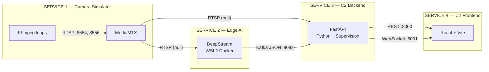

# KẾ HOẠCH TRIỂN KHAI C2 CENTER v2 — DeepStream × Supervision

## Tổng Quan

Hệ thống **loosely coupled** gồm 4 service độc lập, giao tiếp **chỉ** qua protocol/message:



> [!IMPORTANT]
> **Nguyên tắc thiết kế**: Mỗi service có thể khởi động, dừng, thay thế **độc lập**. Không import code chéo. Giao tiếp duy nhất qua: RTSP, Kafka, REST API, WebSocket.

---

## Port Map

| Thành phần | Máy | Port | Giao thức |
|---|---|---|---|
| Cam 1 (Sim) | Laptop A `192.168.1.196` | 8554 | RTSP |
| Cam 2 (Sim) | Laptop A | 8556 | RTSP |
| Cam N (Sim) | Laptop A | 8554 + 2*(N-1) | RTSP |
| Kafka Broker | Laptop A | 9092 | TCP |
| C2 Backend API | Laptop A | 8000 | HTTP/REST |
| C2 WebSockets | Laptop A | 8001 | WS |
| C2 Frontend | Laptop A | 3000 | HTTP |

---

## Kafka JSON Schema — Topic `c2_metadata`

```json
{
  "stream_id": "cam_8554",
  "frame_id": 1024,
  "timestamp": "1679123456.789",
  "objects": [
    {
      "tracking_id": 45,
      "class_id": 0,
      "class_name": "car",
      "bbox": {"x": 100, "y": 200, "w": 150, "h": 80},
      "confidence": 0.89
    }
  ]
}
```

Model labels (3 classes): `car`, `motor`, `heavy_vehicle`

> [!NOTE]
> **Model / Label 분리 정책 (Separation Policy)**:
> - **DeepStream (Edge)**: Model `.engine` + `labels.txt` được quản lý qua SSH vào WSL2 container. Hardcoded path trong config.
> - **C2 Backend (Server)**: Model `.pt`/`.onnx` + `labels.txt` **KHÔNG hardcode**. Backend scan thư mục `models/` tự động, cung cấp API để Frontend chọn model.

> **Phân tách tracking**: Playground video tracking là luồng offline/batch riêng, còn Deep Analysis là luồng live real-time từ DeepStream edge AI. Hai luồng này không dùng chung metadata pipeline.

---

### Phase 2: DeepStream Pipeline (Edge AI — WSL2 on Laptop 2)

> [!IMPORTANT]
> Giữ đơn giản — theo đúng pattern [setup_yolo26_model.sh](file:///d:/datas/Final.yolov8/deepstream_app/single-stream/setup_yolo26_model.sh). Chỉ thêm: multi-source + Kafka sink thay RTSP sink.

#### Môi trường đã xác nhận

- Docker image: `nvcr.io/nvidia/deepstream:6.0.1-devel`
- Docker run command: theo [my_guidebook.txt](file:///d:/datas/Final.yolov8/deepstream_app/single-stream/my_guidebook.txt) (lines 68-77)
- Parser: `libnvdsinfer_custom_impl_Yolo26.so` (built từ [DeepStream-Yolo](file:///d:/datas/Final.yolov8/jetson/DeepStream-Yolo) repo, CUDA_VER=11.4)
- Model: `yolo_all_exports_p2n_fine-tuning2_best.engine` (3 classes, 640x640)
- Laptop 2 WSL2 đã sẵn sàng để chạy DeepStream, Kafka sink, và tracker metadata JSON

#### [NEW] `c2_center/deepstream/multi-stream/setup_c2_multistream.sh`

Mở rộng từ `setup_yolo26_model.sh` proven pattern. Thay đổi chính:

**1. Thêm N sources** (giữ cấu trúc [sourceN] y hệt single-stream):
```ini
[source0]
enable=1
type=4
uri=rtsp://192.168.1.196:8554/cam1
gpu-id=0
select-rtp-protocol=4
latency=150
rtsp-reconnect-interval-sec=5

[source1]
enable=1
type=4
uri=rtsp://192.168.1.196:8556/cam2
...
```

**2. batch-size = N** (khớp số source):
```ini
[streammux]
batch-size=2    # = số source
width=640
height=640
```

**3. Thay [sink0] type=4 (RTSP) → type=6 (Message Broker)**:
```ini
[sink0]
enable=1
type=6
msg-conv-config=nvmsgconv_c2_config.txt
msg-conv-payload-type=256
msg-conv-msg2p-lib=libnvds_msgconv_c2.so
msg-broker-proto-lib=/opt/nvidia/deepstream/deepstream-6.0/lib/libnvds_kafka_proto.so
msg-broker-conn-str=192.168.1.196;9092;c2_metadata

[sink1]
enable=1
type=1      # fakesink
```

**4. Pipeline Optimization** (tối ưu toàn pipeline, không chỉ fakesink):

| Optimization | Config | Lý do |
|---|---|---|
| **OSD tắt** | `[osd] enable=0` | Không cần vẽ bbox trên Edge — Backend vẽ bằng Supervision |
| **Inference interval** | `interval=2` (giữ từ single-stream) | AI mỗi 3 frame, tracker fill gaps |
| **Tiled-display tắt** | `[tiled-display] enable=0` | Không render grid trên Edge |
| **Sync tắt** | `[sink0] sync=0` | Không chờ real-time clock, xử lý nhanh nhất có thể |
| **Streammux buffer** | `batched-push-timeout=40000` | Giữ từ single-stream, đủ cho 2+ sources |
| **GStreamer cache** | `rm -rf ~/.cache/gstreamer-1.0/` | Clear stale plugin cache trước mỗi lần chạy |
| **DISPLAY unset** | `unset DISPLAY` | Tránh X11 overhead trong WSL2 headless |
| **enc-type skip** | Không cần encoder vì output = text JSON | Tiết kiệm GPU encode cycle |

> [!TIP]
> So với single-stream hiện tại (RTSP output cần encoder + OSD), pipeline C2 **nhẹ hơn đáng kể** vì chỉ xuất text JSON. Dự kiến FPS cao hơn 20-30% với cùng phần cứng.

**5. Giữ nguyên** tracker/primary-gie từ single-stream config.

#### [NEW] `c2_center/deepstream/multi-stream/nvmsgconv_c2/`

Custom C++ payload generator cho đúng JSON schema:

```cpp
// c2_payload.cpp — implements nvds_msg2p interface
// Extracts from NvDsFrameMeta + NvDsObjectMeta:
//   - stream_id  ← frame_meta->pad_index → "cam_8554"
//   - frame_id   ← frame_meta->frame_num
//   - timestamp  ← frame_meta->buf_pts (nanosec → sec)
//   - objects[]  ← iterate obj_meta_list:
//       tracking_id ← obj_meta->object_id
//       class_id    ← obj_meta->class_id
//       class_name  ← lookup from labels.txt
//       bbox        ← obj_meta->rect_params {left,top,width,height}
//       confidence  ← obj_meta->confidence
```

Build: `make` → `libnvds_msgconv_c2.so`, copy vào workspace.

---

## Cấu Trúc Thư Mục
> **Playground video mode**: batch/offline; nếu có tracking thì đó là local tracking riêng, không dùng Kafka/DeepStream live metadata.

> **Deep Analysis**: nhận video live từ WebSocket + DeepStream/Kafka, không phụ thuộc vào Playground video mode.

```
│   [Drop files here]     │  Confidence  ───●──── 25%  │
│   image, video          │  Overlap     ───●──── 45%  │
│
├── infrastructure/
│   ├── mediamtx.yml                # MediaMTX multi-path config
│   └── start_cameras.ps1           # PowerShell: N FFmpeg processes
│
├── deepstream/
│   └── multi-stream/
│       ├── setup_c2_multistream.sh # Setup script (follows single-stream pattern)
│       ├── cfg_kafka.txt           # Kafka broker connection
│       └── nvmsgconv_c2/          # Custom C++ msg2p library source
│           ├── c2_payload.cpp
│           ├── c2_payload.h
│           └── Makefile
│
├── backend/
│   ├── requirements.txt
│   ├── main.py                     # FastAPI entry (:8000 + :8001)
│   ├── config.py                   # Pydantic Settings
│   ├── models/                     # ← Dynamic model directory
│   │   ├── yolo_p2n_ft2/
│   │   │   ├── best.pt
│   │   │   └── labels.txt          # car\nmotor\nheavy_vehicle
│   │   └── yolov8n_coco/
│   │       ├── yolov8n.pt
│   │       └── labels.txt          # 80 COCO classes
│   ├── services/
│   │   ├── kafka_consumer.py       # aiokafka → per-stream queue
│   │   ├── video_reader.py         # N threads × cv2.VideoCapture
│   │   ├── sync_engine.py          # Timestamp matcher (±50ms)
│   │   └── model_registry.py       # Auto-scan models/ directory
│   ├── analytics/
│   │   ├── base.py                 # Abstract analyzer interface
│   │   ├── absolute_count.py       # Hàm 1: k = N/L
│   │   ├── area_occupancy.py       # Hàm 2: BEV % occupancy
│   │   ├── pce_density.py          # Hàm 3: PCE-aware
│   │   ├── fundamental_equation.py # Hàm 4: k = q/v
│   │   ├── heatmap.py              # sv.HeatMapAnnotator
│   │   └── line_crossing.py        # sv.LineZone
│   ├── api/
│   │   ├── streams.py              # GET /api/streams, /api/health
│   │   ├── zones.py                # CRUD polygon/line coords
│   │   ├── analytics_api.py        # Switch algorithm, get stats
│   │   ├── models_api.py           # GET /api/models, PUT /api/models/active
│   │   └── playground.py           # POST /api/playground/detect
│   └── ws/
│       └── streamer.py             # WS broadcast (video + stats)
│
└── frontend/
    ├── package.json
    ├── vite.config.js
    ├── index.html
    └── src/
        ├── App.jsx
        ├── pages/
        │   ├── ModelPlayground.jsx  # Tab 1
        │   ├── GridView.jsx         # Tab 2
        │   └── DeepAnalysis.jsx     # Tab 3
        ├── components/
        │   ├── DetectionControls.jsx # Sliders + toggles panel
        │   ├── FileDropZone.jsx      # Drag & drop upload
        │   ├── VideoPlayer.jsx       # WS video 
        │   ├── PolygonDrawer.jsx     # Draw zones on canvas
        │   ├── TrafficChart.jsx      # Recharts real-time
        │   └── StreamCard.jsx        # Grid cell + status
        └── hooks/
            └── useWebSocket.js
```

---

## Proposed Changes — 7 Phases

---

### Phase 1: Infrastructure (Kafka + MediaMTX + Camera Sim)

#### [NEW] `c2_center/docker-compose.yml`

Kafka + Zookeeper trên Docker Desktop (đã có sẵn):

```yaml
services:
  zookeeper:
    image: confluentinc/cp-zookeeper:7.5.0
    ports: ["2181:2181"]
    environment:
      ZOOKEEPER_CLIENT_PORT: 2181
  kafka:
    image: confluentinc/cp-kafka:7.5.0
    ports: ["9092:9092"]
    environment:
      KAFKA_BROKER_ID: 1
      KAFKA_ZOOKEEPER_CONNECT: zookeeper:2181
      KAFKA_ADVERTISED_LISTENERS: PLAINTEXT://192.168.1.196:9092
      KAFKA_OFFSETS_TOPIC_REPLICATION_FACTOR: 1
    depends_on: [zookeeper]
```

#### [NEW] `c2_center/infrastructure/mediamtx.yml`

Config MediaMTX cho N paths. Reuse binary tại `rstp/mediamtx_v1.17.1_windows_amd64/mediamtx.exe`.

#### [NEW] `c2_center/infrastructure/start_cameras.ps1`

Theo đúng pattern đã chạy thành công trong [my_guidebook.txt](file:///d:/datas/Final.yolov8/deepstream_app/single-stream/my_guidebook.txt):

```powershell
# Cam 1 — port 8554
Start-Process -FilePath "ffmpeg" -ArgumentList @(
    "-re", "-stream_loop", "-1",
    "-i", "D:\datas\Final.yolov8\density\test_video.mp4",
    "-rtsp_transport", "tcp",
    "-c:v", "libx264", "-preset", "ultrafast", "-tune", "zerolatency",
    "-vf", "scale=640:640",
    "-b:v", "2M", "-maxrate", "2M", "-bufsize", "1M",
    "-an",
    "-f", "rtsp", "rtsp://localhost:8554/cam1"
)

# Cam 2 — port 8556 (hoặc cùng port, khác path)
Start-Process -FilePath "ffmpeg" -ArgumentList @(
    "-re", "-stream_loop", "-1",
    "-i", "D:\datas\Final.yolov8\density\test_video.mp4",
    "-rtsp_transport", "tcp",
    "-c:v", "libx264", "-preset", "ultrafast", "-tune", "zerolatency",
    "-vf", "scale=640:640",
    "-b:v", "2M", "-maxrate", "2M", "-bufsize", "1M",
    "-an",
    "-f", "rtsp", "rtsp://localhost:8556/cam2"
)
```

**Verify**: `ffplay rtsp://192.168.1.196:8554/cam1`

---

### Phase 2: DeepStream Pipeline (Edge AI — WSL2 on Laptop B)

> [!IMPORTANT]
> Giữ đơn giản — theo đúng pattern [setup_yolo26_model.sh](file:///d:/datas/Final.yolov8/deepstream_app/single-stream/setup_yolo26_model.sh). Chỉ thêm: multi-source + Kafka sink thay RTSP sink.

#### Môi trường đã xác nhận

- Docker image: `nvcr.io/nvidia/deepstream:6.0.1-devel`
- Docker run command: theo [my_guidebook.txt](file:///d:/datas/Final.yolov8/deepstream_app/single-stream/my_guidebook.txt) (lines 68-77)
- Parser: `libnvdsinfer_custom_impl_Yolo26.so` (built từ [DeepStream-Yolo](file:///d:/datas/Final.yolov8/jetson/DeepStream-Yolo) repo, CUDA_VER=11.4)
- Model: `yolo_all_exports_p2n_fine-tuning2_best.engine` (3 classes, 640x640)

#### [NEW] `c2_center/deepstream/multi-stream/setup_c2_multistream.sh`

Mở rộng từ `setup_yolo26_model.sh` proven pattern. Thay đổi chính:

**1. Thêm N sources** (giữ cấu trúc [sourceN] y hệt single-stream):
```ini
[source0]
enable=1
type=4
uri=rtsp://192.168.1.196:8554/cam1
gpu-id=0
select-rtp-protocol=4
latency=150
rtsp-reconnect-interval-sec=5

[source1]
enable=1
type=4
uri=rtsp://192.168.1.196:8556/cam2
...
```

**2. batch-size = N** (khớp số source):
```ini
[streammux]
batch-size=2    # = số source
width=640
height=640
```

**3. Thay [sink0] type=4 (RTSP) → type=6 (Message Broker)**:
```ini
[sink0]
enable=1
type=6
msg-conv-config=nvmsgconv_c2_config.txt
msg-conv-payload-type=256
msg-conv-msg2p-lib=libnvds_msgconv_c2.so
msg-broker-proto-lib=/opt/nvidia/deepstream/deepstream-6.0/lib/libnvds_kafka_proto.so
msg-broker-conn-str=192.168.1.196;9092;c2_metadata

[sink1]
enable=1
type=1      # fakesink
```

**4. Pipeline Optimization** (tối ưu toàn pipeline, không chỉ fakesink):

| Optimization | Config | Lý do |
|---|---|---|
| **OSD tắt** | `[osd] enable=0` | Không cần vẽ bbox trên Edge — Backend vẽ bằng Supervision |
| **Inference interval** | `interval=2` (giữ từ single-stream) | AI mỗi 3 frame, tracker fill gaps |
| **Tiled-display tắt** | `[tiled-display] enable=0` | Không render grid trên Edge |
| **Sync tắt** | `[sink0] sync=0` | Không chờ real-time clock, xử lý nhanh nhất có thể |
| **Streammux buffer** | `batched-push-timeout=40000` | Giữ từ single-stream, đủ cho 2+ sources |
| **GStreamer cache** | `rm -rf ~/.cache/gstreamer-1.0/` | Clear stale plugin cache trước mỗi lần chạy |
| **DISPLAY unset** | `unset DISPLAY` | Tránh X11 overhead trong WSL2 headless |
| **enc-type skip** | Không cần encoder vì output = text JSON | Tiết kiệm GPU encode cycle |

> [!TIP]
> So với single-stream hiện tại (RTSP output cần encoder + OSD), pipeline C2 **nhẹ hơn đáng kể** vì chỉ xuất text JSON. Dự kiến FPS cao hơn 20-30% với cùng phần cứng.

**5. Giữ nguyên** tracker/primary-gie từ single-stream config.

#### [NEW] `c2_center/deepstream/multi-stream/nvmsgconv_c2/`

Custom C++ payload generator cho đúng JSON schema:

```cpp
// c2_payload.cpp — implements nvds_msg2p interface
// Extracts from NvDsFrameMeta + NvDsObjectMeta:
//   - stream_id  ← frame_meta->pad_index → "cam_8554"
//   - frame_id   ← frame_meta->frame_num
//   - timestamp  ← frame_meta->buf_pts (nanosec → sec)
//   - objects[]  ← iterate obj_meta_list:
//       tracking_id ← obj_meta->object_id
//       class_id    ← obj_meta->class_id
//       class_name  ← lookup from labels.txt
//       bbox        ← obj_meta->rect_params {left,top,width,height}
//       confidence  ← obj_meta->confidence
```

Build: `make` → `libnvds_msgconv_c2.so`, copy vào workspace.

---

### Phase 3: C2 Backend Core (FastAPI)

#### [NEW] `c2_center/backend/requirements.txt`
```
fastapi==0.115.0
uvicorn[standard]==0.30.0
aiokafka==0.11.0
opencv-python-headless==4.10.0.84
numpy>=1.26
supervision>=0.25.0
ultralytics>=8.3.0
websockets==13.1
pydantic-settings>=2.0
python-multipart>=0.0.9
```

#### [NEW] `c2_center/backend/config.py`
```python
class Settings(BaseSettings):
    KAFKA_BOOTSTRAP: str = "localhost:9092"
    KAFKA_TOPIC: str = "c2_metadata"
    RTSP_STREAMS: dict = {
        "cam_8554": "rtsp://localhost:8554/cam1",
        "cam_8556": "rtsp://localhost:8556/cam2",
    }
    MODELS_DIR: Path = Path("./models")   # ← scan thư mục này
    SYNC_TOLERANCE_MS: float = 50.0
    WS_TARGET_FPS: int = 15
```

> [!NOTE]
> - `RTSP_STREAMS` là dict động — thêm stream mới chỉ cần thêm entry + restart backend. Frontend auto-discover qua `GET /api/streams`.
> - `MODELS_DIR` trỏ đến thư mục chứa các model. Backend tự scan, **không hardcode tên model**.

#### [NEW] `c2_center/backend/services/model_registry.py`

Dynamic model discovery — Backend tự đọc, không cần biết trước model nào:

```python
class ModelRegistry:
    """Scan models/ directory, load on-demand, cache in memory."""
    
    def __init__(self, models_dir: Path):
        self.models_dir = models_dir
        self._cache: dict[str, YOLO] = {}  # lazy-loaded
    
    def list_models(self) -> list[ModelInfo]:
        """Scan models/ → return [{name, labels, file_size, num_classes}]."""
        models = []
        for subdir in self.models_dir.iterdir():
            if not subdir.is_dir():
                continue
            # Tìm file .pt hoặc .onnx
            weights = list(subdir.glob("*.pt")) + list(subdir.glob("*.onnx"))
            labels_file = subdir / "labels.txt"
            if weights and labels_file.exists():
                labels = labels_file.read_text().strip().splitlines()
                models.append(ModelInfo(
                    name=subdir.name,
                    weights_path=weights[0],
                    labels=labels,
                    num_classes=len(labels),
                ))
        return models
    
    def get_model(self, name: str) -> YOLO:
        """Lazy-load model vào RAM/GPU khi được chọn lần đầu."""
        if name not in self._cache:
            info = self._find(name)
            self._cache[name] = YOLO(str(info.weights_path))
        return self._cache[name]
    
    def get_labels(self, name: str) -> list[str]:
        """Read labels.txt cho model đang active."""
        info = self._find(name)
        return info.labels
```

**REST API** cho Frontend:
- `GET /api/models` → danh sách models có sẵn (scan `models/`)
- `PUT /api/models/active` → chọn model active cho Playground
- Frontend hiển thị model selector dropdown

**Cách thêm model mới**: Chỉ cần copy folder vào `backend/models/`:
```
models/
├── my_new_model/
│   ├── best.pt        # hoặc .onnx
│   └── labels.txt     # mỗi dòng = 1 class name
```
Restart backend → model tự xuất hiện trong dropdown.

#### [NEW] `c2_center/backend/services/kafka_consumer.py`

- `aiokafka.AIOKafkaConsumer` subscribe topic `c2_metadata`
- Parse JSON → route theo `stream_id` → push vào `asyncio.Queue` per stream
- Background task trong FastAPI lifespan

#### [NEW] `c2_center/backend/services/video_reader.py`

- N daemon threads × `cv2.VideoCapture(rtsp_url)`
- Mỗi thread push `(frame, timestamp)` vào `queue.Queue(maxsize=30)`
- Auto-reconnect loop nếu mất kết nối

#### [NEW] `c2_center/backend/services/sync_engine.py`

```python
class SyncEngine:
    """Ghép metadata JSON + video frame theo timestamp (±50ms)."""
    
    def get_synced_frame(self, stream_id: str) -> tuple[np.ndarray, list[dict]]:
        frame, ts = self.video_queues[stream_id].get(timeout=1.0)
        metadata = self.metadata_buffers[stream_id].pop_nearest(ts, tolerance_ms=50)
        return frame, metadata.get("objects", []) if metadata else []
```

---

### Phase 4: Traffic Analytics (4 Algorithms + Supervision)

Port toàn bộ logic từ `density/` folder. Mỗi algorithm là 1 class độc lập, conform chung 1 interface:

```python
# analytics/base.py
class BaseAnalyzer(ABC):
    @abstractmethod
    def process(self, frame, detections: sv.Detections, params: dict) -> AnalysisResult:
        """Return annotated frame + metrics dict."""
```

#### [NEW] `analytics/absolute_count.py`
Port từ [density_absolute_count.py](file:///d:/datas/Final.yolov8/density/density_absolute_count.py):
- `k = N / L` (N = xe trong ROI, L = chiều dài đường km)
- Centroid-based point-in-polygon test
- **User vẽ ROI polygon** → nhận coords từ REST API

#### [NEW] `analytics/area_occupancy.py`
Port từ [density_area_occupancy.py](file:///d:/datas/Final.yolov8/density/density_area_occupancy.py):
- Bird's Eye View transform (Homography)
- BEV canvas → `countNonZero` → occupancy %
- Minimap radar overlay
- **User vẽ 4-point ROI** → tính `PERSPECTIVE_MATRIX`

#### [NEW] `analytics/pce_density.py`
Port từ [density_pce_aware.py](file:///d:/datas/Final.yolov8/density/density_pce_aware.py):
- PCE weights: `{car: 1.0, motor: 0.5, heavy_vehicle: 2.5}`
- `k_pce = total_pce / ROAD_LENGTH_KM`
- Color-coded congestion status (Normal/Heavy/Jam)

#### [NEW] `analytics/fundamental_equation.py`
Port từ [density_fundamental_equation.py](file:///d:/datas/Final.yolov8/density/density_fundamental_equation.py):
- Entry/Exit line zones → `sv.LineZone`
- Sliding window 30s → flow rate `q` (veh/h)
- Speed estimation `v` (km/h) per tracked vehicle
- `k = q / v`
- **User vẽ Entry line + Exit line** → nhận coords

#### [NEW] `analytics/heatmap.py`
- `sv.HeatMapAnnotator(radius=40, opacity=0.6)`
- Accumulates detection positions over time

#### [NEW] `analytics/line_crossing.py`
- `sv.LineZone` wrapper for simple counting
- **User vẽ line** → gửi 2 điểm qua REST API

---

### Phase 5: WebSocket Video Streaming

#### [NEW] `c2_center/backend/ws/streamer.py`

Processing loop per stream (15 FPS):
1. `sync_engine.get_synced_frame(stream_id)`
2. JSON objects → `sv.Detections`
3. Run active analyzer (user-selected algorithm)
4. Annotate frame
5. `cv2.imencode('.jpg')` → base64
6. Broadcast via WebSocket

Channels:
- `ws://localhost:8001/stream/{stream_id}` → base64 JPEG frames
- `ws://localhost:8001/stats/{stream_id}` → JSON analytics metrics

---

### Phase 6: Frontend (React + Vite)

#### Tab 1: Model Playground

```
┌──────────────────────────────────────────────────────┐
│  MODEL PLAYGROUND                                     │
├─────────────────────────┬────────────────────────────┤
│                         │  ⚙️ Detection Controls      │
│                         │                            │
│   [Drop files here]     │  Confidence  ───●──── 25%  │
│   image, video          │  Overlap     ───●──── 45%  │
│                         │  Opacity     ───●──── 60%  │
│   ┌─────────────────┐   │                            │
│   │                 │   │  Label Display [▼ All    ]  │
│   │  Detection      │   │                            │
│   │  Result         │   │  ☑ Draw Confidence         │
│   │  Preview        │   │  ☑ Draw Labels             │
│   │                 │   │  ☑ Draw Boxes              │
│   └─────────────────┘   │  ☐ Censor Predictions      │
│                         │                            │
│                         │  [Run Detection]           │
└─────────────────────────┴────────────────────────────┘
```

- **FileDropZone**: Drag & drop hoặc click để chọn image/video
- **DetectionControls**: Sliders (confidence 0-100%, overlap 0-100%, opacity 0-100%), combobox label filter, checkboxes
- `POST /api/playground/detect` body: `{file, confidence, overlap, opacity, draw_conf, draw_labels, draw_boxes, censor}`
- Backend chạy YOLO inference offline → trả về annotated image

#### Tab 2: Multi-Stream Grid View

- Dynamic grid (auto-layout dựa trên số stream từ `GET /api/streams`)
- Mỗi cell = `StreamCard` → `` từ WebSocket
- Click cell → full-screen modal
- Connection status indicator per stream

#### Tab 3: Traffic Deep Analysis

```
┌──────────────────────────────┬────────────────────────┐
│                              │  🎛 Analysis Controls    │
│   Real-time Video            │                        │
│   (WebSocket stream)         │  Algorithm [▼ PCE     ]│
│                              │  • Absolute Count      │
│   + Heatmap/Line overlay     │  • Area Occupancy      │
│                              │  • PCE-Aware           │
│                              │  • Fundamental Eq      │
│   ┌──────────────────────┐   │                        │
│   │  PolygonDrawer       │   │  🖊 Draw Tools          │
│   │  Click to draw       │   │  [Draw ROI Polygon]    │
│   │  zones/lines on      │   │  [Draw Entry Line]     │
│   │  the video           │   │  [Draw Exit Line]      │
│   └──────────────────────┘   │  [Clear All]           │
│                              │                        │
│──────────────────────────────│  📊 Live Dashboard      │
│   📈 Traffic Chart           │  Flow: 1200 veh/h      │
│   Real-time vehicle count    │  Speed: 35 km/h        │
│   (Recharts line graph)      │  Density: 34 veh/km    │
│                              │  Status: NORMAL ●      │
└──────────────────────────────┴────────────────────────┘
```

- **PolygonDrawer**: Canvas overlay trên video, click-to-draw polygon/line
  - Draws polygon → `POST /api/zones` gửi coords tới Backend
  - Follows UX pattern from [get_coords.py](file:///d:/datas/Final.yolov8/get_coords.py)
- **Algorithm selector**: Switch giữa 4 thuật toán density
- **TrafficChart**: Recharts line/bar chart cập nhật từ `ws://localhost:8001/stats/`

Design: Dark theme, glassmorphism, Inter font, micro-animations.

---

### Phase 7: Integration & Polish

1. **Smoke test**: FFmpeg → MediaMTX → DeepStream → Kafka → Backend → Frontend
2. **Latency**: Target < 500ms end-to-end
3. **Resilience**: Kill/restart bất kỳ service → các service khác tự recover
4. **Dynamic streams**: Thêm cam 3 (FFmpeg + DS source + backend config) → Frontend auto-discover

---

## Verification Plan

| Phase | Command / Action | Pass Criteria |
|---|---|---|
| 1 | `docker compose up -d` | Kafka broker listening :9092 |
| 1 | `ffplay rtsp://192.168.1.196:8554/cam1` | Video 640x640 plays |
| 2 | DeepStream container logs | "FPS: 25+" per stream |
| 2 | `kafka-console-consumer --topic c2_metadata` | JSON messages arrive |
| 3 | `GET http://localhost:8000/api/health` | All streams connected |
| 4 | `pytest backend/tests/ -v` | Analytics unit tests pass |
| 5 | `wscat -c ws://localhost:8001/stream/cam_8554` | Base64 frames arriving |
| 6 | `http://localhost:3000` | All 3 tabs functional |
| 7 | Kill Kafka → restart | Backend auto-reconnects |

---

## Tài Nguyên Tái Sử Dụng

| Source | Used In | What |
|---|---|---|
| [single-stream/setup_yolo26_model.sh](file:///d:/datas/Final.yolov8/deepstream_app/single-stream/setup_yolo26_model.sh) | Phase 2 | Pipeline pattern (config gen + deepstream-app launch) |
| [single-stream/config_infer_primary_*.txt](file:///d:/datas/Final.yolov8/deepstream_app/single-stream/config_infer_primary_yolo_all_exports_p2n_fine-tuning2_best.txt) | Phase 2 | Inference config (cluster-mode=4, engine-create-func) |
| [single-stream/deepstream_app_*_rtsp.txt](file:///d:/datas/Final.yolov8/deepstream_app/single-stream/deepstream_app_yolo_all_exports_p2n_fine-tuning2_best_rtsp.txt) | Phase 2 | App config template (source, streammux, tracker, osd) |
| [single-stream/*.engine + *.onnx](file:///d:/datas/Final.yolov8/deepstream_app/single-stream) | Phase 2 | Model files (3 classes, 640x640) |
| [single-stream/libnvdsinfer_custom_impl_Yolo26.so](file:///d:/datas/Final.yolov8/deepstream_app/single-stream/libnvdsinfer_custom_impl_Yolo26.so) | Phase 2 | YOLO parser library |
| [jetson/DeepStream-Yolo](file:///d:/datas/Final.yolov8/jetson/DeepStream-Yolo) | Phase 2 | Parser source (rebuild if needed) |
| [my_guidebook.txt](file:///d:/datas/Final.yolov8/deepstream_app/single-stream/my_guidebook.txt) | Phase 1,2 | FFmpeg command, Docker run, WSL2 setup |
| [density/density_absolute_count.py](file:///d:/datas/Final.yolov8/density/density_absolute_count.py) | Phase 4 | Algorithm 1: N/L |
| [density/density_area_occupancy.py](file:///d:/datas/Final.yolov8/density/density_area_occupancy.py) | Phase 4 | Algorithm 2: BEV occupancy |
| [density/density_pce_aware.py](file:///d:/datas/Final.yolov8/density/density_pce_aware.py) | Phase 4 | Algorithm 3: PCE weights |
| [density/density_fundamental_equation.py](file:///d:/datas/Final.yolov8/density/density_fundamental_equation.py) | Phase 4 | Algorithm 4: k=q/v |
| [get_coords.py](file:///d:/datas/Final.yolov8/get_coords.py) | Phase 6 | Polygon drawing UX pattern |
| [mediamtx.exe](file:///d:/datas/Final.yolov8/rstp/mediamtx_v1.17.1_windows_amd64/mediamtx.exe) | Phase 1 | RTSP server binary |
